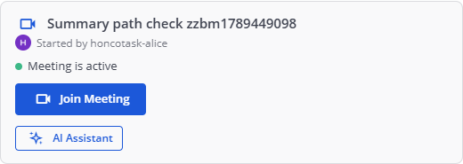
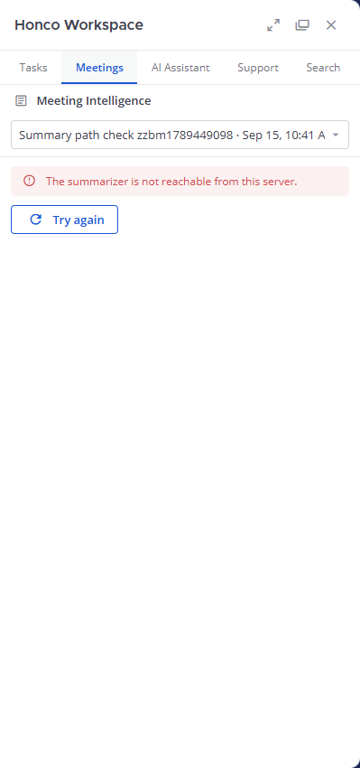
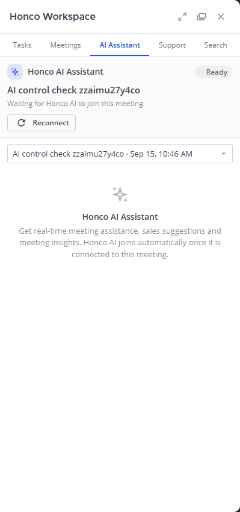
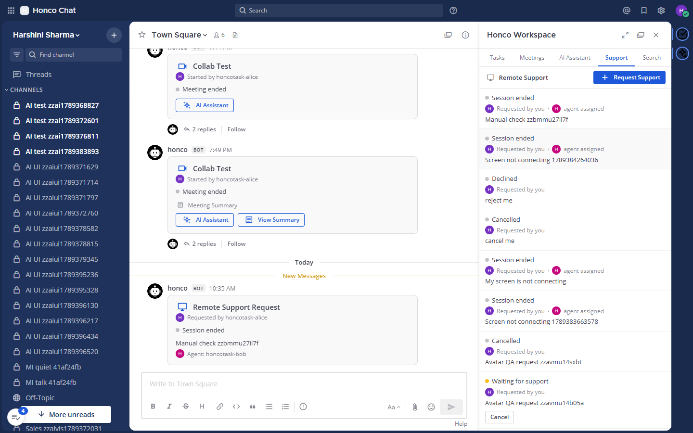

# HONCO CHAT

## Complete Button-by-Button User & Developer Manual

**"Understand every major action, what happens behind it, and where the code lives."**

| | |
|---|---|
| Manual version | 1.0 — 15 September 2026 |
| Code documented | Git commit `126acc9` (application code); documentation commits `72e3153`, `8e64c95`, `30503cd` |
| Application | Honco Chat — Mattermost 11.11.0 fork, Team Edition, unlicensed · plugin `com.honco.workspace` 0.1.0 |
| How buttons were verified | Every Honco control in Part 3 was **clicked in the running application on 15 Sep 2026** and its effect checked against the API and the database. 29 controls verified; results are recorded per button in the STATUS line. Native Mattermost controls were inventoried from the running UI but are not individually re-verified (they are upstream behaviour). |
| Companion documents | `docs/HONCO_CHAT_COMPLETE_DOCUMENTATION.pdf` (reference) · `docs/HONCO_CHAT_PROJECT_LEARNING_GUIDE.pdf` (learning guide). This manual supersedes both where they disagree — see the corrections box below. |

> **Corrections to the earlier documents, found by clicking the buttons this time**
> 1. **"Start AI session" is not rendered at all** in the current environment. Both earlier documents said pressing it shows a "not configured" state. In the code the control requires `cfg.service_configured` (`main.js`, `canStart`), and with `AIServiceURL` empty the panel instead shows the introduction "Honco AI joins automatically once it is connected to this meeting." Verified twice on freshly created, active meetings.
> 2. **"Generate summary" has two distinct outcomes**, not one. For a meeting with no human messages in its window it returns **empty** *without contacting the summarizer* (verified: 0 messages → "No messages were posted in this channel during the meeting"). Only a meeting with real conversation exercises the external path — verified today with four messages: status **failed**, "The summarizer is not reachable from this server."
> 3. **"View Summary" only appears when a summary exists and is usable** (`has_summary`). On a meeting whose summary is `failed` the button is correctly absent. The closed-panel defect is still present and was reproduced again today.

---

<figure class="shot"><figcaption>Figure 1 — The running Honco Chat, annotated. ① team menu ② Find channel ③ channel list ④ channel header ⑤ account menu (Profile) ⑥ Honco Workspace icon ⑦ AI Assistant icon ⑧ a meeting card ⑨ message composer.</figcaption></figure>

## Table of contents

1. What am I looking at?
2. Complete button map
3. Button-by-button manual
4. Main chat buttons
5. Profile & profile photo
6. Tasks
7. Meetings
8. Meeting lifecycle
9. Jitsi
10. Jibri / recording
11. Meeting Intelligence
12. AI Assistant
13. Remote Support
14. Files & attachments
15. Notifications
16. Search
17. Admin dashboard
18. Button → code map
19. Button → database map
20. Button → external service map
21. Complete data flow examples
22. What is Mattermost vs what is Honco?
23. Code navigation
24. Debugging a button
25. Common button problems
26. Feature status
27. Important limitations
28. Safe project operations
29. Quick reference
30. Beginner glossary

---

# 1. What am I looking at?

When you open Honco Chat you are looking at a **customised Mattermost**. Mattermost is an open-source team-chat server (like Slack, but installed on your own machines). Honco added one plugin — **Honco Workspace** — plus a few services around it. Everything below was read from the running application on 15 Sep 2026.

```
┌──────────────────────────────────────────────────────────────────────────────────────┐
│ ▤  H Honco Chat        [ Search ]        ?        @   ⌂   ⚙   (your avatar)          │ ← top navigation
├──────────┬────────────────────────────────────────────────────────┬──────────┬───────┤
│ Harshini │ ☆  Town Square ▾   👤6  ⧉  ⓘ                          │  Honco   │  ▣    │
│ Sharma ▾ ├────────────────────────────────────────────────────────┤ Workspace│  ✦    │ ← App Bar
│  + ⌕     │                                                        │  panel   │       │   (2 icons)
│          │   honco BOT  7:49 PM                                   │          │       │
│ Threads  │   ┌──────────────────────────────────────┐             │  Tasks   │       │
│          │   │ ▣ Client Review                      │             │ Meetings │       │
│ CHANNELS │   │   Started by  (avatar) alice         │  ← meeting  │ AI Asst. │       │
│  # Town  │   │   ● Meeting is active · 2 participants│     card    │ Support  │       │
│  # Sales │   │   [Join Meeting] [AI Assistant]      │             │ Search   │       │
│  # Dev   │   └──────────────────────────────────────┘             │ Admin*   │       │
│          │                                                        │          │       │
│ DIRECT   │   ┌──────────────────────────────────────┐             │ *admins  │       │
│ MESSAGES │   │ 🖥 Remote Support Request             │  ← support  │   only   │       │
│  @ honco │   │   (avatar) Requested by alice        │     card    │          │       │
│  @ bob   │   │   ● Waiting for support              │             │          │       │
│          │   └──────────────────────────────────────┘             │          │       │
│          ├────────────────────────────────────────────────────────┤          │       │
│          │  Write to Town Square                                  │          │       │
│          │  B I S H 🔗 <> " ≔ ≡   …   Aa 📎 ☺ ➤                   │ ← composer│       │
└──────────┴────────────────────────────────────────────────────────┴──────────┴───────┘
```

| Area | What it is |
|---|---|
| **Login screen** | Email or Username · Password · Show password · "Forgot your password?" · Log in. No sign-up link — accounts are created by an administrator (`EnableOpenServer=false`). |
| **Main workspace** | Everything after login: sidebar, conversation, panels. |
| **Left sidebar** | Your team name (with a menu), "+" to browse/create channels, Find Channels, **Threads**, the **CHANNELS** list, the **DIRECT MESSAGES** list, and per-channel "⋮" option menus. |
| **Team** | A group of channels and people. Honco Chat currently has 2 teams; you can belong to several and switch between them. |
| **Channels** | Named conversations — public (#) or private (🔒). |
| **Direct Messages** | One-to-one conversations; a **group DM** is the same thing with several people. |
| **Main conversation area** | The channel header (favourite ☆, channel name menu, Members, Channel files, View Info), the message list — including Honco's **meeting cards** and **support cards** — and the message composer. |
| **Right-side Honco Workspace panel** | Honco's own panel: **Tasks · Meetings · AI Assistant · Support · Search** and, for system administrators only, **Admin**. |
| **Top navigation** | Product switch menu · Search box · Help · Recent mentions (@) · Saved messages · Settings (⚙) · your account menu (your avatar). |
| **Profile** | Account menu → **Profile** → Profile Settings (Full Name, Username, Nickname, Position, Email, **Profile Photo**) and Security (password, MFA, sessions). |
| **Search** | Two different searches: Mattermost's box at the top (messages and files) and Honco's **Search tab** in the panel (tasks, meetings, recordings, summaries, support). |
| **Admin area** | Two separate things: Honco's **Admin tab** (read-only dashboard, in the panel) and Mattermost's **System Console** at `/admin_console` (full configuration). |

---

# 2. Complete button map

Every interactive control visible in the current application, grouped by location. "Honco" marks controls added by the Honco Workspace plugin; the rest are native Mattermost. Names are exactly as they appear on screen (or the accessible name where the control is an icon).

### A. Login
| Control | Type | Who | Action | Status |
|---|---|---|---|---|
| Email or Username / Password | input | everyone | credentials | Native · DONE |
| Show password (👁) | toggle | everyone | reveals the password | Native · DONE |
| Log in | button | everyone | starts a session | Native · DONE |
| Forgot your password? | link | everyone | password-reset e-mail | Native · DONE |

### B. Top navigation
| Control | Icon | Who | Action | Status |
|---|---|---|---|---|
| Product switch menu | ▤ | everyone | switches product/back to channels | Native |
| Search | box | everyone | Mattermost message/file search | Native |
| Help | ? | everyone | opens the configured help link | Native |
| Recent mentions | @ | everyone | mentions panel | Native |
| Saved messages | 🔖 | everyone | saved posts panel | Native |
| Settings | ⚙ | everyone | display/notification settings | Native |
| User's account menu | avatar | everyone | status, custom status, **Profile**, Log out | Native |

### C. Left sidebar
| Control | Who | Action | Status |
|---|---|---|---|
| Team name ▾ | everyone | team menu (invite, settings, leave) | Native |
| Browse or create channels (+) | everyone | join/create a channel | Native |
| Find Channels (⌕) | everyone | channel switcher | Native |
| Threads | everyone | followed threads | Native |
| Channels category options / Channel options for … (⋮) | everyone | mute, favourite, leave, move | Native |
| Write a direct message (+) | everyone | opens the member picker | Native |

### D. Channel header
| Control | Who | Action | Status |
|---|---|---|---|
| add to favorites (☆) | everyone | favourite this channel | Native |
| \<channel\> channel menu ▾ | everyone | View Info, Mute, Notification Preferences, Channel Settings, Members, Move to | Native |
| Members (👤n) | everyone | member list in the right panel | Native |
| Channel files | everyone | files posted here | Native |
| Open in new window | everyone | pops the channel out | Native |
| View Info (ⓘ) | everyone | channel info panel | Native |

### E. Message composer
| Control | Who | Action | Status |
|---|---|---|---|
| bold · italic · strike through · heading · link · code · quote · bulleted list · numbered list | everyone | Markdown formatting | Native |
| Message priority | everyone | marks a message urgent/important | Native |
| formatting (Aa) | everyone | shows/hides the formatting bar | Native |
| attachment (📎) | everyone | **upload a file** | Native |
| select an emoji (☺) | everyone | emoji picker | Native |
| Send Now (➤) / Enter | everyone | **send the message** | Native |
| `/meet …` typed in the composer | everyone | **creates a meeting** | **Honco** · DONE |

### F. Message actions (hover a message)
| Control | Who | Action | Status |
|---|---|---|---|
| Add Reaction | everyone | emoji reaction | Native |
| save message | everyone | adds to Saved messages | Native |
| reply | everyone | opens the thread in the right panel | Native |
| more (⋯) | everyone | Mattermost's post menu (edit, copy link, delete, …) | Native |

### G. Profile menu (account menu)
| Control | Who | Action | Status |
|---|---|---|---|
| Online / Away / Do not disturb / Offline | everyone | presence | Native |
| Set custom status | everyone | status text/emoji | Native |
| Profile | everyone | opens Profile Settings | Native |
| Log out | everyone | ends the session | Native |

### H. Profile settings
| Control | Who | Action | Status |
|---|---|---|---|
| Profile Settings / Security tabs | everyone | switches section | Native |
| Edit (Full Name, Username, Nickname, Position, Email) | everyone | edit that field | Native |
| **Profile Photo → Edit** | everyone | expands the photo section | Native + **Honco wording** · DONE |
| **Change photo** | everyone | file picker + preview | Native + Honco wording · DONE |
| **Save photo** | everyone | uploads the photo | Native + Honco wording · DONE |
| **Remove photo** | everyone (only when a photo is set) | restores the default avatar | Native + Honco wording · DONE |
| Cancel | everyone | discards the choice | Native · DONE |

### I. Tasks (Honco)
New task · Save task · Cancel · Edit · Delete → Yes · status ▾ (To do / In progress / Done) · Assignee ▾ · Due date · All statuses ▾ · Mine ☐ · Previous · Next — **all DONE and verified today.**

### J. Meetings / Meeting Intelligence (Honco)
Choose a meeting ▾ · Generate summary · Regenerate · Try again — **DONE inside Honco; the external summarizer is BLOCKED.**

### K. AI Assistant (Honco)
Meeting ▾ · Reconnect · Transcript (section toggle) · Jump to latest · Load earlier lines · Show previous suggestions (N) · Retry — **DONE.**
Start AI session · Start new AI session · Stop session · Retry connection — **NOT TESTABLE here: these render only when an AI service URL is configured.**

### L. Remote Support (Honco)
Request Support (opens the form) · Request Support (sends) · Cancel · Accept Request · Decline · Start Session · End Session · Refresh — **all DONE and verified today.**

### M. Search (Honco)
Search field + Enter · chips **All / Tasks / Meetings / Recordings / Summaries / Support** · See all N … · Previous · Next · result rows — **DONE and verified today.**

### N. Admin (Honco, system admins only)
Admin tab · Refresh · read-only cards (System health, Usage, Files, Notifications, AI Assistant, Security, Recent failures, versions) — **DONE and verified today.**

### O. Files / attachments
attachment (📎) · file preview/download · **View Recording** (Honco meeting card) · Channel files — Native, plus Honco's recording link · **DONE.**

### P. Notifications
No buttons: Honco notifications arrive as direct messages from the **honco** bot and as channel posts. Mattermost's own notification settings live in ⚙ Settings → Notifications.

### Q. Meeting cards (Honco)
Join Meeting · AI Assistant · View Summary · View Recording · badges "Recording failed" / "Recording unavailable" — **DONE** (View Summary has a known defect, see Part 3).

### R. Support cards (Honco)
Read-only: title, requester avatar + name, status dot, issue text, agent. All actions are on the Support tab.

### S. Other Honco controls
App Bar icon **Honco Workspace** (opens the panel) · App Bar icon **AI Assistant** (opens the panel on the AI tab) · channel-header button "Honco Workspace" (when the App Bar is hidden / phone) · the Honco results button registered into Mattermost's search box.


---

<figure class="shot"><figcaption>Figure 2 — Tasks tab, annotated. ① panel tabs ② All statuses ③ Mine ④ New task ⑤ status selector ⑥ Edit ⑦ Delete ⑧ due date / Overdue ⑨ Previous / Next.</figcaption></figure>

# 3. Button-by-button manual

**How to read an entry.** FRONTEND names the function inside `plugins/com.honco.workspace/webapp/dist/main.js` (one file — the whole Honco UI). API paths are relative to `/plugins/com.honco.workspace/api/v1`. BACKEND files are in `plugins/com.honco.workspace/server/`. STATUS is the result of clicking the control in the running application on 15 Sep 2026 unless the entry says otherwise.

---

### BUTTON: Honco Workspace (App Bar icon)

**WHERE:** right edge of the window (App Bar); on a phone, the channel "≡" menu → Honco Workspace.  
**WHO CAN SEE IT:** every logged-in user.  
**PURPOSE:** opens and closes the Honco panel — the home of Tasks, Meetings, AI Assistant, Support, Search and Admin.  
**WHEN I CLICK IT:** the right-hand panel opens on the tab you used last; clicking again closes it.  
**FRONTEND:** `Plugin.initialize` → `registry.registerAppBarComponent(ICON_URL, …, HoncoPanel)`; the panel itself is `HoncoPanel`.  
**API:** none on open. Each tab fetches its own data when you switch to it.  
**BACKEND:** none.  
**DATABASE:** none.  
**EXTERNAL SERVICE:** none.  
**WEBSOCKET:** none for the click; the panel subscribes to `meeting_updated`, `support_updated` and `ai_event` while it is open.  
**RESULT:** the panel appears; the channel area narrows.  
**ERROR CASES:** none observed. If the plugin is disabled the icon disappears entirely.  
**CODE LOCATION:** `webapp/dist/main.js` (`Plugin.initialize`, `HoncoPanel`).  
**STATUS:** DONE — verified (panel opened and closed repeatedly during the pass).

---

### BUTTON: AI Assistant (App Bar icon)

**WHERE:** second App Bar icon.  
**WHO CAN SEE IT:** every logged-in user.  
**PURPOSE:** jump straight to the AI Assistant tab for the meeting in the channel you are reading.  
**WHEN I CLICK IT:** the panel opens on the **AI Assistant** tab; the newest meeting of the current channel is selected.  
**FRONTEND:** `registerAppBarComponent(AI_ICON_URL, …)` → `AIIntent.open()` → `window.HoncoOpenWorkspace()` + `initialTab='ai'`.  
**API:** `GET /channels/{channel_id}/meetings` (to find the meeting to select), then `GET /meetings/{id}/ai`.  
**BACKEND:** `meetings_api.go` (`handleListChannelMeetings`), `ai_api.go` (`handleGetAISession`).  
**DATABASE:** reads `honco_meetings`; AI session state lives in the plugin key-value store (`ai:session:<meeting_id>`), not in a Honco table.  
**EXTERNAL SERVICE:** none for this click.  
**WEBSOCKET:** subscribes to `ai_event`.  
**RESULT:** the AI panel with the meeting selector and the current session state.  
**ERROR CASES:** channel with no meetings → the tab explains there is nothing to show; not a channel member → 404 and an explanatory message.  
**CODE LOCATION:** `main.js` (`AIIntent`, `AIPanel`), `server/ai_api.go`.  
**STATUS:** DONE — verified (opened on the AI tab with the correct meeting selected).

---

### BUTTON: New task

**WHERE:** Honco panel → Tasks tab, top right.  
**WHO CAN SEE IT:** every member of the team.  
**PURPOSE:** opens the form for creating a task.  
**WHEN I CLICK IT:** an inline form appears with Title (required), Description, Assignee ▾, Status ▾ and Due date, plus **Save task** and **Cancel**.  
**FRONTEND:** `TasksPanel` → sets the editor state → `TaskEditor`.  
**API:** none (opening the form makes no request). The Assignee list is filled from Mattermost's `GET /api/v4/users?in_team=<team>&per_page=200&active=true`.  
**BACKEND:** none for the click.  
**DATABASE:** none.  
**EXTERNAL SERVICE:** none.  
**WEBSOCKET:** none.  
**RESULT:** the form opens above the list.  
**ERROR CASES:** if the member list cannot be read the Assignee dropdown falls back to "Unassigned" only; the form still works.  
**CODE LOCATION:** `main.js` (`TasksPanel`, `TaskEditor`, `fetchTeamMembers`).  
**STATUS:** DONE — verified (form opened; no API call, as expected).

---

### BUTTON: Save task (create)

**WHERE:** the task form.  
**WHO CAN SEE IT:** every team member.  
**PURPOSE:** creates the task.  
**WHEN I CLICK IT:** the button shows a saving state, the form closes, and the new task appears at the top of the list.  
**FRONTEND:** `TaskEditor` submit → `request('POST', '/tasks', payload)`.  
**API:** `POST /tasks` — body `{team_id, title, description, assignee_id, status, due_at}`.  
**BACKEND:** `tasks_api.go` → `handleCreateTask` (team membership; assignee must be in the same team; validation in `task.go`).  
**DATABASE:** `INSERT` into **`honco_tasks`**; if a different person is assigned, a row is claimed in **`honco_notifications`**.  
**EXTERNAL SERVICE:** none.  
**WEBSOCKET:** none (the list reloads from the response).  
**RESULT:** 201 and the row appears; the assignee receives a direct message from the **honco** bot.  
**ERROR CASES:** 400 "title is required" / "title is too long" / "status must be one of todo, in_progress, done" / "assignee is not a member of this team" — all shown inline; 403 not a team member; 429 rate limited (60 mutations/minute); 500 shows "Request failed".  
**CODE LOCATION:** `main.js` (`TaskEditor`), `server/tasks_api.go`, `server/task.go`, `server/store.go`, `server/notify.go`.  
**STATUS:** DONE — verified today: clicking it created `honco_tasks` row `wp17f1mx…` and `POST /tasks` was observed on the wire.

---

### BUTTON: Cancel (task form)

**WHERE:** the task form. **WHO:** everyone. **PURPOSE:** abandon the form.  
**WHEN I CLICK IT:** the form closes; nothing is sent.  
**FRONTEND:** `TaskEditor` (`onCancel`). **API/BACKEND/DATABASE/EXTERNAL/WEBSOCKET:** none.  
**RESULT:** the list returns unchanged. **ERROR CASES:** none.  
**CODE LOCATION:** `main.js` (`TaskEditor`). **STATUS:** DONE — verified.

---

### BUTTON: Edit (task row)

**WHERE:** on each task row. **WHO CAN SEE IT:** everyone; only the **creator or the assignee** may save (the server enforces it).  
**PURPOSE:** change title, description, assignee or due date.  
**WHEN I CLICK IT:** the same form opens, pre-filled; **Save task** submits the change.  
**FRONTEND:** `TaskRow` → `TaskEditor` in edit mode.  
**API:** `PATCH /tasks/{task_id}` — only the fields present are changed (`"assignee_id": ""` unassigns).  
**BACKEND:** `tasks_api.go` → `handleUpdateTask`.  
**DATABASE:** `UPDATE` **`honco_tasks`**; possibly a **`honco_notifications`** claim for the new/previous assignee.  
**RESULT:** the row re-renders with the new values.  
**ERROR CASES:** 403 "only the creator or assignee can change this task"; validation errors as for create.  
**CODE LOCATION:** `main.js` (`TaskRow`, `TaskEditor`), `server/tasks_api.go`.  
**STATUS:** DONE — verified today (title changed and persisted; read back from the API).

---

### BUTTON: Assignee ▾ (assign / reassign)

**WHERE:** inside the task form. **WHO:** creator or assignee (to save).  
**PURPOSE:** choose who is responsible; "Unassigned" clears it.  
**WHEN I CLICK IT:** a dropdown of the team's active, non-bot members, sorted by username.  
**FRONTEND:** `TaskEditor` (the `assignee` select), list from `fetchTeamMembers`.  
**API:** Mattermost `GET /api/v4/users?in_team=…` to fill the list; the change is saved by `POST /tasks` or `PATCH /tasks/{id}`.  
**BACKEND:** `tasks_api.go` re-checks team membership of the chosen assignee — the browser's list is convenience, not authorization.  
**DATABASE:** `honco_tasks.assignee_id`; notifications in `honco_notifications`.  
**RESULT:** the row shows the new assignee with their profile photo; the new assignee gets "task_assigned", the previous one "task_reassigned".  
**ERROR CASES:** 400 "assignee is not a member of this team" (for example if they left the team since the list loaded).  
**CODE LOCATION:** `main.js` (`TaskEditor`, `fetchTeamMembers`, `memberLabel`), `server/tasks_api.go`, `server/notify.go`.  
**STATUS:** DONE — verified as part of create/edit.

---

### BUTTON: Status ▾ (task row)

**WHERE:** on every task row. **WHO:** creator or assignee.  
**PURPOSE:** move the task between **To do → In progress → Done**.  
**WHEN I CLICK IT:** the selector changes immediately and the row updates (Done rows are struck through).  
**FRONTEND:** `TaskRow` (the status `<select>`).  
**API:** `PUT /tasks/{task_id}/status` — body `{status}`.  
**BACKEND:** `tasks_api.go` → `handleSetTaskStatus`.  
**DATABASE:** `UPDATE` **`honco_tasks`**; a claim in **`honco_notifications`**.  
**RESULT:** the new status; a DM to the other party ("task_status", or "task_completed" to the creator when someone else finishes it).  
**ERROR CASES:** 403 not creator/assignee; 400 invalid status (not reachable from the UI, which only offers the three values).  
**CODE LOCATION:** `main.js` (`TaskRow`), `server/tasks_api.go`, `server/notify.go`.  
**STATUS:** DONE — verified today: selecting "In progress" changed the stored status (read back as `in_progress`).

---

### BUTTON: Delete → Yes (task row)

**WHERE:** on each task row. **WHO CAN SEE IT:** everyone, but only the **creator** may complete it.  
**PURPOSE:** remove a task.  
**WHEN I CLICK IT:** "Delete" turns into a **Yes** confirmation; clicking Yes removes the row.  
**FRONTEND:** `TaskRow` (`confirming` state).  
**API:** `DELETE /tasks/{task_id}`.  
**BACKEND:** `tasks_api.go` → `handleDeleteTask`.  
**DATABASE:** **soft delete** — `honco_tasks.deleted_at` is set; the row stays in the table and disappears from every list and from search.  
**RESULT:** the row vanishes; a later `GET /tasks/{id}` answers 404.  
**ERROR CASES:** 403 "only the creator can delete this task".  
**CODE LOCATION:** `main.js` (`TaskRow`), `server/tasks_api.go`.  
**STATUS:** DONE — verified today: confirmation shown, row deleted, `GET` afterwards returned 404.

---

### BUTTON: All statuses ▾ · Mine ☐ · Previous · Next (task filters and paging)

**WHERE:** Tasks tab toolbar and the foot of the list. **WHO:** everyone.  
**PURPOSE:** narrow the list (by status, or to tasks assigned to you) and move between pages.  
**WHEN I CLICK IT:** the list reloads; the counter at the bottom right reads "1–20", "21–40"…  
**FRONTEND:** `TasksPanel` (filter state → query string).  
**API:** `GET /tasks?team_id=…&status=…&assignee_id=<me>&page=N&limit=20`.  
**BACKEND:** `tasks_api.go` → `handleListTasks`; page sizes in `task.go` (`DefaultTaskPageSize = 60`, `MaxTaskPageSize = 200`; the panel asks for 20).  
**DATABASE:** `SELECT` from **`honco_tasks`**, always restricted to the current team.  
**RESULT:** the filtered page.  
**ERROR CASES:** 400 "page must be a non-negative number" / "limit must be a number" / "invalid status filter".  
**CODE LOCATION:** `main.js` (`TasksPanel`), `server/tasks_api.go`, `server/task.go`.  
**STATUS:** DONE — verified today (the "Mine" filter produced `…&assignee_id=<alice>` on the wire).

---

### COMMAND: `/meet` (create a meeting)

**WHERE:** typed in any channel's composer. **WHO:** every channel member.  
**PURPOSE:** create a video meeting for this channel, now or scheduled.  
**FORMS:** `/meet` · `/meet <name>` · `/meet in 30m <name>` · `/meet at 15:00 <name>` · `/meet schedule` (a form) · `/meet list` · `/meet history` · `/meet cancel <id>`.  
**WHEN I TYPE IT:** you get a private (ephemeral) reply with the meeting link in a copyable code block, and a **meeting card** is posted in the channel.  
**FRONTEND:** Mattermost's slash-command handling (no Honco JavaScript involved); the card is drawn by `MeetingCard`.  
**API:** Mattermost `POST /api/v4/commands/execute` → the command's target is **meetsvc** (`127.0.0.1:8077`), which then calls `POST /meetings/register` with the header `X-Honco-Service-Secret`.  
**BACKEND:** `chat/meetsvc.py` (room name, scheduling, reminders) → `server/recordings_api.go` → `handleRegisterMeeting`; the card is built in `server/meeting_card.go`.  
**DATABASE:** `INSERT` into **`honco_meetings`** (`status='active'`, `started_at=0`; or `scheduled` with `scheduled_at`), plus the card post in Mattermost's `posts`.  
**EXTERNAL SERVICE:** the room lives on **Jitsi** (`MeetPublicURL`), created on demand when the first person opens it.  
**WEBSOCKET:** `meeting_updated` so every open client draws the card.  
**RESULT:** an ephemeral reply with the link + a meeting card in the channel.  
**ERROR CASES:** meetsvc down → Mattermost shows a command error; wrong service secret → registration is refused with 401 and no card appears; malformed time → meetsvc answers with usage help.  
**CODE LOCATION:** `chat/meetsvc.py`, `server/recordings_api.go`, `server/meeting_card.go`, `main.js` (`MeetingCard`).  
**STATUS:** DONE — verified today: three meetings created this way, each produced a row and a card.

---

<figure class="shot"><figcaption>Figure 3 — An active meeting card created during this verification pass: Join Meeting and AI Assistant are offered; View Summary is absent because this meeting has no usable summary.</figcaption></figure>

### BUTTON: Join Meeting (meeting card)

**WHERE:** on a meeting card, while the meeting has not ended.  
**WHO CAN SEE IT:** every member of the channel.  
**PURPOSE:** open the Jitsi room.  
**WHEN I CLICK IT:** a new browser tab opens at the room address; Jitsi shows its prejoin screen.  
**FRONTEND:** `MeetingCard` — an ordinary link (`<a href={card.join_url} target="_blank">`), not a request.  
**API:** none at click time.  
**BACKEND:** none at click time. Within 10 seconds the participant poller notices you.  
**DATABASE:** indirectly — `honco_meetings.started_at` (first person seen) and rows in **`honco_meeting_participants`**.  
**EXTERNAL SERVICE:** **Jitsi** (web on `:8443`; the plugin reads occupancy from Prosody).  
**WEBSOCKET:** `meeting_updated` when the poller records the change.  
**RESULT:** you are in the meeting; the card changes to "Meeting is active · N participants" and the thread gains "started"/"joined" replies.  
**ERROR CASES:** the address must be reachable **from your browser** — `MeetPublicURL` is currently the host's LAN address `https://192.168.1.11:8443`, so a machine outside that LAN cannot join; a self-signed certificate warning must be accepted on the LAN; if Jitsi is down the tab fails to load. Honco cannot detect any of these.  
**CODE LOCATION:** `main.js` (`MeetingCard`), `server/meeting_lifecycle.go`, `server/muc.go`.  
**STATUS:** DONE — verified today: on a freshly created active meeting the link read `https://192.168.1.11:8443/summary-path-check-…-b4a60f` with `target=_blank`. (Whether that address resolves is a network property, not a button property.)

---

### BUTTON: AI Assistant (meeting card)

**WHERE:** on every meeting card. **WHO:** every channel member.  
**PURPOSE:** open the AI Assistant panel for *this* meeting.  
**WHEN I CLICK IT:** the Honco panel opens (even if it was closed) on the AI Assistant tab with this meeting selected.  
**FRONTEND:** `MeetingCard` → `window.HoncoOpenAIAssistant(meeting_id)` → `AIIntent.open()` → `window.HoncoOpenWorkspace()`.  
**API:** `GET /meetings/{id}/ai` (session state), `GET /channels/{id}/meetings` (the selector).  
**BACKEND:** `server/ai_api.go`, `server/meetings_api.go`.  
**DATABASE:** reads `honco_meetings`; session state from the plugin key-value store.  
**WEBSOCKET:** `ai_event` while the tab is open.  
**RESULT:** the AI panel for that meeting.  
**ERROR CASES:** not a channel member → 404 and an explanatory message.  
**CODE LOCATION:** `main.js` (`MeetingCard`, `AIIntent`, `AIPanel`), `server/ai_api.go`.  
**STATUS:** DONE — verified today **with the panel closed**: the panel opened on the AI tab with the right meeting.

---

### BUTTON: View Summary (meeting card)

**WHERE:** on a meeting card, **only when a usable summary exists** (`has_summary`).  
**WHO:** every channel member.  
**PURPOSE:** open the meeting's notes in the Meetings tab.  
**WHEN I CLICK IT:** *if the Honco panel is already open*, it switches to Meeting Intelligence with this meeting selected. **If the panel is closed, nothing happens.**  
**FRONTEND:** `MeetingCard` → `window.HoncoOpenMeetingIntelligence(meeting_id)` → `MeetingIntent.open()`.  
**API:** `GET /meetings/{id}/summary` (once the panel reacts).  
**BACKEND:** `server/summary_api.go`.  
**DATABASE:** reads **`honco_meeting_summaries`**.  
**RESULT (panel open):** the notes are shown. **RESULT (panel closed):** no visible change.  
**ERROR CASES:** the defect above; a summary that is `failed` or `empty` makes the button absent rather than broken.  
**CODE LOCATION:** `main.js` — compare `MeetingIntent.open` (lines ~1042) with `AIIntent.open`: the AI one calls `window.HoncoOpenWorkspace()`, the meeting one does not. The fix is one line in `MeetingIntent.open`.  
**STATUS:** **PARTIAL — known defect, reproduced today.** Works with the panel open; does nothing with the panel closed.

---

### BUTTON: View Recording (meeting card)

**WHERE:** on a meeting card when `recording_status = ready`. **WHO:** every channel member.  
**PURPOSE:** play the meeting recording.  
**WHEN I CLICK IT:** the MP4 opens in Mattermost's media viewer.  
**FRONTEND:** `MeetingCard` — a link to `/api/v4/files/<recording_file_id>`.  
**API:** Mattermost `GET /api/v4/files/{file_id}` (the card also calls `GET /api/v4/files/{id}/info` when rendering, to notice a deleted file).  
**BACKEND:** Mattermost's file service (the plugin is not involved at play time).  
**DATABASE:** `honco_recordings.file_id` → Mattermost `fileinfo`; the bytes are under `~/honco-chat/run/data/`.  
**EXTERNAL SERVICE:** the file was produced earlier by **Jibri**.  
**RESULT:** the recording plays.  
**ERROR CASES:** not a channel member → 403/404; file deleted → the card shows "Recording unavailable"; a recording that failed to arrive shows the red badge "Recording failed" with the reason.  
**CODE LOCATION:** `main.js` (`MeetingCard`), `server/recordings_api.go`, `server/recording.go`.  
**STATUS:** DONE — verified today: the link returned **HTTP 200, `video/mp4`**.

---

### BUTTON: Choose a meeting ▾ (Meetings tab)

**WHERE:** Honco panel → Meetings tab ("Meeting Intelligence"). **WHO:** channel members.  
**PURPOSE:** pick which meeting's notes to read or generate.  
**WHEN I CLICK IT:** a list of this channel's meetings, newest first, with date and time.  
**FRONTEND:** `MeetingPanel` (the meeting `<select>`).  
**API:** `GET /channels/{channel_id}/meetings` (returns the meetings and a `summary_status` map), then `GET /meetings/{id}/summary`.  
**BACKEND:** `server/summary_api.go`, `server/meetings_api.go`.  
**DATABASE:** **`honco_meetings`**, **`honco_meeting_summaries`**.  
**RESULT:** the chosen meeting's notes, or an invitation to generate them. The choice is remembered per channel in `sessionStorage`, so a refresh returns to it.  
**ERROR CASES:** not a channel member → 404; no meetings → an empty state.  
**CODE LOCATION:** `main.js` (`MeetingPanel`, `MeetingIntent`), `server/summary_api.go`.  
**STATUS:** DONE — verified today (26 meetings listed; selection changed the panel).

---

<figure class="shot"><figcaption>Figure 4 — Verified today: a forced generation on a meeting with four real messages ended in "The summarizer is not reachable from this server.", with Try again offered.</figcaption></figure>

### BUTTON: Generate summary / Regenerate / Try again

**WHERE:** Meetings tab, after choosing a meeting. **WHO:** channel members.  
**PURPOSE:** turn the **channel conversation that happened during the meeting** into notes. (It does not listen to audio — that is not implemented anywhere in Honco Chat.)  
**WHEN I CLICK IT:** the panel shows a working state and polls until the result arrives.  
**FRONTEND:** `MeetingPanel` → `requestStatus('POST', '/meetings/{id}/summary', {force})`, then polling `GET`.  
**API:** `POST /meetings/{meeting_id}/summary` → 202 Accepted; `GET /meetings/{meeting_id}/summary` for the result.  
**BACKEND:** `server/summary_api.go` → `handleGenerateSummary`; window and transport in `server/summarizer.go`; model in `server/meeting_summary.go`.  
**DATABASE:** **`honco_meeting_summaries`** — one row per meeting, status `pending → ready | empty | failed`; a **`honco_notifications`** claim for the DM.  
**EXTERNAL SERVICE:** the **Claude summarizer** on the host "mother" (`SummarizerHost`, SSH with a key pinned to `summarize/honco-summarize.sh`), or a local executable if `SummarizerCommand` is set (it is empty here).  
**RESULT (three real outcomes, all observed):**  
- **empty** — no human messages in the window: "No messages were posted in this channel during the meeting…" The summarizer is **not** contacted.
- **failed** — the summarizer could not be reached: "The summarizer is not reachable from this server." with **Try again**.
- **ready** — Summary, Key points, Decisions, Action items, Participants, and **View Summary** appears on the card.
**ERROR CASES:** 404 not a channel member; 202 then `failed` if the summarizer times out (`SummarizerTimeoutSeconds`, clamped 10–900); a generation stuck in `pending` for 15 minutes is treated as stale and can be retried.  
**CODE LOCATION:** `main.js` (`MeetingPanel`), `server/summary_api.go`, `server/summarizer.go`, `server/meeting_summary.go`, `summarize/honco-summarize.sh`.  
**STATUS:** **Honco side DONE; external path BLOCKED.** Verified today: a meeting with no conversation returned **empty** in seconds without an external call; a meeting with four real messages returned **failed — "The summarizer is not reachable from this server."** (`message_count=4`). `192.168.2.150:31013` does not answer from this machine.

---

<figure class="shot"><figcaption>Figure 5 — The AI Assistant tab on a live meeting with no AI service configured: status "Ready", Reconnect, the meeting selector and the introduction. No Start control is rendered.</figcaption></figure>

### BUTTON: Start AI session / Start new AI session

**WHERE:** AI Assistant tab — in the introduction block, or in the header once there is content.  
**WHO CAN SEE IT:** channel members — **but only when an AI service URL is configured and the meeting is live.**  
**PURPOSE:** ask the external AI service to attach to this meeting.  
**WHEN I CLICK IT:** the status moves to *Connecting*, then to *Live* as events arrive.  
**FRONTEND:** `AIPanel` → `startSession` → `requestStatus('POST', '/meetings/{id}/ai/session', {})`. The control renders only if `canStart` — which requires `cfg.service_configured` (from `GET /ai/status`) — and, in the introduction, `meetingLive`.  
**API:** `POST /meetings/{meeting_id}/ai/session`.  
**BACKEND:** `server/ai_api.go` → `handleStartAISession` → `server/ai_adapter.go` → `POST {AIServiceURL}/v1/sessions` with a bearer token held server-side.  
**DATABASE:** no table — the session is stored in the plugin key-value store as `ai:session:<meeting_id>`.  
**EXTERNAL SERVICE:** the **AI service owned by another team** (voice, transcript, suggestions, insights, topics, final summary).  
**WEBSOCKET:** `ai_event` for every subsequent update.  
**RESULT:** a live session; transcript lines, suggestions, insights and topics appear as they arrive.  
**ERROR CASES:** service unreachable → status `unavailable` with an explanation; service error → `failed`; not a channel member → 404.  
**CODE LOCATION:** `main.js` (`AIPanel`, `canStart`, `startSession`), `server/ai_api.go`, `server/ai_adapter.go`, `server/ai.go`; contract in `AI_INTEGRATION.md`.  
**STATUS:** **NOT TESTABLE in the current environment.** `AIServiceURL` is empty, so `service_configured` is false and **the button is not rendered at all** — verified twice today on freshly created, active meetings. The panel instead shows: *"Honco AI Assistant — Get real-time meeting assistance, sales suggestions and meeting insights. Honco AI joins automatically once it is connected to this meeting."* No AI service exists on this network to connect.

---

### BUTTON: Stop session

**WHERE:** AI Assistant tab header, while the status is *Live* or *Connecting*. **WHO:** channel members.  
**PURPOSE:** end the AI session for this meeting.  
**FRONTEND:** `AIPanel` → `stopSession` (renders only when `canStop`).  
**API:** `DELETE /meetings/{meeting_id}/ai/session`.  
**BACKEND:** `server/ai_api.go` → `handleEndAISession` → adapter `POST {AIServiceURL}/v1/sessions/{id}/end`.  
**DATABASE:** plugin key-value store only. **EXTERNAL SERVICE:** the AI service. **WEBSOCKET:** `ai_event` (status change).  
**RESULT:** status becomes *Ended*; final outputs may still arrive afterwards.  
**ERROR CASES:** service unreachable → the session is still marked ended locally.  
**CODE LOCATION:** `main.js` (`AIPanel`), `server/ai_api.go`.  
**STATUS:** **NOT TESTABLE here** — it only appears during a live session, which requires the external service.

---

### BUTTON: Reconnect (AI Assistant)

**WHERE:** AI Assistant tab header. **WHO:** channel members.  
**PURPOSE:** re-read the session from the server after a connection drop, so nothing missed is lost.  
**WHEN I CLICK IT:** the panel refetches and redraws.  
**FRONTEND:** `AIPanel` → `reconnect`.  
**API:** `GET /meetings/{meeting_id}/ai` (and `GET /channels/{id}/meetings` to refresh the selector).  
**BACKEND:** `server/ai_api.go`. **DATABASE:** plugin key-value store + `honco_meetings`.  
**RESULT:** the current state; no change if nothing moved.  
**ERROR CASES:** 404 if you lost access to the channel; network failure shows an error line.  
**CODE LOCATION:** `main.js` (`AIPanel`), `server/ai_api.go`.  
**STATUS:** DONE — verified today (a `GET` was observed and the panel redrew).

---

### BUTTONS: Transcript · Load earlier lines · Jump to latest · Show previous suggestions (N) · Retry

**WHERE:** inside the AI Assistant tab. **WHO:** channel members.  
**PURPOSE:** *Transcript* expands/collapses the stored transcript (with `aria-expanded`); *Load earlier lines* fetches older lines; *Jump to latest* scrolls to the newest line; *Show previous suggestions* expands the suggestion history; *Retry* re-attempts after a service error.  
**FRONTEND:** `TranscriptBlock`, `AILive`, `Section2`.  
**API:** `GET /meetings/{id}/ai/transcript?before=<seq>&limit=200` (Load earlier lines). The others are UI-only.  
**BACKEND:** `server/ai_api.go` → `handleGetAITranscript`. **DATABASE:** plugin key-value store.  
**RESULT:** more lines, a scrolled list, or an expanded section.  
**ERROR CASES:** if the service never sent older lines the button is not offered.  
**CODE LOCATION:** `main.js` (`TranscriptBlock`, `AILive`).  
**STATUS:** DONE for the UI-only controls (verified: the tab renders and the collapsible sections work). *Load earlier lines* and *Retry* are **NOT TESTABLE here** — they need a session with content.

---

<figure class="shot"><figcaption>Figure 6 — The Support tab after creating a request during the verification pass.</figcaption></figure>

### BUTTON: Request Support (opens the form)

**WHERE:** Honco panel → Support tab. **WHO:** everyone.  
**PURPOSE:** start a request for desk-side/remote help.  
**WHEN I CLICK IT:** a form appears with "What is going wrong?" and a warning never to include passwords; the same button becomes **Cancel** while the form is open.  
**FRONTEND:** `SupportPanel` (form state).  
**API:** none for opening. **DATABASE:** none. **RESULT:** the form.  
**CODE LOCATION:** `main.js` (`SupportPanel`). **STATUS:** DONE — verified today.

---

### BUTTON: Request Support (sends the request)

**WHERE:** the support form. **WHO:** everyone (channel members).  
**PURPOSE:** create the request and tell the support agents.  
**WHEN I CLICK IT:** the button shows "Sending…", the form closes, your request appears in the list and a **support card** is posted in the channel.  
**FRONTEND:** `SupportPanel` → `request('POST', '/support/requests', {team_id, channel_id, issue})`.  
**API:** `POST /support/requests`.  
**BACKEND:** `server/support_api.go` → `handleCreateSupportRequest`; card and notifications in `server/support_card.go`.  
**DATABASE:** `INSERT` into **`honco_support_requests`** (status `open`) and **`honco_support_events`** (action `created`); a **`honco_notifications`** claim.  
**EXTERNAL SERVICE:** none at this step (RustDesk is used later, by the people, outside Honco).  
**WEBSOCKET:** `support_updated`.  
**RESULT:** the request is queued; the configured support channel is notified.  
**ERROR CASES:** 400 issue required / too long (max 1024 characters); 403 not a member of the channel; 500 "could not create request".  
**CODE LOCATION:** `main.js` (`SupportPanel`), `server/support_api.go`, `server/support_card.go`.  
**STATUS:** DONE — verified today: the request was created with status `open` and read back through the API.

---

### BUTTONS: Accept Request · Decline (support queue)

**WHERE:** Support tab, in the queue. **WHO CAN SEE THEM:** **support agents only** — the members of the channel named in the plugin settings (`SupportChannelName` in `SupportTeamName`, currently `honco-support` in `harshini-sharma`). Being a system administrator does **not** make you an agent.  
**PURPOSE:** take the request, or refuse it with an optional reason.  
**FRONTEND:** `SupportPanel` → `request('POST', '/support/requests/{id}/accept' | '/reject')`.  
**API:** `POST /support/requests/{request_id}/accept` · `/reject`.  
**BACKEND:** `server/support_api.go` → `handleAcceptSupport` / `handleRejectSupport` (agent membership re-checked server-side on every call).  
**DATABASE:** `UPDATE` **`honco_support_requests`** (status `accepted`/`rejected`, `agent_id`, `accepted_at`) + `INSERT` **`honco_support_events`**; a `honco_notifications` claim.  
**WEBSOCKET:** `support_updated`. **RESULT:** the card and the rows update; the requester gets a DM.  
**ERROR CASES:** 403 "you may not perform this action on this request" (not an agent); **409 "this request was already updated by someone else"** when two agents click at once.  
**CODE LOCATION:** `main.js` (`SupportPanel`), `server/support_api.go`, `server/support_card.go`.  
**STATUS:** DONE — verified today: accept returned 200 and the status became `accepted`.

---

### BUTTONS: Start Session · End Session (support)

**WHERE:** Support tab, on a request you have accepted. **WHO:** the assigned agent.  
**PURPOSE:** mark the remote session as running, then finished.  
**WHEN I CLICK Start Session:** the status becomes *Session active* and the card shows the RustDesk hint — "Open the RustDesk client and share your ID with the agent."  
**API:** `POST /support/requests/{id}/start` · `/end`.  
**BACKEND:** `server/support_api.go` → `handleStartSupport` / `handleEndSupport`.  
**DATABASE:** **`honco_support_requests`** (`active`/`ended`, `started_at`/`ended_at`) + **`honco_support_events`**.  
**EXTERNAL SERVICE:** **RustDesk** — and only as a hint. Honco stores no RustDesk credential, calls no RustDesk API, and cannot tell whether a screen session actually happened.  
**RESULT:** status changes; the requester (or the agent, if the requester ended it) gets a DM.  
**ERROR CASES:** 403 if you are not the assigned agent; 409 on a concurrent change.  
**CODE LOCATION:** `main.js` (`SupportPanel`, `RustDeskHint`), `server/support_api.go`.  
**STATUS:** DONE for the workflow — verified today (`active` then `ended`, with `honco_support_events` recording created → accepted → started → ended). The RustDesk session itself is **NOT TESTABLE** from this machine.

---

### BUTTON: Cancel (my support request)

**WHERE:** Support tab, on your own open/accepted/active request. **WHO:** the requester.  
**API:** `POST /support/requests/{id}/cancel` → `handleCancelSupport`.  
**DATABASE:** `honco_support_requests` status `cancelled` + an event; the assigned agent gets a DM.  
**RESULT:** the request closes. **ERROR CASES:** 403 if it is not yours; 409 if it changed meanwhile.  
**CODE LOCATION:** `main.js` (`SupportPanel`), `server/support_api.go`. **STATUS:** DONE (same code path as the other transitions, all verified).

---

<figure class="shot"><figcaption>Figure 7 — The Search tab: the category chips carry a data hook, and selecting "Tasks" produced type=tasks on the wire.</figcaption></figure>

### BUTTON: Search + Enter, and the category chips

**WHERE:** Honco panel → Search tab. **WHO:** everyone (results are limited to what you may see).  
**PURPOSE:** find Honco objects — tasks, meetings, recordings, summaries, support requests. (Message text is **not** searched here; use Mattermost's own box for that.)  
**WHEN I CLICK/TYPE:** results appear grouped by category with counts; the chips **All / Tasks / Meetings / Recordings / Summaries / Support** narrow it; **See all N …** jumps to one category; **Previous / Next** page through.  
**FRONTEND:** `SearchPanel`; the chips carry `data-search-filter="all|tasks|…"` (a deliberate hook, because "Tasks" and "Support" also name panel tabs).  
**API:** `GET /search?q=<term>&type=<all|tasks|…>&page=N&limit=20` (maximum 50).  
**BACKEND:** `server/search_api.go` → `handleSearch`; queries and scope in `server/search.go`.  
**DATABASE:** `SELECT` with `ILIKE` over **`honco_tasks`**, **`honco_meetings`**, **`honco_recordings`**, **`honco_meeting_summaries`**, **`honco_support_requests`** — every query restricted to your teams and channel memberships.  
**RESULT:** grouped hits; clicking one opens the relevant tab or post.  
**ERROR CASES:** empty query → the panel explains instead of searching; no matches → "No Honco results for …"; 400 for a bad page value.  
**CODE LOCATION:** `main.js` (`SearchPanel`), `server/search_api.go`, `server/search.go`.  
**STATUS:** DONE — verified today: Enter produced `GET …/search?q=meeting&type=all&page=0`; the Tasks chip produced `type=tasks` and marked itself `aria-selected=true`.

---

<figure class="shot"><figcaption>Figure 8 — The Admin tab, annotated. ① System health (live probes) ② Usage ③ Files ④ Refresh.</figcaption></figure>

### BUTTON: Admin tab · Refresh

**WHERE:** Honco panel, last tab. **WHO CAN SEE IT:** **system administrators only** (permission `manage_system`).  
**PURPOSE:** a read-only dashboard for the Honco parts: health, usage, files, notifications, AI, security flags, recent failures.  
**WHEN I CLICK IT:** both calls run; **Refresh** runs them again.  
**FRONTEND:** `AdminPanel`.  
**API:** `GET /admin/overview` and `GET /admin/health`.  
**BACKEND:** `server/admin_api.go` (permission checked on every call), counts in `server/admin_store.go`, file figures in `server/files_admin.go`.  
**DATABASE:** counts from the `honco_*` tables and Mattermost's tables; `fileinfo` for the file card.  
**EXTERNAL SERVICE:** the health card probes **Jitsi** (`MeetPublicURL`, 4-second timeout), **Jibri** (`127.0.0.1:2222`) and **meetsvc** (`127.0.0.1:8077`).  
**RESULT:** the cards render; unreachable components are shown in red with the probe time.  
**ERROR CASES:** a normal user does not see the tab **and** the API answers **403**; a slow Jitsi probe delays the health card by up to 4 seconds.  
**CODE LOCATION:** `main.js` (`AdminPanel`), `server/admin_api.go`, `server/admin_store.go`, `server/files_admin.go`.  
**STATUS:** DONE — verified today: both calls observed, Refresh re-ran them, the tab was **absent** for a normal user and `/admin/overview` returned **403** for her.

---

<figure class="shot"><figcaption>Figure 9 — Profile Settings, annotated. ① Profile Settings ② Profile Photo section ③ current photo ④ accepted types and size limit ⑤ Change photo ⑥ Save photo ⑦ Cancel.</figcaption></figure>

### BUTTONS: Change photo · Save photo · Remove photo · Cancel (Profile Photo)

**WHERE:** account menu → Profile → Profile Settings → **Profile Photo** → Edit. **WHO:** everyone, for their own photo only.  
**PURPOSE:** set, replace or remove your profile picture.  
**WHEN I CLICK THEM:** *Change photo* opens the file picker and shows a **preview**; *Save photo* uploads it and the section reports "Profile photo updated."; *Remove photo* (only when a photo is set) followed by Save restores the default and reports "Profile photo removed."; *Cancel* discards the choice.  
**FRONTEND:** Mattermost's own `user_settings_general.tsx` + `setting_picture.tsx`, with Honco's wording and messages applied by `chat/branding/profile-photo.py`.  
**API:** `POST /api/v4/users/{user_id}/image` (multipart) · `DELETE /api/v4/users/{user_id}/image` · `GET /api/v4/users/{user_id}/image?_=<last_picture_update>`.  
**BACKEND:** Mattermost `channels/api4/user.go` (`setProfileImage`, `setDefaultProfileImage`, `getProfileImage`) — the Honco plugin is not involved.  
**DATABASE:** **no new table.** The image goes to the file store under your user id; the only database change is `Users.LastPictureUpdate`.  
**WEBSOCKET:** Mattermost's `user_updated` — every open client re-keys your avatar URL, so the new photo appears everywhere at once.  
**RESULT:** your photo changes in messages, threads, DMs, member lists, pickers, mention search — and in the Honco panels and cards, which render the same URL.  
**ERROR CASES:** wrong type → "Only JPG, PNG or BMP images can be used as a profile photo."; too large → "…larger than the maximum allowed size." (limit `FileSettings.MaxFileSize`, 100 MB here); a corrupt file → the server refuses and the section shows "Unable to update profile photo. Please try again."; changing someone else's photo → **403**.  
**CODE LOCATION:** `chat/branding/profile-photo.py` (wording/behaviour, then rebuild the web client); Honco avatars: `main.js` (`UserAvatar`, `pictureUpdateOf`).  
**STATUS:** DONE — verified in the previous session with two real users (57/57 settings checks, 44/44 two-user checks) and unchanged since.

---

### BUTTON: attachment 📎 / Send (native, for completeness)

**WHERE:** the message composer. **WHO:** channel members.  
**PURPOSE:** attach a file; send the message.  
**API:** Mattermost `POST /api/v4/files` then `POST /api/v4/posts`.  
**BACKEND:** Mattermost's file and post services (no Honco code).  
**DATABASE:** Mattermost `fileinfo` and `posts`; bytes under `~/honco-chat/run/data/<date>/`.  
**RESULT:** the file appears in the message, downloadable by channel members only (public links are disabled).  
**ERROR CASES:** over 100 MB → refused; not a channel member → 403.  
**CODE LOCATION:** Mattermost fork (`~/honco-workspace/server`), not this repository.  
**STATUS:** DONE (native upstream behaviour; exercised regularly by the file test suite, 32/32).


---

# 4. Main chat buttons

Everything in this part except `/meet` and the two cards is **native Mattermost** — Honco changed none of it. It is documented so you know where the boundary is.

| Control | What happens behind the scenes | Native or Honco |
|---|---|---|
| **New message / Send (➤ or Enter)** | `POST /api/v4/posts` → row in `posts` → Mattermost broadcasts `posted` on the WebSocket → the message appears for everyone in the channel; mentions trigger notifications. | Native |
| **Reply / Thread** | The reply panel opens on the right; the reply is a post with `root_id` set. Honco's bot uses the same mechanism for meeting lifecycle replies. | Native |
| **Attach file / Upload** | `POST /api/v4/files` (≤ 100 MB) → `fileinfo` row + bytes under `run/data/<date>/` → the post carries the file id. | Native |
| **Emoji / Add Reaction** | `POST /api/v4/reactions`. | Native |
| **Mention (@)** | Autocomplete from `GET /api/v4/users`; the mention is plain text in the message that Mattermost resolves at render and notification time. | Native |
| **Channel actions** (☆ favourite, channel menu, Members, Channel files, View Info, Notification Preferences, Mute) | Mattermost channel APIs; nothing Honco-specific. | Native |
| **DM / Group DM** | "Write a direct message" opens the member picker; selecting people creates a DM or group channel (`POST /api/v4/channels/direct` or `/group`). | Native |
| **Search (top box)** | Mattermost message and file search. The Honco plugin registers an extra results button here (`registerSearchComponents`); Mattermost suppresses plugin search *pills* on an unlicensed server, which is why the Honco entry point is the panel's Search tab. | Native + small Honco registration |
| **Notifications** | Desktop and e-mail behaviour is Mattermost's, driven by ⚙ Settings → Notifications. Honco's own notifications are DMs from the `honco` bot (Part 15). | Native delivery, Honco content |
| **Profile** | Account menu → Profile (Part 5). | Native + Honco wording |
| **Message menu (⋯)** | Mattermost's post menu (edit, copy link, pin, delete, …). Not modified by Honco. | Native |
| **Channel menu (name ▾)** | View Info, Mute, Notification Preferences, Channel Settings, Members, Move to. | Native |
| **`/meet …`** | The one Honco command in the composer — see Part 3 and Part 7. | **Honco** |
| **Meeting card / Support card** | Custom post types rendered by the plugin (`custom_honco_meeting`, `custom_honco_support`). | **Honco** |

---

<figure class="shot"><figcaption>Figure 10 — The login screen of the running application.</figcaption></figure>

# 5. Profile & profile photo

```
Profile Settings  →  Profile Photo → Edit
        ↓
Select Photo   ("Change photo"; the browser checks the type and the size first)
        ↓
Preview        (shown before anything is uploaded; Cancel discards it)
        ↓
Save           ("Save photo")
        ↓
Mattermost Avatar API      POST /api/v4/users/{id}/image      (only your own id; anyone else → 403)
        ↓
Existing user avatar storage  (the server resizes and stores the image under your user id in the file store;
                               the ONLY database change is Users.LastPictureUpdate)
        ↓
user_updated WebSocket event  (Mattermost tells every connected client)
        ↓
All UI locations update       (each client rebuilds the URL as /api/v4/users/{id}/image?_=<LastPictureUpdate>)
```

| Endpoint | What it does | Notes |
|---|---|---|
| `POST /api/v4/users/{id}/image` | upload/replace | multipart `image`; **authorization**: `SessionHasPermissionToUserOrBot` — you may only change your own (or a bot you manage); **validation**: `Content-Length` against `FileSettings.MaxFileSize` (413 if larger) and an image decode (400 if it is not a real image). The browser additionally restricts the picker to `.jpeg,.jpg,.png,.bmp` and checks the size first. |
| `DELETE /api/v4/users/{id}/image` | remove | same permission check; restores the generated default avatar. |
| `GET /api/v4/users/{id}/image?_=<ts>` | read | any authenticated user; **401** when anonymous. The response is cacheable for a day, which is why the timestamp is always in the URL. |

**Storage.** Under the user id in Mattermost's file store (`FileSettings.Directory`, here `~/honco-chat/run/data/`). **`last_picture_update`** is the millisecond timestamp of the last change (negative after a removal) and acts as the **cache key**: a new value means a new URL, so no browser or proxy can show the old picture. That is the whole cache-invalidation mechanism — there is nothing custom.

**Where the avatar appears:** messages, threads, DMs and group DMs, the channel member list, the profile popover, the DM picker, mention search, the account menu — and inside Honco: **task rows (assignee), support rows and support cards (requester and agent), meeting cards ("Started by")**. All of them render the same URL through one component, `UserAvatar` in `main.js`, which follows `last_picture_update` from the webapp store.

**Meeting participants are the exception:** they are Jitsi display names with no Mattermost identity behind them, so they show initials rather than photos.

> **No new avatar table.** Mattermost already stores one picture per user, serves it with cache-busting, checks permission and broadcasts changes. A second Honco copy would have to be kept in sync and secured again for no benefit.

---

# 6. Tasks

```
USER                    FRONTEND                 API                    BACKEND               DATABASE            RESULT
────                    ────────                 ───                    ───────               ────────            ──────
New task          →  TaskEditor opens        (none)                  —                     —                   form
Save task         →  request POST         →  POST /tasks          →  tasks_api.go        → INSERT honco_tasks → row + DM
 (assignee set)                                                       notify.go           → honco_notifications
Edit → Save       →  TaskEditor (edit)    →  PATCH /tasks/{id}    →  handleUpdateTask    → UPDATE            → row
Status ▾          →  TaskRow              →  PUT /tasks/{id}/status→ handleSetTaskStatus → UPDATE            → row + DM
Delete → Yes      →  TaskRow (confirm)    →  DELETE /tasks/{id}   →  handleDeleteTask    → deleted_at set    → row gone
Filters / paging  →  TasksPanel           →  GET /tasks?…         →  handleListTasks     → SELECT            → list
```

| Rule | Detail |
|---|---|
| Scope | Tasks belong to a **team**. Every request carries `team_id`; you must be a member. |
| Assignment | The assignee must be a member of the same team — re-checked on the server for every create and update. |
| Status | Exactly three values: `todo`, `in_progress`, `done`. |
| Due date | Optional, stored in `due_at` (milliseconds). |
| Overdue | Not stored — computed: due date in the past and status ≠ done. Shown in red on the row. |
| Reminders | A background scanner every 10 minutes sends "due soon" (within 24 h) and "overdue" once per task per due date. |
| Authorization | Read: team members. Edit/status: creator **or** assignee. Delete: creator only. |
| Paging | Panel asks for 20; server default 60; maximum 200. |

**If I want to change Tasks:** UI → `main.js` (`TasksPanel`, `TaskEditor`, `TaskRow`); rules and page sizes → `server/task.go`; HTTP → `server/tasks_api.go`; SQL and the table → `server/store.go` (migration 1); notifications and the scanner → `server/notify.go`. Tests: `go test ./server/...`, browser `tasks-ux.js`, API `p11-tasks.sh`.

---

# 7. Meetings

```
User
 ↓ types /meet Client review
Mattermost slash command       (POST to the command's target)
 ↓
meetsvc.py  (127.0.0.1:8077)   builds  <MeetPublicURL>/client-review-<6 hex>, keeps schedules on disk
 ↓ POST /meetings/register  (X-Honco-Service-Secret)
Honco meeting registration     recordings_api.go → handleRegisterMeeting
 ↓
PostgreSQL                     INSERT honco_meetings (status active, started_at 0)
 ↓
Jitsi room                     created on demand when the first person opens the address
 ↓
Meeting card                   posted by the honco bot (custom_honco_meeting)
 ↓
Participant lifecycle          poller every 10 s asks Prosody who is in the room
 ↓
WebSocket  meeting_updated     →  Browser: the card re-renders in place
```

**Controls on the card:** Join Meeting (while not ended) · AI Assistant (always) · View Summary (when a summary exists) · View Recording (when a recording is ready) — all in Part 3. Badges replace the recording button when a recording failed or its file was deleted.

**Participant information** shown on the card is the count plus the Jitsi display names, from `honco_meeting_participants`.

**Other `/meet` forms:** `list` (pending reminders in this channel), `history` (past meetings), `cancel <id>`, `schedule` (the same as `in`/`at` but as a form). All answered by `meetsvc.py`; reminders survive a restart because they are kept in `~/honco-chat/run/meet-schedule.json`.

---

# 8. Meeting lifecycle

| State | When | Who sets it | Visible effect |
|---|---|---|---|
| **Created** | `/meet` runs | `handleRegisterMeeting` | row `status='active'`, `started_at=0`; the card appears. A scheduled meeting is `scheduled` until its time. |
| **Active / Started** | the poller sees the **first** occupant | `meeting_lifecycle.go` | `started_at = now`; thread reply "started"; card reads "Meeting is active · N participants". |
| **Participant joins** | a new occupant appears | `meeting_lifecycle.go` + `muc.go` | row in `honco_meeting_participants`; "joined" reply; count updates. |
| **Participant leaves** | an occupant disappears | same | `left_at` set, `present=false`; "left" reply. |
| **Empty meeting** | occupants = 0 | same | nothing yet — the 90-second grace period starts. |
| **Ended** | empty for **90 s** (`emptyRoomGrace`) | same | `status='ended'`, `ended_at`; "ended" reply; Join Meeting disappears. |
| **30-minute fallback** | nobody ever joined for **30 min** (`neverJoinedTimeout`) | same | the meeting is ended so it cannot hang around for ever. |

Both timings are **implemented and verified** (constants `participantPollInterval = 10s`, `emptyRoomGrace = 90s`, `neverJoinedTimeout = 30min` in `server/meeting_lifecycle.go`). The 90-second path was broken until commit `e9b03ed` — `started_at` used to be stamped only on a status transition that never happened for `/meet`-registered meetings — and was then verified with two real participants (ended 108 s after the room emptied; never-joined meetings ended at 30.0–30.1 min).

Every state change publishes **`meeting_updated`** and, where appropriate, posts a reply in the card's thread through `postOnce`, which claims a row in `honco_notifications` so a repeated poll cannot post twice.

---

# 9. Jitsi

**What it is:** open-source video-conferencing software, running here as Docker containers (project `honco-meet`).
**Why Honco uses it:** Honco does not build video. Jitsi provides the room, the media and a recorder that can be self-hosted.

```
Honco Chat  ──── link on the meeting card ────►  Jitsi room (web :8443)  ────►  audio / video / screen share
Honco Chat  ◄─── "who is in room X?" every 10 s ───  Prosody (127.0.0.1:5280, mod_muc_size)
```

**When Join Meeting is clicked** the browser opens `card.join_url` — `MeetPublicURL` + the room name, for example `https://192.168.1.11:8443/client-review-a1b2c3`. Honco sends nothing at that moment; it learns you joined from the next poll.

| Part | Belongs to | Role in this deployment |
|---|---|---|
| Meeting card, `/meet`, participant tracking, lifecycle, recording delivery | **Honco** | everything around the room |
| **Jitsi web** | Jitsi | the page you join, prejoin screen, toolbar (including Record) |
| **Prosody** | Jitsi | presence/chat server; **relevant to Honco** because the plugin reads room occupancy from it |
| **Jicofo** | Jitsi | assigns resources and the Jibri recorder |
| **JVB** | Jitsi | routes the audio/video streams (UDP 10000) |

**Honco's Jitsi settings:** `MeetPublicURL` (must match meetsvc's `MEET_BASE` and be reachable by *participants*), `ProsodyHTTPURL` (loopback only), `XMPPDomain` (`meet.jitsi`).

---

<figure class="shot"><figcaption>Figure 11 — A meeting card after the meeting ended, as posted by the honco bot.</figcaption></figure>

# 10. Jibri / recording

```
Meeting running in Jitsi
 ↓  a participant presses "Start recording" in the Jitsi toolbar   ← Honco NEVER starts a recording
Jibri joins invisibly and records (1280×720, 25 fps)
 ↓  the participant stops it, or the room empties                   ← "Stop recording"
MP4 written to /storage/<recording-id>/ plus metadata.json (the room name is in meeting_url)
 ↓
Finalize: Jibri runs /config/finalize.sh   (source of truth: meet/jibri-finalize.sh)
 ↓   reads the secret from /config/honco-callback.secret (0600, never in Git)
Honco callback:  POST /recordings/complete   multipart room_name, status, duration, file
 ↓   header X-Jibri-Callback-Secret, compared in constant time
Mattermost file storage: uploaded by the honco bot → fileinfo row + bytes under run/data/
 ↓
honco_recordings row (ready | failed) → Recording card: "View Recording"; bot posts "Recording ready for … (size · N min)"
```

| Step | Detail |
|---|---|
| Start / stop recording | Jitsi toolbar, by a participant. There is no Honco button for this. |
| Finalize | **Not run at all** when zero media was captured — that case shows up as a meeting whose card never gains a recording. Log inside the container: `/storage/finalize.log`. |
| Callback authentication | `X-Jibri-Callback-Secret` must match `JibriCallbackSecret`; otherwise **401** and a warning in the server log. Rate-limited as a service route (60/min). |
| Size limit | `MaxRecordingMB` (0 ⇒ Mattermost's `MaxFileSize`, 100 MB here; hard ceiling 2048). Oversized recordings are stored as **failed** with a reason and reported in the channel — never silently dropped. |
| Storage | Ordinary Mattermost file, so channel permissions apply for free. |
| View Recording | `/api/v4/files/<id>` — verified today returning **HTTP 200 `video/mp4`**. |
| Recording unavailable | The card probes `/api/v4/files/{id}/info`; if the file was deleted it shows "Recording unavailable" instead of a broken player. |
| Recording failed | Red badge with the reason from `honco_recordings.error_message`. |
| **If Jibri is unavailable** | Jitsi shows "Recording failed to start" (or offers no Record button); nothing reaches Honco; the card simply never gains a recording; the Admin health card shows Jibri unavailable. After a Docker Desktop restart Jibri usually has to be recreated. |

**Code:** `meet/jibri-finalize.sh`, `meet/setup-jibri.sh`, `server/recordings_api.go` (`handleRecordingComplete`), `server/recording.go`, `main.js` (`MeetingCard`). **Tables:** `honco_recordings` + Mattermost `fileinfo`.

---

# 11. Meeting Intelligence

Four things people mix up:

| Term | What it is |
|---|---|
| **Meeting** | the room, the card, who joined — `honco_meetings` |
| **Recording** | the MP4 from Jibri — `honco_recordings` |
| **Meeting Intelligence** | **written notes made from the channel conversation during the meeting** — `honco_meeting_summaries` |
| **AI Assistant** | a **live** assistant during the call, from an external AI service — plugin key-value store |

```
Meeting
 ↓
Channel conversation      messages posted in the meeting's channel between its creation and the end of its last
                          recording (or now); capped at 6 hours / 1000 messages / 200 000 characters; bot posts excluded
 ↓
Summary request           Meetings tab → Generate summary → POST /meetings/{id}/summary → row status "pending"
 ↓
External Claude service   ssh <SummarizerHost> with a key pinned to summarize/honco-summarize.sh → claude -p
                          (or a local executable if SummarizerCommand is set — it is empty here)
 ↓
Summary                   parsed into Summary / Key points / Decisions / Action items / Participants
 ↓
Honco UI                  the sections render; the card gains View Summary; the requester gets a DM
```

| Part | Owner |
|---|---|
| The window, the request, the states, parsing, storage, the panel, the deep link, the notifications, "Try again" | **HONCO CODE** |
| Producing the actual notes (the Claude CLI on the host "mother") | **EXTERNAL CLAUDE SERVICE** |

**Status today — BLOCKED, verified by running it:**
- A meeting with **no human messages** returns **empty** in seconds and never contacts the summarizer: *"No messages were posted in this channel during the meeting…"* (observed twice, `message_count = 0`).
- A meeting with **four real messages** returned **failed** — *"The summarizer is not reachable from this server."* (`message_count = 4`, 15 Sep 2026). `192.168.2.150:31013` does not answer from this machine.
- The `ready` rows in the database are **stub output** from a test fixture (they contain "STUB-ECHO"); **no genuine Claude summary exists here.**

Honco Chat performs **no speech-to-text** anywhere. A separate batch transcription worker exists in `transcribe/` for another host and is not called by the plugin.

---

# 12. AI Assistant

```
User
 ↓  clicks AI Assistant (card or App Bar)
Honco AI Assistant UI          main.js AIPanel — states, transcript, suggestions, insights, topics, summary view
 ↓  Start AI session (only rendered when a service URL is configured)
Honco integration              POST /meetings/{id}/ai/session → ai_api.go → ai_adapter.go
 ↓                              → POST {AIServiceURL}/v1/sessions   (Bearer token, callback URL, meeting info)
External AI service            listens to the call — voice, transcript, suggestions, insights, topics, summary
 ↓  AI event
Honco callback                 POST /ai/events  with X-Honco-AI-Secret  → validated, stored in the session
 ↓
WebSocket  ai_event            published to the meeting's channel
 ↓
Browser                        the panel appends the line / suggestion / insight / topic live
```

| HONCO OWNS THIS | EXTERNAL SERVICE OWNS THIS |
|---|---|
| The whole UI and its states (idle · connecting · live · reconnecting · processing · ended · completed · unavailable · failed) | Voice capture |
| Session handling (start, stop, reconnect), one session per meeting, stored as `ai:session:<meeting_id>` | Speech-to-text and the transcript lines |
| The callback endpoint `/ai/events` with its shared secret, event aliases and size bounds | Sales suggestions, insights, topics |
| The adapter (`POST {AIServiceURL}/v1/sessions`), bearer token kept server-side and never logged | The post-call summary and action items |
| WebSocket delivery, reconnect handling, authorization (channel membership), rate limiting (300 pushes/min) | Any AI model |
| DM notifications "AI Meeting Summary Ready" / "AI Meeting Insights Unavailable"; the Admin AI card | — |

**Honco does not own the AI engine.** There is no model, no speech recognition and no transcription in this codebase.

**Status today:** `AIServiceURL` is empty → `service_configured = false` → **Start / Stop / Retry connection are not rendered at all**; the panel shows its introduction instead. Verified twice on fresh, active meetings. `Reconnect`, the meeting selector, the transcript section and the empty states all work. The 24 stored sessions visible in the Admin card came from a test fixture, not from a real service. Everything Honco owns is covered by tests (94 API checks, 56 browser checks, 33 entry-point checks, 31 accessibility checks); **real AI end-to-end is BLOCKED** until a service is connected. The contract is written down in `AI_INTEGRATION.md`.

---

# 13. Remote Support

```
Support request   (anyone)            status: open        → support card in the channel + the support channel is told
 ↓
Agent queue       (support-channel members only)
 ↓
Accept            (agent)             accepted            → DM to the requester        [Decline → rejected]
 ↓
Start             (agent)             active              → the card shows the RustDesk hint
 ↓
RustDesk          the requester opens the RustDesk client and shares their ID; the agent controls the screen THERE
 ↓
End               (agent)             ended               → DM        [requester may Cancel → cancelled]
```

| | |
|---|---|
| **HONCO** | the request, its status and timestamps, who the agent is, the audit trail (`honco_support_events`: created / accepted / rejected / started / ended / cancelled with actor and detail), the card, the DMs, live updates by WebSocket. |
| **RUSTDESK** | the actual remote control. Honco stores no RustDesk credential, calls no RustDesk API, and **cannot tell whether a screen session happened**. |
| Who is an agent | Members of the channel in the plugin settings (`honco-support` in `harshini-sharma`). Not system administrators. Blank setting → requests can be raised but nobody can accept them. |
| Concurrency | Two agents accepting at once: the second gets **409**. |

**Verified today:** create → accept → start → end, each returning 200 with the expected status, and `honco_support_events` containing `created,accepted,started,ended`. **A real RustDesk session is NOT TESTABLE from this machine** (the relay is on another host).

---

<figure class="shot"><figcaption>Figure 12 — A support card in the channel: requester avatar, status, issue and the assigned agent.</figcaption></figure>

# 14. Files & attachments

| | Normal attachment | Meeting recording |
|---|---|---|
| Uploaded by | a person (📎) | the plugin, as the `honco` bot |
| API | `POST /api/v4/files` | the same file API, called from Go |
| Stored | `~/honco-chat/run/data/<date>/…` | the same |
| Database | `fileinfo` | `fileinfo` **+** `honco_recordings` |
| Limit | 100 MB (`FileSettings.MaxFileSize`) | `MaxRecordingMB` (0 ⇒ the same 100 MB) |

- **Permissions:** a file is readable only by members of the channel whose post carries it; others get 403/404.
- **Private channels:** the same rule; Honco search never returns hits from channels you are not in.
- **Delete:** deleting the post soft-deletes the file; the meeting card then shows "Recording unavailable".
- **Cache behaviour:** recording links are plain file URLs re-checked when the card renders; profile pictures use the `?_=<last_picture_update>` key (Part 5).
- **Public links:** disabled (`EnablePublicLink=false`) — a file URL cannot be shared with someone outside the channel.
- **Retention:** **there is none.** Nothing deletes files automatically (Mattermost's retention job is an Enterprise feature; this is Team Edition). The only automatic cleanup in the system is pruning `honco_notifications` rows older than 90 days.

---

# 15. Notifications

```
Task assigned        →  notify.go claims a row in honco_notifications  →  DM from the honco bot  →  sidebar badge
Meeting scheduled    →  meetsvc posts the reminder in the channel at the chosen time
Meeting started/ended→  the honco bot replies in the meeting card's thread
Recording ready      →  the honco bot posts "Recording ready for <topic> (size · N min)" in the channel
Support request      →  a post in the support channel; each transition DMs the other party
AI summary ready     →  DM "AI Meeting Summary Ready" with a permalink
```

**How it reaches you.** The plugin first *claims* the event in **`honco_notifications`** using a unique key (kind + subject + recipient + a timestamp). If the key already exists nothing is sent — that is why a retried event never produces a second message. The message is then created as a direct message from the **honco** bot, and Mattermost delivers it like any DM.

| Channel | Works? |
|---|---|
| **In-app** (sidebar badge, DM, channel post, thread reply) | **Yes — verified** |
| **E-mail** | Mattermost's own behaviour for a DM: it sends only if you are away/offline and have e-mail notifications enabled. SMTP is configured (`smtp.gmail.com:587`, STARTTLS) and the admin card reports `smtp_configured: true`, **but no e-mail delivery was exercised in this pass — unverified.** |
| **Push (phones)** | **Not available** — no push server is configured (`push_server_configured: false`). |

Kinds in use: `task_assigned`, `task_reassigned`, `task_status`, `task_completed`, `task_due_soon`, `task_overdue`, `meeting_started/joined/left/ended`, `recording_ready`, `recording_failed`, `meeting_summary_ready`, `meeting_summary_failed`, `support_requested/accepted/rejected/started/ended/cancelled`, `ai_summary_ready`, `ai_processing_failed`.

---

# 16. Search

| Mattermost message search (top box) | Honco global search (Search tab) |
|---|---|
| Searches **messages and files**. | Searches **tasks, meetings, recordings, summaries, support requests**. |
| Native, untouched. | `GET /search` in the plugin. |

```
Search  →  GET /search?q=…&type=all|tasks|meetings|recordings|summaries|support&page=N
 ↓
Honco Search API       search_api.go → handleSearch
 ↓
Authorization          searchScope(you) = your team ids and channel ids; every query is limited to them
 ↓
Search categories      one ILIKE query per category (search.go), wildcards escaped, 20 per page (max 50)
 ↓
Results                grouped with per-category totals → clicking a hit opens the tab or the post
```

- **Tasks** — title and description; **Meetings** — topic and room name; **Recordings** — file name and room; **Summaries** — summary text; **Support** — the issue text.
- Nothing you may not see can appear: another team's tasks and private channels you are not in are excluded by the scope, not by filtering afterwards.
- Injection-safe: terms are parameterised and `%`/`_` are escaped.
- Limits: substring matching only, ranking favours recent rows, message text is not included.

---

<figure class="shot"><figcaption>Figure 13 — Phone width (390 px): the same channel with its cards; the panel is reached from the channel menu.</figcaption></figure>

# 17. Admin dashboard

**Who:** system administrators (`manage_system`) — the tab is hidden for everyone else **and** every call is re-checked on the server (verified: a normal user gets **403**).
**Why:** Mattermost's System Console knows nothing about Honco tables, Jitsi, Jibri, meetsvc or the AI service. This dashboard is the one place where the Honco parts report in. It is **read-only** and never shows a secret value — only whether something is configured.

| Section | What it means | Where the data comes from |
|---|---|---|
| **System health** | six live probes run when you open the tab: Honco Chat, PostgreSQL (with latency), Honco Plugin, Jitsi (`MeetPublicURL`, 4 s timeout), Jibri (`127.0.0.1:2222`), Meeting Service (`127.0.0.1:8077`) | `admin_api.go` → `handleAdminHealth` |
| **Usage** | Users, Teams, Channels (Mattermost) · Active meetings, Meetings, Recordings, Tasks, Summaries, Support open/total (Honco) | `admin_store.go` counts |
| **Honco Workspace** | plugin version, Honco migration number, Mattermost migration number, bot configured | plugin + `db_migrations` |
| **Recent failures** | latest failed recordings, failed summaries, declined support requests | the three tables |
| **Notifications** | bot configured; how many of each kind have been sent | `honco_notifications` grouped by kind |
| **Files** | stored files and bytes, attached to a post, recordings and bytes, largest file, possible orphans, post-deleted-file-kept, recordings missing their file, limits, public-links flag | `files_admin.go` over `fileinfo` + `honco_recordings` |
| **AI** | callback secret configured, service configured, service reachable, sessions live/completed/stored | plugin config + the key-value store |
| **Security** | yes/no flags only: self-signup, MFA, public links, plugin uploads, e-mail/push, SMTP, Jibri/meet/summarizer/support configured, SiteURL | Mattermost configuration |
| **Refresh** | re-runs both calls | — |

Reading on 15 Sep 2026: 10 users, 2 teams, 34 channels, 184+ meetings, 98 recordings, 144 tasks, 14 summaries, 87 support requests, 73 stored files (2.2 MB) — and **"Jitsi — not reachable from this host · ~4000 ms"**, because the probe uses the LAN address, which is not routable from inside WSL. The containers are up and meetings work from LAN browsers.


---

# 18. Button → code map

Every path verified against the working tree at commit `126acc9`. Frontend file: `plugins/com.honco.workspace/webapp/dist/main.js`. Backend directory: `plugins/com.honco.workspace/server/`. API prefix: `/plugins/com.honco.workspace/api/v1`.

| Button | Frontend | API | Backend | DB / Service |
|---|---|---|---|---|
| Honco Workspace (App Bar) | `main.js` `Plugin.initialize`, `HoncoPanel` | — | — | — |
| AI Assistant (App Bar) | `main.js` `AIIntent`, `AIPanel` | `GET /channels/{id}/meetings`, `GET /meetings/{id}/ai` | `meetings_api.go`, `ai_api.go` | `honco_meetings`, KV store |
| New task | `main.js` `TasksPanel`, `TaskEditor` | — (Mattermost `GET /api/v4/users?in_team=`) | — | — |
| Save task (create) | `main.js` `TaskEditor` | `POST /tasks` | `tasks_api.go` `handleCreateTask` | `honco_tasks`, `honco_notifications` |
| Edit task | `main.js` `TaskEditor` | `PATCH /tasks/{id}` | `tasks_api.go` `handleUpdateTask` | `honco_tasks` |
| Assignee ▾ | `main.js` `TaskEditor`, `fetchTeamMembers` | `POST /tasks` · `PATCH /tasks/{id}` | `tasks_api.go`, `notify.go` | `honco_tasks`, `honco_notifications` |
| Status ▾ | `main.js` `TaskRow` | `PUT /tasks/{id}/status` | `tasks_api.go` `handleSetTaskStatus` | `honco_tasks`, `honco_notifications` |
| Delete → Yes | `main.js` `TaskRow` | `DELETE /tasks/{id}` | `tasks_api.go` `handleDeleteTask` | `honco_tasks` (soft) |
| Filters / paging | `main.js` `TasksPanel` | `GET /tasks?…` | `tasks_api.go` `handleListTasks`, `task.go` | `honco_tasks` |
| `/meet` | Mattermost command · card by `main.js` `MeetingCard` | `POST /meetings/register` (service secret) | `chat/meetsvc.py` → `recordings_api.go` `handleRegisterMeeting`, `meeting_card.go` | `honco_meetings`, `posts` · **Jitsi** |
| Join Meeting | `main.js` `MeetingCard` (link) | — | `meeting_lifecycle.go`, `muc.go` (afterwards) | `honco_meeting_participants` · **Jitsi** |
| AI Assistant (card) | `main.js` `MeetingCard` → `AIIntent` | `GET /meetings/{id}/ai` | `ai_api.go` | KV store |
| View Summary (card) | `main.js` `MeetingCard` → `MeetingIntent` | `GET /meetings/{id}/summary` | `summary_api.go` | `honco_meeting_summaries` |
| View Recording (card) | `main.js` `MeetingCard` (link) | Mattermost `GET /api/v4/files/{id}` | Mattermost file service | `honco_recordings` → `fileinfo` |
| Choose a meeting ▾ | `main.js` `MeetingPanel` | `GET /channels/{id}/meetings` | `summary_api.go`, `meetings_api.go` | `honco_meetings`, `honco_meeting_summaries` |
| Generate summary / Regenerate / Try again | `main.js` `MeetingPanel` | `POST` + `GET /meetings/{id}/summary` | `summary_api.go`, `summarizer.go`, `meeting_summary.go` | `honco_meeting_summaries` · **Claude summarizer (SSH)** |
| Start / Start new AI session | `main.js` `AIPanel` `startSession` | `POST /meetings/{id}/ai/session` | `ai_api.go`, `ai_adapter.go` | KV store · **external AI service** |
| Stop session | `main.js` `AIPanel` `stopSession` | `DELETE /meetings/{id}/ai/session` | `ai_api.go`, `ai_adapter.go` | KV store · **external AI service** |
| Reconnect | `main.js` `AIPanel` `reconnect` | `GET /meetings/{id}/ai` | `ai_api.go` | KV store |
| Load earlier lines | `main.js` `TranscriptBlock` | `GET /meetings/{id}/ai/transcript?before=` | `ai_api.go` `handleGetAITranscript` | KV store |
| Request Support (send) | `main.js` `SupportPanel` | `POST /support/requests` | `support_api.go`, `support_card.go` | `honco_support_requests`, `honco_support_events` |
| Accept / Decline | `main.js` `SupportPanel` | `POST /support/requests/{id}/accept` · `/reject` | `support_api.go` | both support tables |
| Start / End Session | `main.js` `SupportPanel` | `POST …/start` · `/end` | `support_api.go` | both support tables · **RustDesk (out of band)** |
| Cancel (support) | `main.js` `SupportPanel` | `POST …/cancel` | `support_api.go` | both support tables |
| Search + chips | `main.js` `SearchPanel` | `GET /search?q=&type=&page=` | `search_api.go`, `search.go` | five `honco_*` tables |
| Admin tab / Refresh | `main.js` `AdminPanel` | `GET /admin/overview`, `GET /admin/health` | `admin_api.go`, `admin_store.go`, `files_admin.go` | all `honco_*` + Mattermost tables |
| Profile Photo (Change/Save/Remove) | Mattermost `setting_picture.tsx`, `user_settings_general.tsx` (patched by `chat/branding/profile-photo.py`) | `POST` / `DELETE /api/v4/users/{id}/image` | Mattermost `channels/api4/user.go` | `Users.LastPictureUpdate` + file store |
| Attach file / Send | Mattermost composer | `POST /api/v4/files`, `POST /api/v4/posts` | Mattermost | `fileinfo`, `posts` |

---

# 19. Button → database map

| Feature | Button | Table | Operation |
|---|---|---|---|
| Task | Save task (create) | `honco_tasks` | INSERT |
| Task | Edit → Save | `honco_tasks` | UPDATE |
| Task | Status ▾ | `honco_tasks` | UPDATE (status, updated_at) |
| Task | Delete → Yes | `honco_tasks` | **UPDATE — soft delete** (`deleted_at` set; the row is never removed) |
| Task | Filters / paging | `honco_tasks` | SELECT |
| Task | (assignment side effect) | `honco_notifications` | INSERT (claim; a duplicate is refused by a unique index) |
| Meeting | `/meet` | `honco_meetings` | INSERT (+ the card post in Mattermost's `posts`) |
| Meeting | Join / leave (no button — the poller) | `honco_meeting_participants` | INSERT / UPDATE (`left_at`, `present`) |
| Meeting | lifecycle transitions | `honco_meetings` | UPDATE (`started_at`, `ended_at`, `status`, `participant_count`) |
| Recording | Jibri callback (no UI button) | `honco_recordings` | INSERT (`ready` or `failed`) + Mattermost `fileinfo` |
| Recording | View Recording | `fileinfo` | SELECT (Mattermost file read) |
| Meeting Intelligence | Generate summary | `honco_meeting_summaries` | INSERT or UPDATE → `pending` → `ready` / `empty` / `failed` |
| AI Assistant | Start / Stop session | *(no table)* plugin key-value store `ai:session:<meeting_id>` | SET / DELETE |
| AI Assistant | service push `/ai/events` | same KV entry | UPDATE (append) |
| Support | Request Support | `honco_support_requests` + `honco_support_events` | INSERT + INSERT (`created`) |
| Support | Accept / Decline / Start / End / Cancel | `honco_support_requests` (UPDATE) + `honco_support_events` (INSERT) | UPDATE + INSERT |
| Search | any search | 5 tables above | SELECT (ILIKE, scoped) |
| Admin | Admin tab / Refresh | all `honco_*` + Mattermost tables | SELECT (counts only) |
| Profile photo | Save / Remove photo | `Users.LastPictureUpdate` (+ file store) | UPDATE — **no Honco table** |
| Notifications | every notified event | `honco_notifications` | INSERT (claim); rows older than 90 days pruned daily |

Nine Honco tables in total: `honco_tasks`, `honco_meetings`, `honco_meeting_participants`, `honco_recordings`, `honco_meeting_summaries`, `honco_notifications`, `honco_support_requests`, `honco_support_events`, `honco_schema_migrations` (migration version, currently **6**).

---

# 20. Button → external service map

| UI action | External service | Purpose | Reachable today? |
|---|---|---|---|
| Join Meeting | **Jitsi** (Docker, web `:8443`) | the video room itself | Containers up. The address used (`https://192.168.1.11:8443`) is a LAN address — reachable from LAN browsers, **not** from inside the WSL machine (which is why the admin probe says "not reachable from this host"). |
| (no button) participant tracking | **Jitsi Prosody** (`127.0.0.1:5280`) | who is in the room, polled every 10 s | Yes |
| Start recording (in Jitsi) → callback | **Jibri** (Docker) | records the MP4 and delivers it to Honco | Yes — health "idle"; a real recording was delivered and plays (HTTP 200, `video/mp4`) |
| Generate summary | **Claude summarizer** on "mother" (`192.168.2.150`, SSH) | writes the meeting notes | **No** — verified today: status `failed`, "The summarizer is not reachable from this server." |
| Start AI session | **External AI service** (`AIServiceURL`) | live transcript, suggestions, insights, topics, final summary | **Not configured** — the control is not even rendered |
| Start Session (support) | **RustDesk** relay/clients | the actual screen control | Separate host, no API integration — **not verified from here** |
| (no button) notification e-mail | **SMTP** `smtp.gmail.com:587` | e-mail notifications, password reset | Configured; **delivery not exercised in this pass** |
| (no button) public access | **Cloudflare tunnel** | a public hostname for the server | `cloudflared` binary is not installed; tunnel `down` |

---

# 21. Complete data flow examples

Format: **USER ACTION → FRONTEND → API → BACKEND → DATABASE / SERVICE → RESPONSE → UI.**

1. **Send a message** — type + Enter → Mattermost composer → `POST /api/v4/posts` → Mattermost post service → `posts` → 201 → the message appears for everyone (WebSocket `posted`).
2. **Create a task** — New task, fill, Save → `TaskEditor` → `POST /tasks` → `tasks_api.go` (team + assignee checks) → `INSERT honco_tasks` (+ `honco_notifications`) → 201 → the row appears; the assignee gets a DM.
3. **Assign a task** — pick in Assignee ▾, Save → `TaskEditor` → `POST`/`PATCH /tasks` → `tasks_api.go` re-checks team membership → `honco_tasks.assignee_id` → 200 → the row shows the new assignee and their photo; DMs to the new and previous assignee.
4. **Schedule a meeting** — `/meet in 30m Review` → Mattermost command → meetsvc → `POST /meetings/register` → `INSERT honco_meetings` (`scheduled`) → ephemeral reply + card → at the time, meetsvc posts the reminder.
5. **Join a meeting** — click Join Meeting → browser opens `join_url` → (no Honco call) → Jitsi room → within 10 s the poller writes `honco_meeting_participants` and `started_at` → WebSocket `meeting_updated` → the card reads "Meeting is active · N participants".
6. **Participant joins** — Jitsi presence changes → poller (`muc.go` asks Prosody) → `INSERT honco_meeting_participants` → thread reply "joined" → `meeting_updated` → the count and names update.
7. **Participant leaves** — presence disappears → poller → `left_at`, `present=false` → "left" reply → card updates; if the room is now empty the 90-second grace starts.
8. **Record a meeting** — a participant presses Record in Jitsi → Jicofo assigns Jibri → Jibri records to `/storage/<id>/…mp4`.
9. **Finish a recording** — recording stops → Jibri runs `finalize.sh` → `POST /recordings/complete` (secret, multipart) → `recordings_api.go` validates size and room → uploads via Mattermost's file API → `INSERT honco_recordings` + `fileinfo` → the card gains **View Recording**; the bot posts "Recording ready for …".
10. **View a recording** — click View Recording → `GET /api/v4/files/{id}` → Mattermost checks channel membership → the MP4 streams → it plays inline (**verified: HTTP 200 `video/mp4`**).
11. **Generate a meeting summary** — Generate summary → `POST /meetings/{id}/summary` → `summary_api.go` + `summarizer.go` collect the channel conversation (bot posts excluded) → row `pending` → SSH to the summarizer → **today: failure** → row `failed` → the panel shows "The summarizer is not reachable from this server." + Try again; a DM reports the failure.
12. **Start the AI Assistant** — (when a service is configured) Start AI session → `POST /meetings/{id}/ai/session` → `ai_adapter.go` → `POST {AIServiceURL}/v1/sessions` → session in the KV store → status *Connecting*. **Today the control is not rendered** because no service URL is set.
13. **Receive an AI transcript event** — the service → `POST /ai/events` with `X-Honco-AI-Secret` → `ai_api.go` validates secret, meeting and size → appended to the session → WebSocket `ai_event` → the line appears in the panel.
14. **Receive an AI suggestion** — same path with `event: "suggestion"` → rendered as a "Sales suggestion" card with a New tag; older ones collapse behind "Show previous suggestions (N)".
15. **Create a support request** — Request Support → describe → Send → `POST /support/requests` → `INSERT honco_support_requests` (`open`) + `honco_support_events` (`created`) → support card posted, support channel told → WebSocket `support_updated`.
16. **Accept a support request** — (agent) Accept Request → `POST …/accept` → agent membership re-checked → `accepted`, `agent_id` set, event written → DM to the requester → both views update.
17. **Start support** — Start Session → `POST …/start` → `active`, `started_at` → the card shows the RustDesk hint → the screen session then happens **in RustDesk**, outside Honco.
18. **Upload a file** — 📎, choose, send → `POST /api/v4/files` → `fileinfo` + bytes under `run/data/` → the post carries the file id → visible to channel members only.
19. **Search** — type + Enter → `GET /search?q=…&type=all` → `searchScope` limits to your teams and channels → ILIKE over the five tables → grouped results → click a hit to open it (**verified today**).
20. **Change the profile photo** — Change photo → preview → Save photo → `POST /api/v4/users/{me}/image` → stored under your user id, `Users.LastPictureUpdate` bumped → `user_updated` broadcast → every client re-keys the URL → your photo changes everywhere, including Honco rows and cards.
21. **Admin health check** — open the Admin tab (or Refresh) → `GET /admin/overview` + `GET /admin/health` → `manage_system` checked → counts read, six probes run → the cards render, unreachable components in red (**verified today**).

---

# 22. What is Mattermost vs what is Honco?

**MATTERMOST NATIVE** — accounts, login, MFA, sessions, password reset · teams, public/private channels, DMs and group DMs · messages, threads, reactions, mentions, message priority, saved messages · file upload/download and storage · message and file search · desktop/e-mail notification delivery · profile settings and the profile-picture API and storage · the System Console · the plugin framework, REST API and WebSocket.

**HONCO CUSTOM** — the Honco Workspace panel (Tasks · Meetings · AI Assistant · Support · Search · Admin) · meeting cards and support cards as custom post types · the meeting lifecycle poller and its thread replies · the `/meet` command service (`meetsvc.py`) · the recording callback and recording cards · Meeting Intelligence · the AI Assistant UI and integration boundary · the Remote Support workflow and audit trail · Honco global search · the Admin dashboard · the notification ledger and the honco bot's messages · nine PostgreSQL tables · the security layer on the plugin routes (auth check, rate limits, headers) · the de-brand scripts (telemetry, crash reporting, update checker, marketplace, hosted push removed; Honco wordmark) · the "Profile Photo" wording and its success/failure messages · the operations scripts.

**HONCO INTEGRATION (things Honco talks to, but does not own)** — Jitsi (rooms), Jibri (recording), the Claude summarizer on "mother" (notes), the external AI service (live assistance), RustDesk (remote control), SMTP (e-mail), Cloudflare tunnel (public access).

---

# 23. Code navigation

| If I want to change… | Open |
|---|---|
| **Tasks** UI | `plugins/com.honco.workspace/webapp/dist/main.js` → `TasksPanel`, `TaskEditor`, `TaskRow` |
| Tasks rules / validation / page sizes | `plugins/com.honco.workspace/server/task.go` |
| Tasks HTTP handlers | `plugins/com.honco.workspace/server/tasks_api.go` |
| **Meeting lifecycle** (10 s poll, 90 s grace, 30 min fallback) | `server/meeting_lifecycle.go` (+ `server/muc.go` for the Prosody query) |
| **Meeting card** (props, thread replies, WebSocket) | `server/meeting_card.go`; drawing: `main.js` → `MeetingCard` |
| `/meet` command, scheduling, reminders | `chat/meetsvc.py` |
| Meeting registration + recording callback | `server/recordings_api.go` |
| **Jibri** limits and statuses | `server/recording.go`; hook `meet/jibri-finalize.sh`; install `meet/setup-jibri.sh`; stack `meet/meet.sh`, `meet/docker-compose.override.yml` |
| **Notifications** | `server/notify.go` (tasks, summaries, due scanner) · `server/recordings_api.go` (recording posts) · `server/support_card.go` (support) · `server/ai_api.go` (AI DMs) |
| **AI Assistant** UI | `main.js` → `AIPanel`, `AILive`, `AIFinished`, `SuggestionCard`, `TranscriptBlock`, `AIIntent` |
| AI integration (service calls, events, secrets) | `server/ai_adapter.go`, `server/ai_api.go`, `server/ai.go`; contract `AI_INTEGRATION.md` |
| **Meeting Summary** | `server/summarizer.go`, `server/meeting_summary.go`, `server/summary_api.go`; `summarize/honco-summarize.sh` |
| **Remote Support** | `server/support.go`, `server/support_api.go`, `server/support_card.go`; UI `main.js` → `SupportPanel`, `SupportCard` |
| **Search** | `server/search.go`, `server/search_api.go`; UI `main.js` → `SearchPanel` |
| **Admin** | `server/admin_api.go`, `server/admin_store.go`, `server/files_admin.go`; UI `main.js` → `AdminPanel` |
| **Profile photo** wording/behaviour | `chat/branding/profile-photo.py`, then rebuild the web client |
| Avatars inside Honco panels | `main.js` → `UserAvatar`, `pictureUpdateOf` |
| **API routes** (the table of every URL) | `plugins/com.honco.workspace/server/api.go` → `newRouter` |
| Security layer (headers, rate limits, service routes) | `server/hardening.go`; auth wrapper in `server/plugin.go` / `api.go` |
| **Database migrations** | `plugins/com.honco.workspace/server/store.go` → `var migrations` (append only — never edit a shipped entry) |
| Plugin settings/config keys | `plugins/com.honco.workspace/plugin.json` |
| Start / stop / publish | `chat/honcochat.sh` |

---

# 24. Debugging a button

The method is always the same: **browser console → Network request → HTTP status → payload → API handler → server log → PostgreSQL → response → frontend state.**

**Worked example — "I clicked Create Task but nothing happened."**
1. **Browser console** (F12 → Console): a red error from `main.js`? Note the line number.
2. **Network tab**: is there a `POST …/api/v1/tasks`? No request at all means the click never reached `fetch` — look at `TaskEditor`'s submit handler.
3. **HTTP status**: `400` validation · `401` session expired (reload) · `403` not a team member, or not creator/assignee · `429` rate limited (wait 10 s) · `500` server problem.
4. **Request payload**: does it carry `team_id` and a non-empty `title`?
5. **Response body**: `{"error":"…"}` is the exact message the panel shows.
6. **API handler**: `server/tasks_api.go` → `handleCreateTask` — the checks run in the order team → assignee → validation.
7. **Server log**: `~/honco-chat/logs/mattermost.log`, look for `honco:` lines near that timestamp.
8. **PostgreSQL** (read-only): `SELECT id,title,status,deleted_at FROM honco_tasks ORDER BY created_at DESC LIMIT 5;`
9. **Frontend state**: after a success the panel reloads the list — if the row is in the table but not on screen, the list query (filter/page) is hiding it.

| Feature | Same method, feature-specific checks |
|---|---|
| **Meeting** | Did Mattermost report a command error (meetsvc down — `./honcochat.sh status`)? `honcochat.log` for "register … 401" (service secret mismatch). `SELECT room_name,status FROM honco_meetings ORDER BY created_at DESC LIMIT 3;` Card exists but Join fails → that is the browser vs `MeetPublicURL`, not Honco. |
| **Recording** | Was Record actually pressed in Jitsi? `meet.sh exec jibri cat /storage/finalize.log` → "delivered to Honco Chat" / "cannot authenticate" / nothing (no media). `mattermost.log` for "recording callback rejected" or "too large". `SELECT status,error_message FROM honco_recordings ORDER BY created_at DESC LIMIT 3;` |
| **AI** | Admin → AI card: *service configured?* If false, the Start control does not exist — that is expected, not a bug. If true: `ai_adapter.go` errors in the log (secrets are redacted). Pushes rejected → the service must send `X-Honco-AI-Secret` (401) and stay under 300/min (429). `GET /meetings/{id}/ai` shows the stored session. |
| **Support** | Admin → Security: "support channel configured"? Is the agent a **member of that channel**? 409 on Accept means someone else acted first. `SELECT status,agent_id FROM honco_support_requests ORDER BY created_at DESC LIMIT 3;` and `honco_support_events`. |
| **Profile photo** | `GET /api/v4/users/<id>` → did `last_picture_update` change? Image requests must carry `?_=<timestamp>`. Other people update through the `user_updated` event; if their socket is down they update on reload. |
| **Search** | Are you a member of the team/channel that owns the item (scope is by membership, by design)? Is the term a substring of the title/topic/issue? Message text is not searched here. `GET /search?q=…` shows the pages and totals. |

---

# 25. Common button problems

| Button | Problem | Likely cause | Where to check | Expected behaviour |
|---|---|---|---|---|
| Join Meeting | opens a tab that never loads | `MeetPublicURL` (`https://192.168.1.11:8443`) not reachable from that browser; self-signed certificate not accepted; Jitsi down | `meet/meet.sh ps`; open the URL directly | Jitsi prejoin screen |
| Join Meeting | button missing | the meeting is `ended` | the card's status line | the button only exists while the meeting is not ended |
| AI Assistant | says "not set up"/offers no Start | `AIServiceURL` empty (current state) | Admin → AI card | Start appears only when a service URL is configured **and** the meeting is live |
| Generate summary | "The summarizer is not reachable from this server." | the summarizer host is unreachable (current state) | `nc -z 192.168.2.150 31013`; `mattermost.log` "summariser failed" | notes, or this honest failure with **Try again** |
| Generate summary | "No messages were posted…" | there was no human conversation in the meeting's window (bot posts do not count) | the channel during the meeting | `empty` is the correct result, not an error |
| View Summary | nothing happens | **known defect**: only works when the Honco panel is already open | open the panel, then click again | should open the panel — one-line fix in `MeetingIntent.open` |
| View Summary | button missing | no summary, or the summary is `failed`/`empty` (`has_summary` false) | Meetings tab | correct behaviour |
| View Recording | "Recording unavailable" | the file was deleted | Admin → Files ("recordings missing file") | a badge instead of a broken player |
| View Recording | "Recording failed" badge | the recording was refused (usually too large) or the callback failed | `honco_recordings.error_message` | the reason is shown, never silent |
| Task doesn't save | inline error under the form | title empty/too long, bad status, assignee not in the team | the message itself | the message tells you which |
| Task Edit/Delete | 403 | you are not the creator (delete) or creator/assignee (edit) | the row's creator | only those people may change it |
| Profile photo | doesn't update for others | their WebSocket is down | reload their page | it should change without a reload |
| Profile photo | "Unable to update profile photo." | the server refused the file (not a decodable image) | try a real JPG/PNG/BMP | a specific message for type/size, this generic one for server refusal |
| Search | returns nothing | you are not a member of the owning team/channel, or it is a message (not a Honco object) | membership; use the top search box for messages | scoped results, or "No Honco results for …" |
| Support | no Accept button | you are not a member of the support channel | the configured support channel | only agents see the queue controls |
| Support | 409 on Accept | another agent acted first | refresh the list | one agent per request |
| Notification missing | expected a second DM | the ledger prevents duplicates by design | `honco_notifications` for the dedupe key | one message per event |
| Notification missing | no e-mail | you were online, or e-mail notifications are off | ⚙ Settings → Notifications | e-mail only when away/offline with it enabled |
| Admin tab missing | you are not a system administrator | `manage_system` permission | System Console → the user's roles | hidden **and** the API returns 403 |

---

# 26. Feature status

| Feature | Status | Verified behaviour | Blocker |
|---|---|---|---|
| Chat, channels, DMs, threads, files (Mattermost) | **DONE** | unchanged upstream behaviour; exercised by the regression suites | — |
| De-brand / telemetry removal | **DONE** | scripted and idempotent | — |
| Tasks (create, edit, assign, status, delete, filter, page) | **DONE** | every control clicked today; DB verified after each | — |
| `/meet` and meeting cards | **DONE** | three meetings created today; cards rendered; Join link correct | — |
| Meeting lifecycle (90 s empty-room, 30 min fallback) | **DONE** | verified previously with two real participants (ended 108 s after empty; fallback 30.0–30.1 min) | — |
| Jibri recording delivery | **DONE** | a real recording plays: HTTP 200 `video/mp4` | needs a participant to press Record; Jibri must be recreated after a Docker restart |
| Meeting Intelligence (Honco side) | **DONE** | request, window, states, UI, Try again, DM all work; `empty` path verified | — |
| Meeting Intelligence (real notes) | **BLOCKED** | forced run with 4 real messages → `failed`, "not reachable" | summarizer host `192.168.2.150` unreachable |
| AI Assistant (UI + integration) | **DONE** | panel, states, meeting selector, Reconnect, transcript section verified | — |
| AI Assistant (Start/Stop, live session) | **NOT TESTABLE** | the controls are not rendered without a configured service | no AI service exists/configured |
| Remote Support workflow | **DONE** | create → accept → start → end verified with two users; audit trail complete | — |
| Remote Support (actual screen control) | **NOT TESTABLE** | — | RustDesk relay on another host, no API integration |
| Files & attachments | **DONE** | permissions, unavailable handling, admin diagnostics | no retention policy (Team Edition) |
| Notifications (in-app) | **DONE** | DMs, channel posts, thread replies, dedupe ledger | — |
| Notifications (e-mail) | **PARTIAL** | SMTP configured (`smtp_configured: true`) | delivery not exercised in this pass |
| Notifications (push) | **NOT IMPLEMENTED** | — | no push server configured |
| Honco global search | **DONE** | Enter and the category chips verified on the wire | substring matching only; no message text |
| Admin dashboard | **DONE** | both calls, Refresh, and the 403 for a normal user verified | Jitsi probe reports unreachable from WSL |
| Profile photo | **DONE** | verified previously with two users (57/57 and 44/44) | — |
| Security (auth, IDOR, secrets, rate limits, headers) | **DONE** | suites green; admin 403 re-verified today | — |
| Cloudflare publish | **PARTIAL** | script exists | `cloudflared` binary not installed |
| Desktop / mobile apps | **PARTIAL** | backend ready | no client source in this repository; push not configured |
| Transcription worker (`transcribe/`) | **NOT TESTABLE** | — | separate host; not called by the plugin |

---

# 27. Important limitations

1. **Claude summarizer unreachable** — `192.168.2.150:31013` does not answer from this machine; real meeting notes cannot be produced. Verified 15 Sep 2026.
2. **AI service not configured** — `AIServiceURL` is empty, so **Start / Stop / Retry connection are not rendered at all** and no live AI session is possible.
3. **RustDesk session unverified** — Honco manages the workflow only; the relay is on another host and was not exercised from here.
4. **SMTP delivery unverified** — configuration is present; no e-mail was sent or received in this pass.
5. **Push notifications unavailable** — no push server is configured.
6. **Cloudflare publish incomplete** — `~/honco-chat/bin/cloudflared` is missing; the tunnel is `down`; a *quick* tunnel would also change hostname on every restart.
7. **Desktop/mobile source unavailable** — the backend supports them, but no client source is in this repository.
8. **Jitsi reachability from WSL** — the admin health probe targets the LAN address and reports "not reachable from this host"; the containers are up and LAN browsers can join.
9. **View Summary closed-panel defect** — the card button does nothing unless the Honco panel is already open (`MeetingIntent.open` never calls `HoncoOpenWorkspace`). Reproduced again today.
10. **No retention policy** — nothing deletes files or recordings automatically (Mattermost's retention job is an Enterprise feature). Only `honco_notifications` rows older than 90 days are pruned.
11. **Honco search does not search message text** — use Mattermost's own search box for that.
12. **Meeting participants are Jitsi names**, not Mattermost users, so they show initials rather than profile photos and a person joining twice can appear twice.
13. **Recording is manual** — Honco never starts a recording; a participant must press Record in Jitsi.
14. **Single Jibri** — one recording at a time; after a Docker Desktop restart Jibri usually needs recreating.
15. **Web client rebuilds are heavy** — a full rebuild takes 7–17 minutes and can starve this machine; run it alone and restart the server afterwards if database errors appear.

---

# 28. Safe project operations

Nothing here is destructive. Never run `DROP DATABASE`, `TRUNCATE`, "reset the database", `git reset --hard` or `git clean` on this project.

```bash
wsl.exe -d Ubuntu-22.04                       # a Linux shell on this machine

# 1. Start everything (PostgreSQL → server → /meet service)
cd ~/honco-workspace/chat
./honcochat.sh start
./honcochat.sh status                         # postgres / honcochat / tunnel / meetsvc / SiteURL

# 2. Check PostgreSQL (read-only)
psql -h 127.0.0.1 -p 5433 -U honco -d honcochat -c "SELECT version FROM honco_schema_migrations ORDER BY version DESC LIMIT 1;"
psql -h 127.0.0.1 -p 5433 -U honco -d honcochat -c "SELECT count(*) FROM honco_tasks WHERE deleted_at = 0;"

# 3. Check server health
curl -s http://127.0.0.1:8065/api/v4/system/ping          # {"status":"OK",...}
~/honco-workspace/chat/healthcheck.sh                      # one line per component

# 4. Check Jitsi and Jibri
cd ~/honco-meet && ~/honco-workspace/meet/meet.sh ps
~/honco-workspace/meet/meet.sh logs jibri | tail -20
#   after a Docker Desktop restart, recreate Jibri:
#   docker compose -f docker-compose.yml -f jibri.yml -f docker-compose.override.yml up -d --force-recreate --no-deps jibri

# 5. Logs
tail -f ~/honco-chat/logs/mattermost.log                   # server + plugin ("honco:" lines)
tail -f ~/honco-chat/logs/honcochat.log                    # start/stop and meetsvc
tail -f ~/honco-chat/logs/pg.log                           # PostgreSQL

# 6. Rebuild safely
cd ~/honco-workspace/plugins/com.honco.workspace           # the plugin (about a minute)
go build ./server/ && go vet ./... && go test ./server/...
#   then package and install with mmctl (see OPERATIONS.md §3)
cd ~/honco-workspace/server/webapp/channels                # the web client (7-17 min) - RUN THIS ALONE
npm run build

# 7. Back up before anything risky
~/honco-workspace/chat/backup-honcochat.sh                 # pg_dump + config + data

# 8. Stop (keeps all data)
cd ~/honco-workspace/chat && ./honcochat.sh stop           # stop-all also stops PostgreSQL
```

**Tests:** Go unit tests `go test ./server/...` (79); the API and browser suites live outside the repository (`honco-browser/*.js` and the scratchpad `*.sh`) — see §25 of the reference document for the full list.

---

# 29. Quick reference

| I want to… | Go to |
|---|---|
| Change **Tasks** | `main.js` (`TasksPanel`, `TaskEditor`, `TaskRow`) · `server/tasks_api.go` · `server/task.go` · `server/store.go` |
| Change **Meeting** behaviour | `server/meeting_lifecycle.go` (timings) · `server/meeting_card.go` (card) · `chat/meetsvc.py` (`/meet`) |
| Change **Jibri** / recording | `meet/jibri-finalize.sh` · `meet/setup-jibri.sh` · `server/recordings_api.go` · `server/recording.go` |
| Change **AI Assistant** UI | `main.js` (`AIPanel`, `AILive`, `AIFinished`, `TranscriptBlock`) |
| Change **AI integration** | `server/ai_adapter.go` · `server/ai_api.go` · `server/ai.go` · `AI_INTEGRATION.md` |
| Change **Meeting Summary** | `server/summarizer.go` · `server/meeting_summary.go` · `server/summary_api.go` · `summarize/honco-summarize.sh` |
| Change **Support** | `server/support_api.go` · `server/support_card.go` · `server/support.go` · `main.js` (`SupportPanel`) |
| Change **Search** | `server/search.go` · `server/search_api.go` · `main.js` (`SearchPanel`) |
| Change **Profile Photo** | `chat/branding/profile-photo.py` (then rebuild the web client) · `main.js` (`UserAvatar`) |
| Change **Notifications** | `server/notify.go` (+ `support_card.go`, `recordings_api.go`, `ai_api.go`) |
| Change **Admin** | `server/admin_api.go` · `server/admin_store.go` · `server/files_admin.go` · `main.js` (`AdminPanel`) |
| Change the **database** | `server/store.go` → append a new migration; never edit a shipped one |
| Find an **API route** | `server/api.go` → `newRouter` (if it is not there, it does not exist) |
| Find the **frontend** | `plugins/com.honco.workspace/webapp/dist/main.js` (the whole Honco UI, one file) |
| Find the **backend** | `plugins/com.honco.workspace/server/*.go` |

**Ports:** PostgreSQL 5433 · Honco Chat 8065 · meetsvc 8077 · Jitsi web 8443 · Prosody 5280 · JVB 10000/udp · Jibri health 2222.

---

# 30. Beginner glossary

| Term | Plain meaning |
|---|---|
| **Mattermost** | The open-source team-chat server Honco Chat is built from. Provides users, channels, messages, files, search and a plugin system. |
| **Honco Workspace plugin** | Honco's own code loaded by Mattermost (`com.honco.workspace`): a Go part on the server and a JavaScript part in the browser. All Honco features live here. |
| **Frontend** | The code that runs in your browser and draws the screen. Honco's is one file: `webapp/dist/main.js`. |
| **Backend** | The code that runs on the server: checks who you are, applies the rules, reads and writes the database. Honco's is Go, in `server/*.go`. |
| **API** | A way for the frontend to ask the backend to do something — a URL you call with some data. |
| **REST API** | The usual style for those URLs: `GET` reads, `POST` creates, `PATCH` edits, `PUT` replaces, `DELETE` removes; answers come back as JSON. |
| **WebSocket** | A connection that stays open so the *server* can push news to the browser (a card changed, a transcript line arrived) instead of the browser asking repeatedly. |
| **PostgreSQL** | The database program that stores everything in tables. One database here, called `honcochat`. |
| **Database migration** | A numbered, one-way change to the database structure ("create this table", "add this column"). Honco's are in `store.go`; applied ones are recorded in `honco_schema_migrations`. |
| **Jitsi** | Self-hosted video-conferencing software. It provides the meeting room. |
| **Jibri** | Jitsi's recorder: joins a room invisibly, records an MP4, then calls Honco Chat to hand it over. |
| **Prosody** | The chat/presence server inside Jitsi. Honco asks it who is currently in a room. |
| **Jicofo** | Jitsi's "conference focus": decides how participants are connected and assigns Jibri when someone presses Record. |
| **JVB** | Jitsi Videobridge: moves the actual audio and video between participants. |
| **RustDesk** | Open-source remote-desktop software. Honco manages the *request workflow*; the screen control happens in RustDesk. |
| **Callback** | A request an outside system makes *to us* when it has finished something — for example Jibri calling `/recordings/complete`. |
| **Webhook** | The general name for that pattern: "call this URL when something happens". Honco's callbacks are webhooks protected by a shared secret. |
| **Bot** | An automated user. `honco` is the bot that posts cards, thread replies and notification DMs. |
| **Session** | Proof that you are logged in, kept in a cookie. Web sessions here last 180 days. |
| **Authentication** | *Who are you?* — checking your login. Without it every Honco route answers 401. |
| **Authorization** | *Are you allowed?* — team membership, channel membership, creator/assignee, support agent, system administrator. |
| **IDOR** | "Insecure Direct Object Reference": guessing someone else's id in a URL to read their data. Honco re-checks the rule on every object, so guessing an id does not help. |
| **Rate limiting** | A cap on how many requests one user can make (reads 240/min, writes 60/min, AI pushes 300/min). Over the cap the server answers 429 and asks you to retry. |
| **File storage** | Where uploaded files and recordings actually live: `~/honco-chat/run/data/`, indexed by Mattermost's `fileinfo` table. |
| **Service secret** | A long random string two machines share, sent in a request header, so the server knows the caller is really meetsvc, Jibri or the AI service. Kept only in server configuration. |
| **Soft delete** | Marking a row as deleted (`deleted_at`) instead of removing it — what "Delete task" does. |
| **Key-value store** | A small storage area Mattermost gives plugins for simple values. Honco keeps AI session state there instead of creating a table. |

---

*Compiled on 15 September 2026 from the running Honco Chat and the source at commit `126acc9`. Every Honco control in Part 3 was clicked in the live application; results marked BLOCKED or NOT TESTABLE depend on systems outside this machine and were not simulated.*
