# HONCO CHAT

## Complete System Documentation & User Guide

**Architecture • Features • UI • APIs • Data Flow • Operations • Testing**

| | |
|---|---|
| Documentation version | 1.0 |
| Documentation date | 14 September 2026 |
| Git commit documented | `126acc9` (branch `main`, not pushed) |
| Repository | `C:\Users\Dell\Desktop\Honco_Chat` (Windows checkout); runtime on WSL `Ubuntu-22.04` at `~/honco-chat` (runtime) and `~/honco-workspace` (source checkout) |
| Mattermost base | 11.11.0, Team Edition, unlicensed |
| Plugin | `com.honco.workspace` 0.1.0 |
| Documentation status | **Verified against the running code and instance** — every status in this document was checked on 14 Sep 2026 by inspecting source, routes, migrations, configuration and by running the test suites listed in Section 25. Where something could not be verified it is marked as such. |

> **How this document was produced.** The code is the source of truth. Facts were taken from the repository (`plugins/com.honco.workspace/server/*.go`, `webapp/dist/main.js`, `chat/*.sh`, `chat/meetsvc.py`, `meet/*`), from the running instance (`mmctl --local config get`, the plugin's own `/admin/overview` and `/admin/health` endpoints, `psql` read-only queries) and from the test suites. Where the existing Markdown documents (`README.md`, `OPERATIONS.md`, `AI_INTEGRATION.md`, `CLIENTS.md`, `chat/DEBRAND.md`) disagree with the code, the discrepancy is called out rather than silently resolved.

---

<figure class="shot">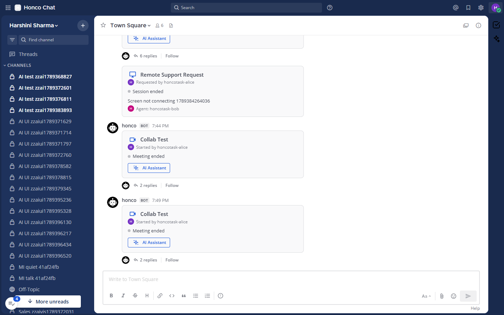<figcaption>Figure 0 — Honco Chat main workspace (Town Square) with a meeting card and a support card, 1440 px, light theme.</figcaption></figure>

## Table of contents

1. What is Honco Chat?
2. Complete system architecture
3. Request / data flow
4. Complete UI map
5. Button-by-button user guide
6. Task management
7. Meetings
8. Jibri recording
9. Meeting Intelligence / summary
10. AI Assistant
11. Remote Support
12. Files & attachments
13. Notifications
14. Global search
15. Admin dashboard
16. Profile / user account
17. Authorization & security
18. Database
19. Project folder structure
20. Code map
21. APIs
22. WebSockets
23. Configuration
24. Running Honco Chat locally
25. Testing
26. Current feature status
27. Known limitations
28. Troubleshooting
29. Common user flows
30. Quick reference

---

# 1. What is Honco Chat?

Honco Chat is Honco's own, self-hosted team collaboration workspace. It is a **customised fork of Mattermost** (an open-source team chat server) extended by one Honco-written plugin, **Honco Workspace** (`com.honco.workspace`), plus a small set of services around it for video meetings, meeting recording, meeting notes, an AI-assistant boundary and an internal remote-support workflow.

**The problem it solves.** A team's conversation, its meetings, the follow-up work, the recordings and the notes normally live in four or five different tools. Honco Chat keeps them in one place, on Honco's own servers, so that:

- a meeting is started from the channel where the discussion is happening, and its card, recording and notes stay in that channel;
- the follow-up becomes a task beside the conversation instead of in a separate tracker;
- an internal "please help me with my screen" request is raised, picked up and closed inside the same workspace, with a record of who did what;
- everything is searchable together.

**What a team can do inside it (today, verified):**

| Area | What works |
|---|---|
| Chat | Everything Mattermost provides: teams, public/private channels, direct and group messages, threads, reactions, mentions, file attachments, message search, notifications, profile settings, System Console. |
| Tasks | Team-scoped tasks with assignee, status, due date, overdue view, filters and paging, with DM notifications. |
| Meetings | `/meet` creates a Jitsi room (now or scheduled), posts a **meeting card** in the channel, tracks who joined/left, ends the meeting when the room empties, and keeps the recording and notes with the card. |
| Recording | Jibri records the Jitsi room; the finished MP4 is delivered to Honco Chat and attached to the meeting card ("View Recording"). |
| Meeting Intelligence | Generates meeting notes (summary, key points, decisions, action items, participants) from the **channel conversation** during the meeting, through a Claude CLI on a separate host. *Currently blocked: that host is unreachable from this box.* |
| AI Assistant | The full UI and secure integration boundary for a live-meeting assistant (transcript, suggestions, insights, topics, post-call summary). *The AI engine itself belongs to another team's service, which is not connected.* |
| Remote Support | Request → agent queue → accept/reject → start/end/cancel, with a card in the channel and an audit trail. The actual remote control is done in RustDesk, outside Honco Chat. |
| Search | One search across tasks, meetings, recordings, summaries and support requests, scoped to what the user may see. |
| Administration | A Honco dashboard (health, usage, files, notifications, AI, security posture) for system admins, alongside Mattermost's System Console. |
| Profile photo | Mattermost's profile picture, relabelled "Profile Photo", shown everywhere including the Honco panels and cards. |

**What makes it different from a plain Mattermost installation:**

1. **De-branded and de-phone-homed.** The vendor's telemetry, crash reporting, update checker, marketplace and hosted push endpoints were removed by scripted, idempotent patches (`chat/branding/*`); the product is "Honco Chat" with its own wordmark.
2. **The Honco Workspace plugin** adds a right-hand panel (Tasks · Meetings · AI Assistant · Support · Search · Admin), two custom post types (meeting card, support card), a second App Bar icon for the AI Assistant, a channel-header button, WebSocket events and nine PostgreSQL tables of its own.
3. **`/meet`** is served by a small Python service (`meetsvc.py`) that creates Jitsi rooms, schedules reminders and registers each meeting with the plugin.
4. **Jitsi + Jibri** run in Docker and call back into Honco Chat when a recording finishes.
5. **Operations scripts** (`honcochat.sh`, `healthcheck.sh`, `backup-honcochat.sh`, `meet/meet.sh`) start, stop, check and back up the whole stack without `sudo`.

**Clearly separated:**

| Existing Mattermost capability (unchanged) | Honco-specific |
|---|---|
| Authentication, sessions, MFA, password policy | Honco Workspace plugin (all of Sections 6–15) |
| Teams, channels, DMs, threads, reactions, mentions | `/meet` service and meeting lifecycle |
| Message search, file attachments, file storage | Jibri recording delivery and recording cards |
| Profile settings, profile picture API and storage | "Profile Photo" wording and success/failure lines; avatars in Honco panels |
| Notifications (desktop, email, mentions) | Honco DM notifications from the `honco` bot with a deduplication ledger |
| System Console | Honco Administration dashboard (read-only) |
| Plugin framework, WebSocket, REST API | De-brand scripts, ops scripts, backups |

> **Note on "Honco Workspace V2".** A separate project (`C:\Users\Dell\Desktop\Honco_Workspace_V2`, Docker containers `honco-workspace-backend/frontend/postgres` on this machine) exists. It is **not** Honco Chat, shares no code or database with it, and is mentioned in this document only where a reader might confuse the two (Section 10 and 27).

---

# 2. Complete system architecture

```
                         ┌──────────────────────────────┐
                         │  Browser / Desktop / Mobile   │
                         │  (Mattermost web client with  │
                         │   the Honco plugin bundle)    │
                         └──────────────┬───────────────┘
                                        │ HTTPS/WS  (LAN: http://<host>:8065 ; public: Cloudflare tunnel)
                                        ▼
   ┌───────────────────────────────────────────────────────────────────────┐
   │  Honco Chat server  (Mattermost 11.11.0 fork, Go)     :8065           │
   │  ┌───────────────────────────────────────────────────────────────┐    │
   │  │  Honco Workspace plugin  com.honco.workspace                   │    │
   │  │  /plugins/com.honco.workspace/api/v1/...                       │    │
   │  │  tasks · meetings · recordings · summaries · AI · support ·    │    │
   │  │  search · admin · notifications · WebSocket events            │    │
   │  └───────────────────────────────────────────────────────────────┘    │
   └───────┬───────────────┬──────────────┬──────────────┬────────────────┘
           │               │              │              │
           ▼               ▼              ▼              ▼
   ┌──────────────┐  ┌───────────┐  ┌──────────┐  ┌─────────────────┐
   │ PostgreSQL 16│  │ meetsvc.py│  │ Local    │  │ SMTP (Gmail,    │
   │ honcochat    │  │ /meet     │  │ file     │  │ STARTTLS :587)  │
   │ 127.0.0.1:   │  │ 127.0.0.1:│  │ storage  │  │ e-mail          │
   │ 5433         │  │ 8077      │  │ run/data │  │ notifications   │
   └──────────────┘  └─────┬─────┘  └──────────┘  └─────────────────┘
                           │ registers meeting (shared secret)
                           ▼
   ┌───────────────────────────────────────────────────────────────┐
   │  Honco Meet  (Docker project honco-meet)                       │
   │  web :8443 · prosody 127.0.0.1:5280 · jicofo · jvb :10000/udp  │
   │  jibri (recorder)  ── finalize hook ──► POST /recordings/complete
   └───────────────────────────────────────────────────────────────┘

   External / other hosts (reached from the plugin, all optional):
     • Summarizer ("mother", 192.168.2.150:31013, SSH forced command → Claude CLI)   [unreachable today]
     • AI service (AIServiceURL, bearer token; pushes events with a callback secret)  [not configured]
     • RustDesk relay (hbbs/hbbr on ubuntu-3)                                          [no API; not on this host]
     • Cloudflare quick tunnel (cloudflared)                                            [binary absent on this box]
```

### 2.1 Component-by-component

| Component | What it does | Why it exists | How Honco talks to it | Local / external | Reachable now? | Known limitations |
|---|---|---|---|---|---|---|
| **Honco Chat server** (`~/honco-chat/build/honcochat`, Mattermost fork) | Chat, users, teams, channels, files, sessions, plugin host. Listens on `:8065`. | The product. | Browser ↔ REST `/api/v4` + WebSocket `/api/v4/websocket`. | Local (WSL) | Yes — `GET /api/v4/system/ping` → `OK` | `SiteURL` is `http://localhost:8065`; a public hostname needs the tunnel and `SiteURL` changed together. |
| **Web client** (`~/honco-workspace/server/webapp/channels/dist`, symlinked as `server/client`) | The React UI. Contains the de-brand and the Profile Photo patches. | Rebuilt from source after every branding script. | Served by the server. | Local | Yes | Rebuild takes 7–17 min and starves the box (see §27). |
| **Honco Workspace plugin** (`plugins/com.honco.workspace`, Go + one JS bundle) | Every Honco feature: Sections 6–15. | Keeps Honco code out of the upstream fork so upstream pulls and de-brand scripts never collide with it. | Runs inside the server; REST under `/plugins/com.honco.workspace/api/v1`; plugin API for posts, users, files, KV, WebSocket. | Local | Yes — enabled, version 0.1.0 | — |
| **PostgreSQL 16** (`~/honco-chat/pgdata`, db `honcochat`, port 5433) | All data: 85 Mattermost tables + 9 Honco tables (94 total). | — | `database/sql` via the plugin's own store (`store.go`) and Mattermost's store. | Local | Yes — health "Healthy · 2–6 ms" | Single instance, no replica. |
| **meetsvc.py** (`~/honco-chat/run/meetsvc.py`, 127.0.0.1:8077) | The `/meet` slash command: instant/scheduled rooms, reminders, list/cancel/history, the schedule dialog. Registers each room with the plugin. | Mattermost slash commands need an HTTP target; scheduling is kept on disk so a restart loses nothing. | Mattermost → meetsvc (slash command POST); meetsvc → plugin `POST /meetings/register` with `X-Honco-Service-Secret`; meetsvc → Mattermost REST with a bot token. | Local | Yes — health "Meeting Service Healthy" | Localhost only by design. |
| **Jitsi** (Docker: web `:8443`, prosody, jicofo, jvb) | The video room. | Self-hosted meetings. | Browser joins `MeetPublicURL/<room>`; plugin asks Prosody (`mod_muc_size`, `127.0.0.1:5280`) who is in the room every 10 s. | Local (Docker Desktop on this machine) | Containers up 8 h; **the admin probe reports "not reachable from this host"** because `MeetPublicURL` is the host LAN address `https://192.168.1.11:8443`, which is not routable from inside WSL right now. Meetings still worked in today's tests. | Self-signed certificate on the LAN; `MeetPublicURL` must be reachable by *participants'* browsers. |
| **Jibri** (Docker) | Records the room to MP4 (1280×720, 25 fps) and runs `finalize.sh`. | Recording. | `finalize.sh` → `POST /recordings/complete` with `X-Jibri-Callback-Secret` (multipart). | Local (Docker) | Yes — health "idle" | One Jibri = one recording at a time; recording only starts when a participant presses Record in Jitsi. |
| **Summarizer** (`summarize/honco-summarize.sh` on host "mother") | Turns a conversation into meeting notes with the Claude CLI. | Claude is authenticated on that host only. | Plugin → `ssh` with a key pinned to a forced command (`SummarizerHost/Port/User/KeyPath`), or a local executable (`SummarizerCommand`). | External host | **No** — `192.168.2.150:22` does not answer from this box; every real generation today fails with "The summarizer is not reachable from this server." | Blocked (§27). |
| **AI service** (another team) | Voice capture, live transcript, suggestions, insights, topics, post-call summary. | Not Honco's engine. | Plugin → `POST {AIServiceURL}/v1/sessions` (bearer token); service → `POST /ai/events` with `X-Honco-AI-Secret`. | External | **Not configured** (`AIServiceURL` empty; overview: `service_configured:false`). | Blocked (§10, §27). |
| **RustDesk** (hbbs/hbbr on ubuntu-3) | Remote control. | Support agents actually take the screen there. | **No integration**: Honco stores no RustDesk credential and calls no RustDesk API; the support card tells the requester to open the RustDesk client. | External host | Not on this host; not tested from here. | Workflow only. |
| **SMTP** (Gmail, `smtp.gmail.com:587`, STARTTLS) | Mattermost e-mail: notifications, password reset, invites. | — | Mattermost's own mailer. | External | Configured (`smtp_configured:true`); sending not exercised in this documentation pass. | Credentials live only in `config.json`. |
| **Cloudflare tunnel** | Publishes `:8065` under a public hostname. | The WSL host's firewall blocks inbound 8065. | `honcochat.sh publish` runs `~/honco-chat/bin/cloudflared tunnel …`. | External | **Binary not present** (`~/honco-chat/bin/cloudflared` missing); tunnel status `down`. | A *quick* tunnel changes hostname on every restart; production needs a named tunnel and `SiteURL` set to it. |
| **Transcription worker** (`transcribe/`, ubuntu-3, GPU) | Batch speech-to-text + notes from recordings (whisper.cpp or the in-house "vixy" model). | Post-call transcripts. | Separate worker; **not called by the plugin**. | External host | Not on this host. | Independent of the AI Assistant and of Meeting Intelligence. |

---

# 3. Request / data flow

### 3.1 The general shape

```
User clicks a control in the Honco panel or on a card
  │
  ▼
Plugin webapp handler (main.js)  ── fetch(..., {credentials:'same-origin', 'X-Requested-With':'XMLHttpRequest'})
  │
  ▼
Mattermost routes /plugins/com.honco.workspace/api/v1/...  →  plugin.ServeHTTP  (plugin.go)
  │   • securityHeaders            (hardening.go)  nosniff / DENY / no-referrer / no-store / Permissions-Policy
  │   • rate limiter               reads 240/min burst 60 · mutations 60/30 · service 60/20 · AI push 300/60
  │   • authentication             Mattermost-User-Id header must be present (set by the server from the session),
  │                                 or a shared-secret header on the three service routes
  ▼
Handler (tasks_api.go, meetings_api.go, ...)
  │   • authorization: team membership / channel membership / creator-or-assignee / support-agent / system admin
  │   • validation: sizes, statuses, ids
  ▼
Store (store.go + feature store files)  →  PostgreSQL  honco_*  tables
Mattermost plugin API                   →  posts, DMs, files, users, KV store
  │
  ▼
JSON response  +  (for meetings/support/AI) a WebSocket event to the channel
  │
  ▼
UI re-renders; other open clients update from the WebSocket event
```

### 3.2 Real examples

**Create task**
```
User → Tasks tab → New task → fills Title / Description / Assignee / Status / Due date → Save task
  → POST /plugins/com.honco.workspace/api/v1/tasks           (tasks_api.go: handleCreateTask)
  → must be a member of the team; assignee must be a member of the same team
  → INSERT honco_tasks                                        (task.go / store.go)
  → if assignee ≠ creator: DM from the honco bot "task_assigned" (notify.go, ledger honco_notifications)
  → 201 JSON task → row appears at the top of the list
```

**Create meeting**
```
User types /meet Client review  (or /meet in 30m …, /meet at 15:00 …, /meet schedule)
  → Mattermost POSTs the slash command to meetsvc.py (127.0.0.1:8077)
  → meetsvc builds the room URL  MEET_BASE/<slug>-<6 hex>  and POSTs /meetings/register (X-Honco-Service-Secret)
  → plugin: INSERT honco_meetings (status active, started_at 0)  +  creates the meeting-card post (custom_honco_meeting)
  → meetsvc answers the slash command (ephemeral reply with the link in a code block)
  → the card is broadcast as "meeting_updated" so open clients render it
```

**Join meeting**
```
User clicks Join Meeting on the card
  → opens card.join_url (MeetPublicURL/<room>) in a new tab — Jitsi prejoin → the room
  → every 10 s the plugin asks Prosody /room-size?room=<room>@<XMPPDomain> (muc.go)
  → first occupant seen: started_at = now, "meeting_started" thread reply; each occupant: honco_meeting_participants
  → card shows "Meeting is active · N participants"; thread replies "joined"/"left"
```

**Recording completion**
```
Participant pressed Record in Jitsi → Jibri writes /storage/<id>/<file>.mp4 + metadata.json
  → Jibri runs /config/finalize.sh (meet/jibri-finalize.sh)
  → POST /recordings/complete  multipart: room_name, status, duration, file   (X-Jibri-Callback-Secret)
  → plugin matches room_name → honco_meetings; size ≤ MaxRecordingMB (0 ⇒ Mattermost MaxFileSize 100 MB)
  → uploads through the Mattermost file API (fileinfo row, stored under run/data/) as the honco bot
  → INSERT honco_recordings (ready | failed) → card gains "View Recording" (or "Recording failed")
  → DM "recording_ready"/"recording_failed" to the meeting creator (deduplicated)
```

**Meeting summary (Meeting Intelligence)**
```
User → Meetings tab → chooses a meeting → Generate summary
  → POST /meetings/{id}/summary                  (summary_api.go)
  → conversation window = meeting created_at … latest recording end (or now), capped at 6 h / 1000 msgs / 200 k chars,
    bot posts excluded (summarizer.go)
  → honco_meeting_summaries status pending → ssh <SummarizerHost> honco-summarize.sh  (or SummarizerCommand)
  → ready (summary, key points, decisions, action items, participants) | empty | failed
  → DM "meeting_summary_ready"/"_failed" with a permalink; card gains View Summary
  TODAY: the SSH host is unreachable → every real generation ends "failed: The summarizer is not reachable from this server."
```

**AI Assistant**
```
User → meeting card "AI Assistant" (or App Bar icon) → panel opens on the AI tab for that meeting → Start AI session
  → POST /meetings/{id}/ai/session        (ai_api.go)  → adapter POST {AIServiceURL}/v1/sessions with the bearer token
  → session stored in the plugin KV store  ai:session:<meeting_id>
  → the service pushes POST /ai/events  (X-Honco-AI-Secret): status / transcript / suggestion / insight / topics / final / error
  → plugin appends to the session, broadcasts "ai_event" on the channel → panel updates live
  → final → DM "AI Meeting Summary Ready" with a permalink; error → "AI Meeting Insights Unavailable"
  TODAY: AIServiceURL is empty → Start returns the honest "not configured / unavailable" state; nothing is faked.
```

**Support request**
```
User → Support tab → Request Support → describes the issue → Send
  → POST /support/requests  (support_api.go)  → INSERT honco_support_requests (open) + honco_support_events (created)
  → support card post in the channel; the support channel (SupportTeamName/SupportChannelName) is notified
  → an agent (member of the support channel) sees it in the queue → Accept Request / Decline → Start Session → End Session
  → every transition: UPDATE request, INSERT event, card re-rendered, "support_updated" WebSocket, DM to the other party
```

**Search**
```
User → Search tab → types a term → Enter (or Mattermost's search box → Honco results button)
  → GET /search?q=…&type=all|tasks|meetings|recordings|summaries|support&page=N   (search_api.go)
  → scope = the caller's teams and channel memberships (searchScope); SQL ILIKE with escaped wildcards
  → grouped pages with totals → results list; clicking a hit opens the relevant tab/post
```

**File upload** (Mattermost, unchanged)
```
User attaches a file → POST /api/v4/files (Mattermost) → fileinfo row + run/data/<date>/… → post carries file_ids
  → readers must be channel members; public links are disabled (EnablePublicLink=false)
```

**Notification**
```
Event (task assigned, recording ready, summary ready, support accepted, …)
  → notify.go claim(kind, subject, recipient, dedupe_key): INSERT honco_notifications (unique index) — second attempt is a no-op
  → DM from the honco bot to the recipient (Mattermost then applies the user's own desktop/e-mail preferences)
```

**Admin dashboard**
```
Admin → Admin tab
  → GET /admin/overview  (system admin only)  — counts from honco_* and Mattermost tables, config flags, recent failures
  → GET /admin/health    — live probes: plugin, PostgreSQL, Jitsi (MeetPublicURL), Jibri (127.0.0.1:2222), meetsvc, plugin state
```

---

# 4. Complete UI map

Verified against the running web client on 14 Sep 2026.

```
LOGIN  (/login — username/e-mail + password; MFA enabled server-wide as an option; "View in Browser" interstitial on first visit)
  │
  ▼
MAIN WORKSPACE (Mattermost)
  ├── Global header: Honco wordmark · search box · @ mentions · saved · settings (gear) · account menu (avatar)
  │     └── Account menu → status · Set custom status · Profile (Profile Settings / Security) · Log out
  ├── Left sidebar: team name · Find channel · Threads · CHANNELS · DIRECT MESSAGES · Add Channels / Invite Members
  ├── Channel view: header (name, members #member_rhs, pinned/files, info) · posts · composer (attach, emoji, formatting)
  ├── Threads (RHS reply view)  ·  Channel members (RHS)  ·  Channel info (RHS)
  ├── App Bar (right edge, desktop):
  │     ├── [Honco Workspace]  → Honco Workspace panel (RHS)
  │     └── [AI Assistant]     → same panel, opened on the AI Assistant tab for the channel's meeting
  ├── Channel header button "Honco Workspace" (shown when the App Bar is hidden / phone channel menu)
  ├── Mattermost search box → "Messages / Files" plus a Honco results button (plugin-registered search component;
  │     search pills are suppressed by Mattermost on an unlicensed server)
  │
  ├── HONCO WORKSPACE PANEL (RHS, tabs; expandable)
  │     ├── Tasks              All statuses ▾ · Mine ☐ · New task · list (title, assignee avatar, due/overdue, status ▾, Edit, Delete) · Previous/Next
  │     ├── Meetings           "Meeting Intelligence": Choose a meeting ▾ · Generate summary / Regenerate / Try again · summary sections
  │     ├── AI Assistant       header (status badge) · Start AI session / Stop session / Reconnect · live blocks · meeting ▾ · AI Meeting Summary
  │     ├── Support            Request Support · my requests · agent queue (Accept Request / Decline / Start Session / End Session / Cancel)
  │     ├── Search             query · All / Tasks / Meetings / Recordings / Summaries / Support · results · paging
  │     └── Admin (admins)     Refresh · System health · Usage · Files · Notifications · AI Assistant · Security · Recent failures
  │
  ├── MEETING CARD (custom post type custom_honco_meeting, posted by the honco bot)
  │     ├── title, "Started by <creator avatar+name>", status line (scheduled / active · N participants / ended), participants
  │     ├── [Join Meeting]        while status ≠ ended and a join_url exists
  │     ├── [AI Assistant]        always (opens the panel on the AI tab for this meeting)
  │     ├── [View Summary]        when has_summary
  │     ├── [View Recording]      when recording_status = ready   (badge "Recording failed" / "Recording unavailable" otherwise)
  │     └── thread replies from the bot: started · joined · left · ended · recording · summary
  │
  ├── SUPPORT CARD (custom_honco_support): "Remote Support Request", requester avatar+name, status dot, issue, agent
  │
  └── PROFILE (account menu → Profile)
        ├── Profile Settings: Full Name · Username · Nickname · Position · Email · **Profile Photo** (Change photo / Save photo / Remove photo / Cancel)
        └── Security: password, MFA, sessions, tokens (Mattermost)
SYSTEM CONSOLE (/admin_console — Mattermost, system admins): users, teams, config, plugins, logs
```

Phone width (≤ 768 px): the left hamburger opens the sidebar; the right "≡" opens the channel menu, which lists Profile, Settings, View Members, … and the Honco Workspace button.

---

# 5. Button-by-button user guide

Each entry: **Location · Who sees it · What happens · Frontend · API · Backend · Storage · Result · Errors.** Frontend is always `plugins/com.honco.workspace/webapp/dist/main.js` (one bundle; the function name is given). API paths are relative to `/plugins/com.honco.workspace/api/v1`.

<figure class="shot">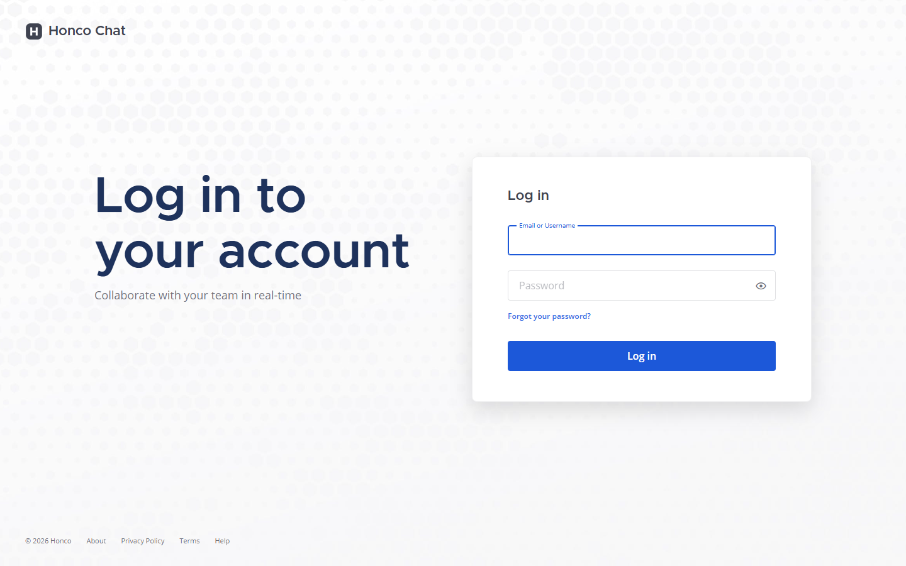<figcaption>Figure 1 — Login page (Honco wordmark; the vendor branding is gone).</figcaption></figure>

### 5.1 Honco Workspace (App Bar icon / channel header button)
- **Location:** right App Bar; on phones, the channel "≡" menu.
- **Who:** every logged-in user.
- **What happens:** toggles the right-hand panel; the last tab is remembered per session; deep links (View Summary, AI Assistant) choose the tab.
- **Frontend:** `Plugin.initialize` → `registerAppBarComponent`, `registerRightHandSidebarComponent`, `registerChannelHeaderButtonAction`; `HoncoPanel`.
- **API:** none on open; each tab fetches on demand. **Errors:** none.

### 5.2 AI Assistant (App Bar icon)
- **Who:** everyone. **What:** opens the panel on the AI tab for the channel's most recent meeting (`GET /channels/{channel_id}/meetings` to find it). **Frontend:** `AIIntent`, `AIPanel`.

<figure class="shot">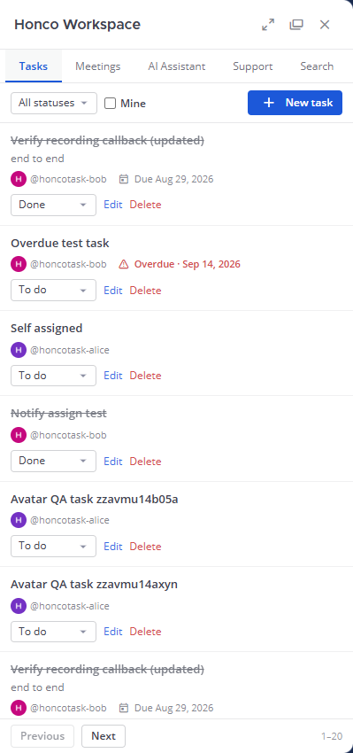<figcaption>Figure 2 — Honco Workspace panel, Tasks tab: filters, New task, rows with assignee avatar, status selector, Edit/Delete, paging.</figcaption></figure>

### 5.3 Tasks tab
| Button | Who | What happens | API / backend | Storage | Result / errors |
|---|---|---|---|---|---|
| **All statuses ▾** | all | filters the list by `todo / in_progress / done` | `GET /tasks?team_id&status&page` · `handleListTasks` | `honco_tasks` | list reloads; the panel asks for 20 per page (server default 60, max 200) |
| **Mine ☐** | all | only tasks assigned to me | `GET /tasks?assignee_id=<me>` | — | — |
| **New task** | all team members | opens the inline form (Title*, Description, Assignee ▾ (team members from `/api/v4/users?in_team`), Status ▾, Due date) | — | — | — |
| **Save task** (create) | all | validates title (required, ≤ 256), status | `POST /tasks` · `handleCreateTask` (`tasks_api.go`) | `INSERT honco_tasks`; `honco_notifications` if assigned | 201; row on top; DM to assignee. Errors: 400 "title is required" / "status must be one of todo, in_progress, done" / "assignee is not a member of this team"; 403 not a team member |
| **Edit** | creator or assignee | opens the same form pre-filled | `PATCH /tasks/{id}` · `handleUpdateTask` | `UPDATE honco_tasks` | reassignment DMs `task_reassigned`; 403 "only the creator or assignee can change this task" |
| **Status ▾** (row) | creator or assignee | changes status in place | `PUT /tasks/{id}/status` · `handleSetTaskStatus` | `UPDATE` | DM `task_status` / `task_completed` to the other party; 403 as above |
| **Delete** → **Yes** | creator only | soft-delete after confirmation | `DELETE /tasks/{id}` · `handleDeleteTask` | `deleted_at = now` | row disappears; 403 "only the creator can delete this task" |
| **Previous / Next** | all | paging | `GET /tasks?page=N` | — | "1–20" counter |

<figure class="shot">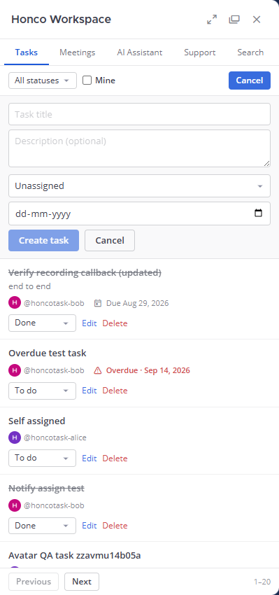<figcaption>Figure 3 — The task form (Title, Description, Assignee, Status, Due date, Save task / Cancel).</figcaption></figure>

### 5.4 Meetings tab (Meeting Intelligence)
| Button | Who | What happens | API / backend | Storage | Result / errors |
|---|---|---|---|---|---|
| **Choose a meeting ▾** | channel members | lists this channel's meetings (newest first) with their summary status | `GET /channels/{channel_id}/meetings` · `handleListChannelMeetings` | `honco_meetings`, `honco_meeting_summaries` | — |
| **Generate summary** | channel members | starts a generation for the chosen meeting | `POST /meetings/{id}/summary` · `handleGenerateSummary` (`summary_api.go`) | `honco_meeting_summaries` pending → ready/empty/failed | polls `GET /meetings/{id}/summary`; ready → sections render; **today: "The summarizer is not reachable from this server."** |
| **Regenerate** | same | new generation replacing the old row | same | same | — |
| **Try again** | same | after a failure | same | same | — |

<figure class="shot"><figcaption>Figure 4 — Meetings tab (Meeting Intelligence) with the one real generation attempt: failed because the summarizer host is unreachable; "Try again" offered.</figcaption></figure>

### 5.5 AI Assistant tab
| Button | Who | What happens | API / backend | Storage | Result / errors |
|---|---|---|---|---|---|
| **Start AI session / Start new AI session** | channel members of the meeting | asks the external service to attach to this meeting | `POST /meetings/{id}/ai/session` · `handleStartAISession` (`ai_api.go`) → `AIIntegrationService.StartSession` (`ai_adapter.go`) | KV `ai:session:<meeting_id>` | status → connecting → live (events arrive). **Today:** service not configured → status `not_configured`/`unavailable`, panel says so; nothing is faked |
| **Stop session** | same | ends the session | `DELETE /meetings/{id}/ai/session` · `handleEndAISession` | KV | status `ended` |
| **Reconnect** | same | re-reads session state after a WebSocket drop | `GET /meetings/{id}/ai` | — | — |
| **Show previous suggestions (N)** / **Load earlier lines** / **Jump to latest** | same | UI only | `GET /meetings/{id}/ai/transcript?before=<seq>` for older lines | KV | — |
| **Meeting ▾** | same | switch between this channel's meetings | `GET /channels/{channel_id}/meetings` | — | — |
| **Transcript** (section toggle) | same | expands the stored transcript | — | — | — |

<figure class="shot">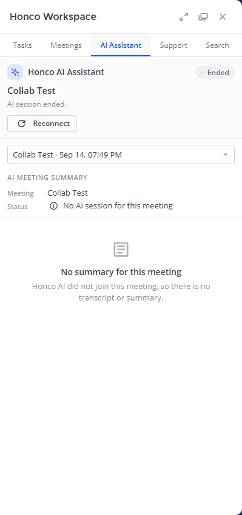<figcaption>Figure 5 — AI Assistant tab for an ended meeting with no session: the honest empty state ("Honco AI did not join this meeting"), Reconnect, meeting selector.</figcaption></figure>

### 5.6 Support tab
| Button | Who | What happens | API / backend | Storage | Result / errors |
|---|---|---|---|---|---|
| **Request Support** → **Send** | everyone | creates a request for the current channel with a free-text issue (≤ 1024 chars; the form warns never to include passwords) | `POST /support/requests` · `handleCreateSupportRequest` (`support_api.go`) | `honco_support_requests` (open), `honco_support_events` (created), support card post | card in the channel; support channel notified; 400 "issue is required"; 403 not a channel member |
| **Cancel** (my request) | requester | cancels while open/accepted | `POST /support/requests/{id}/cancel` | status cancelled + event | card updates |
| **Accept Request** | support agents (members of `SupportChannelName` in `SupportTeamName`) | claims the request | `POST …/accept` · `handleAcceptSupport` | accepted, agent_id | DM to requester `support_accepted`; 403 "not a support agent"; 409 already taken |
| **Decline** | agents | rejects with an optional reason | `POST …/reject` | rejected | DM `support_rejected`; the request stays visible as declined |
| **Start Session** | the assigned agent | marks the remote session active; the card shows the RustDesk hint ("Open the RustDesk client and share your ID with the agent") | `POST …/start` | active, started_at | — |
| **End Session** | the assigned agent | closes it | `POST …/end` | ended, ended_at | DM `support_ended` |
| **Refresh** | all | reloads the list | `GET /support/requests?team_id` | — | — |

<figure class="shot">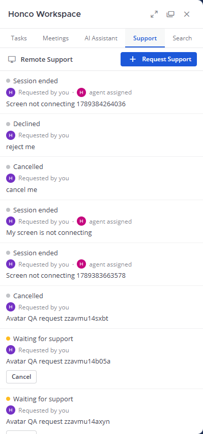<figcaption>Figure 6 — Support tab as a requester (Request Support, own requests).</figcaption></figure>

### 5.7 Search tab
| Control | What happens | API |
|---|---|---|
| query + Enter / **Search** | searches everything the user may see | `GET /search?q=&type=all&page=0` · `handleSearch` (`search_api.go`, `search.go`) |
| **All / Tasks / Meetings / Recordings / Summaries / Support** chips | restricts the type | `type=` |
| **Previous / Next** | paging within a type | `page=` |
| result row | opens the owning tab / channel post | — |

<figure class="shot">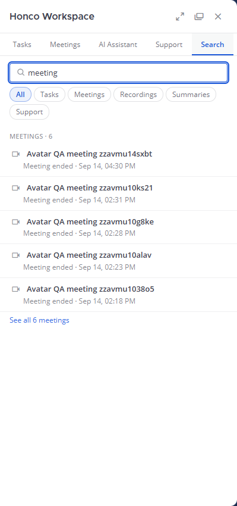<figcaption>Figure 7 — Search tab: query "meeting" grouped by category.</figcaption></figure>

### 5.8 Admin tab (system admins only)
| Control | What happens | API |
|---|---|---|
| **Refresh** | re-runs both calls | `GET /admin/overview`, `GET /admin/health` (`admin_api.go`, `admin_store.go`) |
| sections | read-only figures (see Section 15) | — |

<figure class="shot">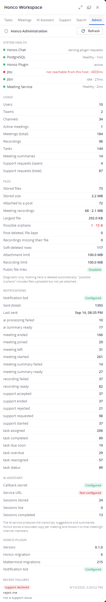<figcaption>Figure 8 — Admin tab (system admin): System health (Jitsi probe reporting "not reachable from this host"), Usage, Files, Notifications, AI Assistant, Security, Recent failures.</figcaption></figure>

### 5.9 Meeting card buttons (`MeetingCard`)
| Button | Shown when | What happens |
|---|---|---|
| **Join Meeting** | `status ≠ ended` and `join_url` | opens `MeetPublicURL/<room>` in a new tab (Jitsi) |
| **AI Assistant** | always | `window.HoncoOpenAIAssistant(meeting_id)` → panel, AI tab, this meeting |
| **View Summary** | `has_summary` | opens the panel on Meeting Intelligence with this meeting selected. **Known defect:** if the panel is closed it does not open it (`MeetingIntent.open` never opens the RHS); works once the panel is open. Found in the audit; not fixed. |
| **View Recording** | `recording_status = ready` | link to `/api/v4/files/<recording_file_id>` (Mattermost file download; channel membership enforced) |
| badge **Recording failed / unavailable** | `recording_status = failed` / file missing | informational |

<figure class="shot">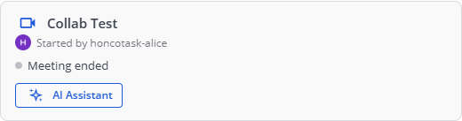<figcaption>Figure 9 — A meeting card in the channel (Started by + avatar, status line, AI Assistant; Join Meeting appears while the meeting is not ended).</figcaption></figure>

### 5.10 Support card (`SupportCard`)
Read-only: "Remote Support Request", requester (avatar + name), status dot (Waiting for support / Accepted / Session active / ended / cancelled / declined), issue, agent. Actions are on the Support tab.

<figure class="shot">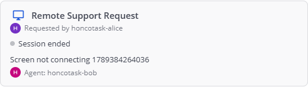<figcaption>Figure 10 — A support card in the channel (requester avatar, status dot, issue, agent).</figcaption></figure>

### 5.11 Profile → Profile Settings → Profile Photo
| Button | What happens | API | Notes |
|---|---|---|---|
| **Edit** | expands the section: current photo, help "JPG, PNG or BMP • maximum size 100MB" | — | — |
| **Change photo** | opens the file picker (`accept=".jpeg,.jpg,.png,.bmp"`) and shows a preview | — | client check: type ∈ {jpeg, png, bmp}, size ≤ `FileSettings.MaxFileSize` |
| **Save photo** | uploads | `POST /api/v4/users/{me}/image` (Mattermost) | success line "Profile photo updated."; failure "Unable to update profile photo. Please try again."; avatar changes everywhere without reload |
| **Remove photo** → **Save photo** | restores the default avatar | `DELETE /api/v4/users/{me}/image` | "Profile photo removed." |
| **Cancel** | discards the choice | — | — |

<figure class="shot">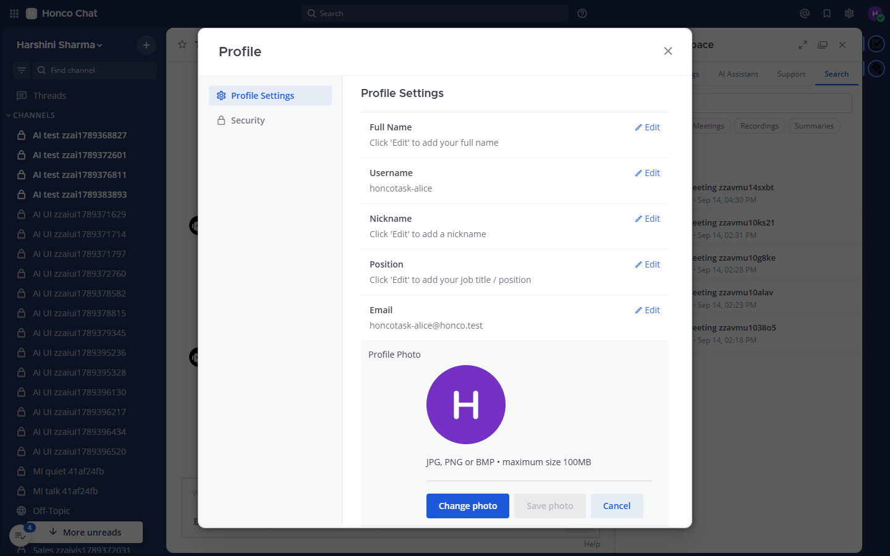<figcaption>Figure 11 — Profile → Profile Settings → Profile Photo, expanded (current photo, help text, Change photo / Save photo / Cancel).</figcaption></figure>

### 5.12 `/meet` slash command (typed in the composer)
| Form | What happens |
|---|---|
| `/meet` | room named after the channel, now |
| `/meet <name>` | named room, now |
| `/meet in 30m <name>` / `/meet at 15:00 <name>` | posts now, reminds the channel at that time (state in `run/meet-schedule.json`) |
| `/meet schedule` | the same as an interactive dialog |
| `/meet list` · `/meet history` · `/meet cancel <id>` | pending reminders · past meetings · drop one |
All forms register the room with the plugin and produce a meeting card; the reply is ephemeral with the link in a code block (Mattermost's own copy button).


---

<figure class="shot">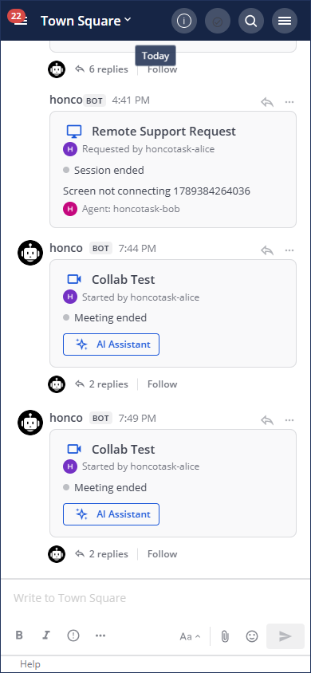<figcaption>Figure 12 — Phone width (390 px): the channel view with cards; the panel is reached from the channel "≡" menu.</figcaption></figure>

# 6. Task management

**Status: DONE.** Verified by `tasks-ux.js` (23/23), `p11-tasks.sh`, `p7-idor.sh`, `p7-paging.sh`, Go unit tests in `task_test.go`.

### 6.1 What a task is
A row in `honco_tasks`: `id, team_id, creator_id, assignee_id, title (≤256), description, status (todo | in_progress | done), due_at, created_at, updated_at, deleted_at`. Tasks are **team-scoped**: every request carries `team_id`, the caller must be a member of that team, and an assignee must be a member of the same team (checked on every create/update through the Mattermost API, not trusted from the browser).

### 6.2 Operations
| Operation | Who may | How | Notification |
|---|---|---|---|
| Create | any team member | `POST /tasks` | assignee (if not the creator): `task_assigned` |
| Edit (title, description, due, assignee) | creator or assignee | `PATCH /tasks/{id}` — pointer fields, so "absent" and "set to empty" differ; `"assignee_id": ""` unassigns | new assignee: `task_assigned`; previous assignee: `task_reassigned` |
| Change status | creator or assignee | `PUT /tasks/{id}/status` | creator when someone else completes: `task_completed`; the other party on other changes: `task_status` |
| Delete | creator only | `DELETE /tasks/{id}` (soft: `deleted_at`) | none |
| List / filter | team member | `GET /tasks?team_id&status&assignee_id&creator_id&due_before&page&limit` | — |
| Due soon / overdue | background | every 10 min (`runDueScanner`): due within 24 h → `task_due_soon`; past due and not done → `task_overdue`; one DM per task per due date | assignee |

Filters in the UI: **All statuses** (todo / in_progress / done), **Mine**. The Overdue state is shown inline in red ("Overdue · date"). Paging: the panel requests 20 rows per page; the server default is 60, maximum 200 (`DefaultTaskPageSize`, `MaxTaskPageSize` in `task.go`).

### 6.3 User flow
```
Tasks tab ──► New task ──► form (Title*, Description, Assignee ▾, Status ▾, Due date) ──► Save task
                                                                                        │
      ┌─────────────────────────────────────────────────────────────────────────────────┘
      ▼
POST /tasks ──► team membership? ──► assignee in team? ──► INSERT honco_tasks ──► 201
      │                                                                          │
      └──── 403 / 400 shown inline in the form ◄───────────────────────────────  │
                                                                                 ▼
                                             row at top of list ◄── DM to assignee (task_assigned, once)
```

### 6.4 Error handling
Validation errors are returned as `{"error": "..."}` with 400 and shown inline under the form ("title is required", "title is too long", "status must be one of todo, in_progress, done", "assignee is not a member of this team"). Authorization failures are 403 with the reason text. The request body is capped at 64 KB (`MaxBytesReader`). Rate limit: 60 mutations/min (burst 30) per user.

### 6.5 Where the code is
| Layer | File |
|---|---|
| UI (form, rows, filters, paging, avatars) | `plugins/com.honco.workspace/webapp/dist/main.js` — `TaskForm`, `TaskRow`, `TasksTab`, `fetchTeamMembers`, `memberLabel` |
| HTTP handlers | `server/tasks_api.go` |
| Model + validation + page sizes | `server/task.go` |
| SQL | `server/store.go` (`CreateTask`, `ListTasks`, …) |
| Notifications | `server/notify.go` (`notifyAssigned`, `notifyUnassigned`, `notifyCompleted`, `notifyStatusChanged`, `scanDueTasks`) |
| Tests | `server/task_test.go`, `server/notify_test.go`, browser `tasks-ux.js`, API `p11-tasks.sh` |

---

# 7. Meetings

**Status: DONE**, with two external caveats (Jitsi public URL reachability from WSL; recording requires a participant to press Record). Verified by `card-e2e.sh` (17), `card-render.js` (8/8 with two real Jitsi participants), `lifecycle-e2e.js` (16/16), `qa-meet.sh`, `meeting_test.go`.

### 7.1 The pieces
| Piece | Role |
|---|---|
| `/meet` (`chat/meetsvc.py`, 127.0.0.1:8077) | Slash-command service. Builds the room URL `MEET_BASE/<slug>-<6 hex>`, handles `in`/`at`/`schedule`/`list`/`history`/`cancel`, keeps reminders in `run/meet-schedule.json` and history in `run/meet-history.json`, registers the room with the plugin. |
| `POST /meetings/register` (`recordings_api.go`) | Service route (`X-Honco-Service-Secret`). Inserts `honco_meetings` (`status active`, `started_at 0`, or `scheduled` with `scheduled_at`) and creates the meeting-card post. |
| Meeting card (`meeting_card.go` + `MeetingCard` in `main.js`) | Custom post type `custom_honco_meeting`; props are display-only (no room secrets, no occupant JIDs); re-rendered on every change through the `meeting_updated` WebSocket event. |
| Jitsi room | `MeetPublicURL/<room>` (config `meetpublicurl`, must equal meetsvc's `MEET_BASE`). |
| Participant poller (`meeting_lifecycle.go`, `muc.go`) | Every 10 s asks Prosody `mod_muc_size` (`ProsodyHTTPURL`, loopback) for the occupants of every non-ended room. |
| `honco_meeting_participants` | One row per occupant (Jitsi display name + occupant key), `joined_at / left_at / present`. These are Jitsi identities, **not** Mattermost users. |

### 7.2 Lifecycle (as implemented)
```
/meet ──► registered: status=active, started_at=0        (or scheduled, until scheduled_at passes)
   │
   │  poller sees ≥1 occupant
   ▼
started_at = now (first person actually seen)  ── thread reply "started"; card "Meeting is active · N participants"
   │  occupants change → participants rows; thread replies "joined" / "left" (batched per poll)
   │
   │  occupants = 0 for 90 s (emptyRoomGrace)
   ▼
status = ended, ended_at = now ── thread reply "ended"; card "Meeting ended"; Join button disappears
   │
   └── never joined: status active for 30 min (neverJoinedTimeout) ──► ended
```
Constants: `participantPollInterval = 10 s`, `emptyRoomGrace = 90 s`, `neverJoinedTimeout = 30 min`. The 90-second path was broken until commit `e9b03ed` (started_at was only stamped on a status transition that never happened for `/meet`-registered meetings); it is now verified end-to-end with two real participants: ended 108 s after the room emptied, and never-joined meetings ended at 30.0–30.1 min.

### 7.3 Card states and buttons
| Card state | Line shown | Buttons |
|---|---|---|
| scheduled | "Scheduled for …" | Join Meeting, AI Assistant |
| active | "Meeting is active · N participants" + names | Join Meeting, AI Assistant, (View Summary / View Recording when available) |
| ended | "Meeting ended" | AI Assistant, View Summary (if any), View Recording / Recording failed / Recording unavailable |

### 7.4 Full flow diagram
```
User ─/meet─► Mattermost ─POST─► meetsvc.py ─register─► plugin ─► honco_meetings + card post ─ws─► all clients
                                                             ▲                                        │
User ─Join Meeting─► Jitsi web :8443 ─► prosody/jicofo/jvb    │ poll 10 s (muc.go)                    │
                                       │                      │                                        │
                                       └─► occupants ─────────┘ ─► participants / started / ended ─ws─┘
                                       │
              participant presses Record ─► jibri ─► MP4 + finalize.sh ─POST /recordings/complete─► plugin
                                                                                                      │
                                                          fileinfo (Mattermost file API) ◄────────────┘
                                                          honco_recordings ready|failed
                                                          card: View Recording · channel post "Recording ready for …"
```

### 7.5 Jitsi configuration (Docker project `honco-meet`, `~/honco-meet`)
`docker-compose.yml` + `jibri.yml` + `docker-compose.override.yml` (Honco's overrides: `mod_muc_size` on Prosody, Jibri callback host, branding). `.env`: `XMPP_DOMAIN=meet.jitsi`, `PUBLIC_URL=https://localhost:${HTTPS_PORT}`, `ENABLE_RECORDING=1`, `JIBRI_RECORDING_DIR=/storage`, `JIBRI_FINALIZE_RECORDING_SCRIPT_PATH=/config/finalize.sh`, `JIBRI_RECORDING_RESOLUTION=1280x720`, `JIBRI_RECORDING_FRAMERATE=25`. Roles: **prosody** (XMPP, room presence — the plugin reads occupancy from it), **jicofo** (conference focus), **jvb** (media bridge, UDP 10000), **web** (the Jitsi UI on 8443), **jibri** (headless Chrome + ffmpeg recorder). `meet/meet.sh {up|down|ps|logs|restart|exec|config}` wraps `docker compose` with the right file set; `meet/setup-jibri.sh` installs the finalize hook and the callback secret file; `meet/brand-meet.sh` and `gen-backgrounds.py` do the Jitsi branding.

### 7.6 Where the code is
`chat/meetsvc.py` · `server/recordings_api.go` (register, complete, list) · `server/meetings_api.go` (get meeting, list by channel, active meetings) · `server/meeting_lifecycle.go` · `server/muc.go` · `server/meeting_card.go` · `main.js` `MeetingCard`, `MeetingsTab`, `MeetingIntent` · tests `meeting_test.go`, `lifecycle-e2e.js`, `card-render.js`, `card-e2e.sh`.

---

# 8. Jibri recording

**Status: DONE** (real end-to-end delivery verified in the audit: room `lan-recording-test-4ebd1b`, 271,429-byte MP4, finalize log "delivered to Honco Chat", row `ready`, playable in the channel).

| Step | What happens | Where |
|---|---|---|
| Start | A participant presses **Record** in the Jitsi toolbar. Jicofo assigns the (single) Jibri, which joins the room as a hidden participant and records with ffmpeg. Honco does **not** start recordings automatically. | Jitsi / Jibri |
| Stop | The participant stops recording or the room empties. Jibri writes `/storage/<recording-id>/<file>.mp4` and `metadata.json` (its `meeting_url` ends in the room name). | Jibri |
| Finalize hook | Jibri runs `/config/finalize.sh` (`meet/jibri-finalize.sh`, installed by `setup-jibri.sh`). It is **not** run when zero media was captured — that case appears as a meeting whose card never gains a recording. The hook reads the callback secret from `/config/honco-callback.secret` (0600, never in git), finds Honco Chat via `/config/honco-chat.host`, `host.docker.internal` or the docker gateway, and POSTs the file. Log: `/storage/finalize.log`. | `meet/jibri-finalize.sh` |
| Callback | `POST /recordings/complete`, multipart (`room_name`, `status`, `duration`, `file`), header `X-Jibri-Callback-Secret` compared in constant time with `JibriCallbackSecret`. Missing/bad secret → 401 and a warning in the server log. Rate-limited as a service route (60/min, burst 20). | `recordings_api.go: handleRecordingComplete` |
| Size limit | `MaxRecordingMB` (0 ⇒ Mattermost `MaxFileSize`, currently 100 MB; hard ceiling 2048). The request body is bounded; an oversized recording is recorded as **failed** with an error message and reported in the channel — never silently dropped. The file is held in memory (~2× its size) while stored. | `recording.go`, `recordings_api.go` |
| Storage | Uploaded through Mattermost's file API as the `honco` bot → a `fileinfo` row and a file under `~/honco-chat/run/data/<date>/…` (`FileSettings.DriverName=local`). `honco_recordings` keeps `file_id, file_name, size_bytes, duration_secs, status`. | Mattermost files |
| Card | `recording_status=ready` + `recording_file_id` → **View Recording** (`/api/v4/files/<id>`; the browser plays the MP4 in Mattermost's media viewer). `failed` → red badge with the reason. `unavailable` → the card checks the file still exists (`GET /api/v4/files/<id>/info`) and shows "Recording unavailable" if it was deleted. | `MeetingCard` |
| Notification | Channel post by the bot: "Recording ready for **topic** (size · N min)" or "Recording failed for **room**. <reason>", deduplicated per recording. | `recordings_api.go` |
| Listing | `GET /channels/{channel_id}/recordings` (channel members). | `recordings_api.go` |

**If Jibri is unavailable:** Jitsi shows "Recording failed to start" (or no Record button when no Jibri is registered); nothing reaches Honco; the meeting card simply never gains a recording. The Admin health card shows Jibri as unavailable (probe of `127.0.0.1:2222`). After a Docker Desktop restart Jibri must be recreated (`OPERATIONS.md` §8) — a known issue.

**Security:** the secret is never in the script; the plugin never trusts the file name for the room (it uses `room_name` and must find a registered meeting); files are readable only by channel members; public links are disabled.

**Testing:** `lan-record-e2e.js` (two real participants, real Record, real delivery), `rec-api-test.sh` (16), `recording-unavailable.js` (8), `recording_test.go`.

---

<figure class="shot"><figcaption>Figure 13 — Meeting Intelligence "empty" result: no messages were posted during that meeting.</figcaption></figure>

# 9. Meeting Intelligence / summary

**Status: BLOCKED (external).** The code path is complete and tested with a stub summarizer, but the real summarizer host is unreachable, so no genuine Claude summary can be produced today.

### 9.1 What it does — precisely
Meeting Intelligence turns the **channel conversation during a meeting** into structured notes. It does **not** transcribe audio: Honco Chat implements no speech-to-text (a separate batch transcription worker exists in `transcribe/` on another host and is not called by Honco Chat).

```
Meeting (honco_meetings)
  │  conversation window: created_at … latest recording end (or now); cap 6 h, 1000 messages, 200 000 chars
  ▼
Channel posts in that window, excluding bot posts and system messages     (summarizer.go: conversationFor)
  │
  ▼
Summary request  POST /meetings/{id}/summary  → honco_meeting_summaries status=pending
  │
  ▼
Claude summarizer:  ssh -i <SummarizerKeyPath> -p <SummarizerPort> <SummarizerUser>@<SummarizerHost>   (forced command → summarize/honco-summarize.sh → claude -p)
                    or, if SummarizerCommand is set, that local executable (stdin conversation → stdout markdown)
  │
  ▼
Parsed into summary · key_points · decisions · action_items · participants (raw_output kept)  → status ready | empty | failed
  │
  ▼
Meetings tab renders the sections; the meeting card gains View Summary; DM "Meeting summary ready/failed" with a permalink
```

Statuses: `pending`, `ready`, `failed`, `empty` (no messages in the window — the honest result for a meeting nobody typed during). A generation older than 15 min still `pending` is treated as stale and can be retried. Timeout `SummarizerTimeoutSeconds` (10–900).

### 9.2 Fields
Summary, Key points, Decisions, Action items, Participants — these are what `honco_meeting_summaries` stores and what the panel shows. **Key Insights, Client Insights and Important Topics are not Meeting Intelligence fields**; they belong to the AI Assistant (Section 10) and come from the external AI service.

### 9.3 Current state (verified 14 Sep 2026)
- Config: `SummarizerHost=192.168.2.150`, port 31013, `SummarizerCommand` empty → SSH path. `192.168.2.150:22` does not answer from this machine; the one real attempt in the database ("Release planning", 9 Sep) is `failed` and the panel shows **"The summarizer is not reachable from this server."** with **Try again**.
- The other `ready` rows in the database are `STUB-ECHO` outputs from test fixtures (`mi-seed-ready.sh` sets `SummarizerCommand` to a stub); they are not Claude output.
- The `empty` state and the whole UI (`meeting-intel.js`), the deep link (View Summary → panel), notifications and the API (`summary_test.go`) are verified.

Code: `server/summarizer.go` (window, transport, parsing), `server/meeting_summary.go` (model, store), `server/summary_api.go` (routes), `summarize/honco-summarize.sh` (runs on "mother"), `main.js` `MeetingsTab` / `SummaryView`.

---

# 10. AI Assistant

**Status: UI and integration infrastructure DONE; real AI E2E BLOCKED (external service not connected).**

### 10.1 Who owns what
| IMPLEMENTED IN HONCO | PROVIDED BY THE EXTERNAL AI SERVICE (other team) |
|---|---|
| Entry points (meeting card button, App Bar icon, panel tab), the whole panel UI (live / completed / idle / error states, transcript paging, suggestions history, dark theme, phone layout, accessibility) | Voice capture and speech recognition |
| Meeting association (`meeting_id` ↔ session) | Live transcript lines |
| `POST /ai/events` callback endpoint with shared-secret authentication, event aliases, bounds | Sales suggestions, insights (concern / sentiment / opportunity), topics |
| Adapter `AIIntegrationService` (`StartSession`, `EndSession`) with SSRF-checked base URL and bearer token held server-side | Post-call summary, action items, transcript reference |
| Session storage in the plugin KV store (`ai:session:<meeting_id>`) | Any AI model |
| WebSocket broadcast `ai_event` to the channel; reconnect handler | — |
| DM notifications "AI Meeting Summary Ready" / "AI Meeting Insights Unavailable" | — |
| Admin card (configured? reachable? sessions live/completed/stored) | — |

Honco Chat does **not** implement an AI engine, STT or transcription for this feature.

### 10.2 States and controls
`not_configured` → (Start) `connecting` → `live` (events arriving) → `ended` (meeting over; final outputs may still arrive) → `completed` (final received) · `unavailable` (service unreachable/refused) · `failed` (service reported an error). Header badge words: Live / Offline / Failed / Ended / Connecting. Controls: **Start AI session** (idle), **Stop session** (live), **Start new AI session** (after end), **Reconnect** (re-read state), **Show previous suggestions (N)**, **Load earlier lines**, **Jump to latest**, meeting selector, **Transcript** toggle.

### 10.3 Flows
```
Browser ──POST /meetings/{id}/ai/session──► plugin ──POST {AIServiceURL}/v1/sessions (Bearer AIServiceToken, callback URL, meeting info)──► AI service
Browser ◄──ai_event (WebSocket)──────────── plugin ◄──POST /ai/events  X-Honco-AI-Secret ─────────────────────────────────────────── AI service
                                                      events: status | transcript | suggestion | insight | topics | final | error (+ aliases)
Browser ──GET /meetings/{id}/ai──────────► plugin (session state, last N lines)      Browser ──GET /meetings/{id}/ai/transcript?before=seq──► older lines
Browser ──DELETE /meetings/{id}/ai/session► plugin ──POST /v1/sessions/{sid}/end──► AI service
```
Authentication: browser routes need a Mattermost session and channel membership for the meeting; the push route needs the callback secret (constant-time compare; unset secret ⇒ every push rejected, 401); the outbound call carries the bearer token, which never reaches a browser or a log (`redactErr`). Rate limit for pushes: 300/min, burst 60. Payloads are size-bounded and JSON-round-tripped to plain maps before broadcast (a struct in a WebSocket payload wedged the gob RPC once — guarded by `TestBroadcastPayloadIsGobSafe`).

### 10.4 Current state
`aiserviceurl` is empty; the callback secret is set. Admin card: `service_configured:false`, `service_reachable:false`, `sessions_stored:24`, `sessions_completed:13` (test sessions driven by the fixture pusher `ai-push.sh`). Pressing Start today produces the honest "not configured" state. No teammate service exists on the network (no ports, compose or config were found; `mother` is unreachable; Honco Workspace V2 is a different product with batch transcription and a Claude Q&A, not this real-time contract).

Code: `server/ai.go` (session model, events, aliases, KV, lifecycle hooks), `server/ai_adapter.go` (service interface, HTTP adapter, URL checks), `server/ai_api.go` (routes, DMs), `server/hardening.go` (`isAIPushRoute`, `limitAIPush`), `main.js` `AIPanel`, `AILive`, `AIFinished`, `SuggestionCard`, `TranscriptBlock`, `AIIntent`, `HoncoAIBus`; contract document `AI_INTEGRATION.md`; tests `ai_test.go` (event aliases, bounds, gob safety), `ai-api.sh` (94), `ai-e2e.js` (56), `ai-entry-e2e.js` (33), `ai-a11y.js` (31), `ai-notif-e2e.js` (10).

---

# 11. Remote Support

**Status: DONE (workflow).** RustDesk itself is an external dependency with **no integration** (by design). Verified by `support-e2e.js` (23/23, two users), `support-api.sh` (43), `support_test.go`.

### 11.1 Roles
- **Requester:** any user, from any channel they belong to.
- **Support agents:** the members of the channel `SupportChannelName` in team `SupportTeamName` (currently `honco-support` in `harshini-sharma`). Add/remove an agent by adding/removing them from that channel. Being a system admin does **not** make someone an agent. If either setting is blank, requests can still be raised but nobody can accept them (fails closed).

### 11.2 State machine
```
        Request Support                     Accept Request              Start Session            End Session
 ──────────────────► open ───────────────────► accepted ─────────────────► active ─────────────────► ended
                       │  Decline (agent)         │  Cancel (requester)      │  Cancel (requester)
                       └──────────► rejected      └──────────► cancelled     └──────────► cancelled
                       └──────────► cancelled (requester)
```
Every transition: optimistic update guarded against concurrent edits (409 "this request was already updated by someone else"), an `honco_support_events` row (`created / accepted / rejected / started / ended / cancelled`, actor, detail) — the audit trail — a re-rendered support card, a `support_updated` WebSocket event, and a DM to the other party (`support_accepted / rejected / started / ended` to the requester; `support_cancelled` to the agent; `support_ended` goes to the agent when the requester ended it). New requests notify the support channel (`notifySupportAgents`, deduplicated).

### 11.3 The RustDesk boundary
When a session is **active** the card and the requester's row show the hint: "Open the RustDesk client and share your ID with the agent." Honco stores no RustDesk credential, calls no RustDesk API and cannot see whether a RustDesk session actually happened. The RustDesk relay (hbbs/hbbr) runs on ubuntu-3 per `README.md`; it is not on this host and was not tested from here. If RustDesk is down, the Honco workflow still works but the agent cannot take the screen — an external dependency.

Tables: `honco_support_requests`, `honco_support_events`. APIs: `POST/GET /support/requests`, `GET /support/requests/{id}`, `POST …/{accept|reject|start|end|cancel}` (`is_agent` is returned by the list call so the UI can show agent controls; the server re-checks on every action). Code: `server/support.go`, `support_api.go`, `support_card.go`; `main.js` `SupportTab`, `SupportCard`, `RustDeskHint`.

---

# 12. Files & attachments

**Status: DONE (Mattermost) + Honco recording handling.** Verified by `files-e2e.js` (32/32), `p8-security.sh` (56), `retention.sh` (5), `files_test.go`.

| Topic | Fact (verified) |
|---|---|
| Normal attachments | Mattermost's own upload (`POST /api/v4/files`), stored under `FileSettings.Directory = ~/honco-chat/run/data/` (driver `local`), organised by date. |
| Recording files | Uploaded by the plugin as the `honco` bot through the same file API, so they are ordinary `fileinfo` rows attached to the recording post. |
| Permissions | A file is readable only by members of the channel of the post it is attached to; a non-member gets 403/404 (verified: alice refused on bob's private channel). |
| Private channel access | As above; Honco search never returns hits from channels the caller is not a member of. |
| Deletion | Deleting the post soft-deletes the file (Mattermost). The meeting card then shows "Recording unavailable" (it probes `/files/{id}/info`). The admin Files card counts `post_deleted_file_kept` and `possible_orphans`. |
| Cache invalidation | Recording links are `/api/v4/files/<id>`; the card re-checks existence when rendered. Profile pictures are keyed by `last_picture_update` (Section 16). |
| Maximum size | `FileSettings.MaxFileSize = 104857600` (100 MB) for uploads; recordings use `MaxRecordingMB` (0 ⇒ same 100 MB). Larger recordings are refused and reported as failed. |
| Public links | `FileSettings.EnablePublicLink = false` — no anonymous file URLs. |
| Playback | The browser plays MP4 recordings in Mattermost's media viewer from the file endpoint; verified with a real Jibri recording. |
| Security | Path traversal on the plugin routes → 301/404 (verified); oversized bodies → 400; security headers on every plugin response. |
| Admin diagnostics | Files card: stored files/bytes, attached to a post, recordings and bytes, largest file, possible orphans, post-deleted-file-kept, recordings missing their file, max sizes, public links flag (`files_admin.go`). |
| Retention | **There is no retention policy.** Nothing deletes files or recordings automatically; `notification` ledger rows older than 90 days are pruned daily (that is the only pruning). Mattermost's own data-retention job is an Enterprise feature and is not available on this Team Edition server. |

---

# 13. Notifications

All Honco notifications are **direct messages from the `honco` bot** (or channel posts for meeting/recording events), each claimed first in the `honco_notifications` ledger (unique `dedupe_key`), so a retried or repeated event never produces a second message. Desktop pop-ups and **e-mail** are then Mattermost's own behaviour for a DM: e-mail is sent by Mattermost only if `SendEmailNotifications` is on (it is), SMTP is configured (it is) and the recipient is away/offline with e-mail notifications enabled in their settings. No Honco code sends e-mail directly. Push notifications are **not** configured (`push_server_configured:false`).

| Event | Recipient | Type | Trigger | Dedupe key | UI behaviour | E-mail |
|---|---|---|---|---|---|---|
| Task assigned | assignee (≠ actor) | DM | create / edit with a new assignee | `task_assigned:<task>:<assignee>:<updated_at>` | DM with task title | Mattermost DM rules |
| Task reassigned | previous assignee | DM | edit changing assignee | `task_reassigned:<task>:<prev>:<updated_at>` | DM | same |
| Task status changed | the other party (creator or assignee) | DM | status change (not to done) | `task_status:<task>:<to>:<updated_at>` | DM | same |
| Task completed | creator (when someone else completes) | DM | status → done | `task_completed:<task>:<updated_at>` | DM | same |
| Task due soon | assignee | DM | scanner, due within 24 h, not done | `task_due_soon:<task>:<due_at>` | once per due date | same |
| Task overdue | assignee | DM | scanner, past due, not done | `task_overdue:<task>:<due_at>` | once per due date | same |
| Meeting scheduled / reminder | channel | channel post by meetsvc's bot token | `/meet in|at|schedule` | meetsvc state file | reminder post at the time | channel rules |
| Meeting started / joined / left / ended | channel (thread under the card) | bot reply | poller transitions | `meeting_<kind>:<meeting>[:names|:ended_at]` | thread replies; card re-renders | — |
| Recording ready | channel | bot post | Jibri callback stored | `recording_ready:<rec>` | "Recording ready for … (size · min)"; card gets View Recording | channel rules |
| Recording failed | channel | bot post | callback refused / oversize / store error | `recording_failed:<rec>` | "Recording failed for … <reason>"; red badge | channel rules |
| Meeting summary ready / failed | requester | DM with permalink | generation finished | `meeting_summary_<kind>:<meeting>:<updated_at>` | "View Summary" appears on the card | DM rules |
| Support requested | support channel | post | new request | `support_requested:<request>` | agents see the queue | channel rules |
| Support accepted / rejected / started / ended | requester (ended → agent if the requester ended it) | DM | transition | `support_<action>:<request>:<updated_at>` | card + row update | DM rules |
| Support cancelled | agent | DM | requester cancels | `support_cancelled:<request>:<updated_at>` | — | DM rules |
| AI summary ready | meeting creator | DM "**AI Meeting Summary Ready**" + permalink | `final` event from the AI service | `ai_summary_ready:<meeting>` | opens the AI tab | DM rules |
| AI failure | meeting creator | DM "**AI Meeting Insights Unavailable**" | `error` event | `ai_processing_failed:<meeting>` | — | DM rules |

Ledger figures today (admin card): task_assigned 206, task_reassigned 57, task_status 89, task_completed 89, due_soon 19, overdue 29, recording_ready 82, recording_failed 37, meeting_started 261, ended 162, summary ready 27 / failed 14, support requested 98 …, ai_summary_ready 17, ai_processing_failed 10. Code: `server/notify.go`, plus the call sites named above; tests `notify_test.go`, `notify_phase4_test.go`, `notif-e2e.sh`, `notif-phase4.sh`, `notifications.js`, `notif-phase4.js`.


---

# 14. Global search

**Status: DONE.** Verified by `search-e2e.js` (27/27), `qa-inj.sh` (injection), `search_test.go`.

| Topic | Fact |
|---|---|
| Native search | Mattermost's search box (Messages / Files) is untouched. The plugin registers a search component (`registerSearchComponents`) that adds a Honco results button; Mattermost suppresses plugin search *pills* on an unlicensed server, so the entry point is the button and the panel's Search tab. |
| Honco search | `GET /search?q=<term>&type=all|tasks|meetings|recordings|summaries|support&page=N&limit=M` (`search_api.go`, `search.go`). Default 20 per page, maximum 50; larger values are clamped, never refused. |
| Categories | **Tasks** (title, description), **Meetings** (topic, room name), **Recordings** (file name, room), **Summaries** (summary text), **Support** (issue). |
| Scope / authorization | `searchScope(userID)` computes the caller's team ids and channel ids once; every query is `team_id IN (...)` or `channel_id IN (...)` (bounded lists). A user in team A never sees team B's rows; private channels the user is not in are excluded (verified: carol sees nothing from the other team's private channel). |
| Filters | type chips; "All" returns one page per category with per-category totals so the UI can say "No Honco results" without adding up pages. |
| Injection | Terms are parameterised; `%`/`_` are escaped for ILIKE (`EscapeLike`); verified with `'; DROP …` style terms — table intact, literal match. |
| Results | Rows open the owning tab or the channel post; the selection survives a refresh. |
| Limitations | Substring ILIKE, no ranking beyond recency (`RankExpr` favours recent rows), no full-text index; message contents are **not** part of Honco search (use Mattermost search). |

---

# 15. Admin dashboard

**Status: DONE.** Verified by `admin-e2e.js` (26/26; 22/26 only when the Jitsi probe times out and the test captures early), `admin-api.sh` (37), `p9-admin-role.sh`.

- **Who:** users with `manage_system` (system admins). The tab is offered only to admins (read from the webapp store) and **every** `/admin/*` call re-checks the permission server-side (`p9-admin-role.sh`: a normal user gets 403 on all of them).
- **What it is not:** it does not replace the System Console (`/admin_console`), which remains Mattermost's configuration area. The Honco dashboard is read-only.

| Section | Metric | Where the number comes from |
|---|---|---|
| System health (`GET /admin/health`) | Honco Chat, PostgreSQL (latency), Honco Plugin (active), Jitsi (HTTP probe of `MeetPublicURL`, 4 s timeout), Jibri (`127.0.0.1:2222` health), Meeting Service (meetsvc `127.0.0.1:8077`) | live probes in `admin_api.go` |
| Usage | Users, Teams, Channels | Mattermost tables |
| | Active meetings, Meetings (total), Recordings, Tasks, Meeting summaries, Support (open/total) | `honco_*` counts (`admin_store.go`) |
| Files | Stored files/size, attached to a post, meeting recordings + bytes, largest file, possible orphans, post-deleted-file-kept, recordings missing file, soft-deleted, max file / recording bytes, public links | `files_admin.go` over `fileinfo` + `honco_recordings` |
| Notifications | bot configured; count per kind | `honco_notifications` grouped by kind |
| AI Assistant | callback configured, service configured/reachable, sessions live / completed / stored | plugin config + KV scan (`adminAI()`) |
| Security | self-signup, MFA, public links, plugins/uploads, signature requirement, e-mail/push, SMTP, push server, Jibri/meet/summarizer/support configured, SiteURL | Mattermost config (booleans only — **no values**) |
| Recent failures | last recording failures, summary failures, support declines | `honco_recordings` failed, `honco_meeting_summaries` failed, `honco_support_events` rejected |
| Versions | plugin 0.1.0, honco migration 6, Mattermost migration 215, bot configured | plugin + `db_migrations` |

Today's readings: 10 users, 2 teams, 34 channels, 184 meetings (3–5 active), 98 recordings, 144 tasks, 14 summaries, 87 support requests (4 open), 73 stored files / 2.2 MB, Jitsi "not reachable from this host · ~4000 ms" (see §27).

---

# 16. Profile / user account

**Status: DONE.** Verified by `auth.js` (20/20), `p9-pwchange.sh`, `profile-photo-e2e.js` (57/57), `avatar-e2e.js` (44/44, two users), `av-api.sh` (29/29).

| Topic | Fact |
|---|---|
| Authentication | Mattermost e-mail/username + password; `EnableMultifactorAuthentication=true` (optional per user); `EnableOpenServer=false` (no self-signup); sessions 4320 h (180 days) for web; password reset by e-mail (verified in the auth suite). Honco changed nothing here except branding text. |
| Profile information | Account menu → **Profile → Profile Settings**: Full Name, Username, Nickname, Position, Email, Profile Photo. **Security**: password change (old password required, verified), MFA, sessions, personal access tokens. |
| Profile photo | Mattermost's profile picture, stored by the server under the user id in the file store (no table besides `Users.LastPictureUpdate`); `POST/DELETE /api/v4/users/{id}/image`, only for the session's own user (403 otherwise, verified); served at `GET /api/v4/users/{id}/image?_={last_picture_update}` (24 h cacheable, the timestamp is the cache key). Honco relabelled the section **Profile Photo** with **Change photo / Save photo / Remove photo**, a preview, "Profile photo updated." / "Profile photo removed." lines and a plain failure message (`chat/branding/profile-photo.py`). |
| Where the avatar appears | Everywhere Mattermost renders a user (messages, threads, DMs, group DMs, member list, popover, pickers, mention search, header) **and** the Honco panels/cards (task assignee, support requester and agent, meeting "Started by") through one `UserAvatar` that uses the same URL and follows `last_picture_update` from the webapp store — no copies. Meeting *participants* are Jitsi display names and keep initials. |
| Normal user can change | own name, username (if allowed), nickname, position, e-mail (password required), photo, password, MFA, notification and display preferences, custom status. |
| Administrator can change | any user's profile, roles, active state, password reset, MFA reset, team membership — in the System Console or `mmctl`. Admins do **not** get extra powers in the Honco panels except the Admin tab. |

---

# 17. Authorization & security

Plain-language summary of what is actually enforced (verified in `p8-security.sh` 56, `p7-idor.sh` 30, `p9-cache-auth.sh` 28, `p9-hardening.sh` 15, `qa-secrets.sh`, `qa-inj.sh`, `av-api.sh`):

| Layer | Rule | How it is enforced |
|---|---|---|
| Authentication | Every plugin route needs a logged-in Mattermost session; anonymous requests get 401 (all routes verified). Three service routes use a shared secret header instead: `/meetings/register` (`X-Honco-Service-Secret`), `/recordings/complete` (`X-Jibri-Callback-Secret`), `/ai/events` (`X-Honco-AI-Secret`); an unset secret rejects everything. | `plugin.go` (`Mattermost-User-Id` header set by the server), `checkSecret` constant-time compare |
| Team membership | Tasks and search are scoped to teams the caller belongs to; assignees must be team members. | `tasks_api.go`, `search_api.go` via the Mattermost API |
| Channel membership | Meetings, recordings, summaries, AI sessions and support requests are visible only to members of their channel (404, not 403, for outsiders so existence is not leaked). | `meetings_api.go`, `summary_api.go`, `ai_api.go`, `support_api.go` |
| Object-level (IDOR) | 30 checks: a user cannot read/modify another team's tasks, another channel's meetings/recordings/summaries/support requests, or another user's AI session, by guessing ids. | `p7-idor.sh` |
| Admin | `/admin/*` require `manage_system`; the UI hint is not authorization. | `admin_api.go` |
| Support agents | Membership of the configured support channel; re-checked on every accept/reject/start/end. | `support_api.go` |
| Self-only | Profile photo, password, profile edits — Mattermost's `SessionHasPermissionToUser`. | Mattermost |
| Cross-team isolation | Verified: two teams, private channel in team B not visible/searchable from team A. | `search-e2e.js`, `p7-idor.sh` |
| Service secrets | Stored only in Mattermost config (`config.json`, 0600) as `secret: true` settings; never returned by any API, never logged (`redactErr`), never in the JS bundle. Sweep of five secret values across bundle, repo, logs, posts and responses: 0 hits. | `qa-secrets.sh` |
| Callback secrets | Jibri: read from a 0600 file in the container, never in the script. AI: header compare. Meet: env file `run/meetsvc.env` 0600. | `meet/jibri-finalize.sh`, `ai_api.go` |
| Rate limiting | Per user (or per IP for service routes): reads 240/min burst 60; mutations 60/30; service 60/20; AI push 300/60 → 429 with `Retry-After: 10`. Mattermost's own `RateLimitSettings.Enable` is false. | `hardening.go` |
| Security headers | On every plugin response: `X-Content-Type-Options: nosniff`, `X-Frame-Options: DENY`, `Referrer-Policy: no-referrer`, `Cache-Control: no-store`, `Permissions-Policy: camera=(), microphone=(), geolocation=()`. | `hardening.go` |
| Input bounds | JSON bodies capped (64 KB for tasks; recordings by `MaxRecordingMB`); titles/issues length-checked; statuses whitelisted; ids validated; ILIKE wildcards escaped. | handlers |
| File access | Channel membership; no public links; recordings via the file API; traversal attempts on plugin routes → 301/404. | Mattermost + `hardening.go` |
| Password/session | Mattermost defaults; password change requires the current password; sessions invalidated on password change (verified). | Mattermost |
| Audit trail | Support: `honco_support_events`. Notifications: `honco_notifications` ledger. Mattermost's own audit log for logins/config. Tasks and meetings keep `created_at/updated_at` but no per-field history. | tables |
| What is **not** claimed | No third-party certification (SOC 2 / ISO / HIPAA / GDPR). No end-to-end encryption. TLS is terminated outside Mattermost (`ConnectionSecurity=""`): plain HTTP on the LAN, HTTPS only through the Cloudflare tunnel. Jitsi on the LAN uses a self-signed certificate. | — |

---

# 18. Database

One PostgreSQL 16 database, **`honcochat`** (`127.0.0.1:5433`, user `honco`), 94 tables: 85 Mattermost tables (`users`, `teams`, `channels`, `posts`, `fileinfo`, `preferences`, `sessions`, `db_migrations` = 215 applied, …) and 9 Honco tables created by the plugin's own migration runner (`store.go`; version table `honco_schema_migrations`, currently 6; migrations are append-only, one transaction each, and never touch Mattermost's schema).

| Feature | Table(s) | Purpose |
|---|---|---|
| Tasks | `honco_tasks` | team-scoped tasks (indexes: team+status, assignee, due) |
| Meetings | `honco_meetings` | one row per `/meet` room: room_name (unique), channel, creator, topic, status, post_id (card), scheduled/started/ended_at, participant_count |
| Participants | `honco_meeting_participants` | Jitsi occupants per meeting (occupant_key unique per meeting), joined/left/present |
| Recordings | `honco_recordings` | delivered recordings: meeting, room, channel, status (ready/failed/unavailable), file_id → Mattermost `fileinfo`, size, duration, error |
| Summaries | `honco_meeting_summaries` | one per meeting (unique): status, summary, key_points, decisions, action_items, participants, raw_output, window, message_count |
| Notifications | `honco_notifications` | deduplication ledger (kind, subject, recipient, unique dedupe_key); rows older than 90 days pruned daily |
| Support | `honco_support_requests`, `honco_support_events` | requests with status/agent/timestamps; audit events per request |
| Migrations | `honco_schema_migrations` | applied Honco migration versions |
| AI sessions | *(no table)* — plugin KV store `ai:session:<meeting_id>` (Mattermost `pluginkeyvaluestore`) | session state, transcript lines, suggestions, final outputs |

Relationships (all by 26-char Mattermost-style ids, no foreign keys — the plugin validates through the Mattermost API instead):
```
teams ──< honco_tasks >── users (creator, assignee)
channels ──< honco_meetings ──< honco_meeting_participants
                 │  └──< honco_recordings ──> fileinfo (file_id)
                 └──1 honco_meeting_summaries
posts (custom_honco_meeting / custom_honco_support) ◄── post_id
teams ──< honco_support_requests ──< honco_support_events ;  users (requester, agent, actor)
honco_notifications (kind, subject_id, recipient_id)  — no relation, ledger only
```
Row counts today: tasks 144 (live), meetings 184, recordings 98, summaries 14, support requests 87, notifications 1389. No secrets are stored in Honco tables. Backups: `chat/backup-honcochat.sh` (`pg_dump` + config + data; see `OPERATIONS.md` §6); restore is documented there and must not be confused with reset — nothing in this document recommends dropping or truncating.

---

# 19. Project folder structure

**Git repository (Windows: `C:\Users\Dell\Desktop\Honco_Chat`)** — "everything Honco-specific"; deliberately excludes the Mattermost and Jitsi sources.
```
Honco_Chat/
├── README.md                 start here: layout, where things run, rebuild from scratch, STT note, secrets policy
├── OPERATIONS.md             run-book: build, deploy plugin, start/stop, health, backup/restore, rollback, recovery, secrets, boundaries
├── AI_INTEGRATION.md         the AI Assistant contract (events, endpoints, security, what is not claimed)
├── CLIENTS.md                desktop/mobile client status (PARTIAL: no source in repo)
├── HONCO_UPGRADE_PLAN.md     the phased plan and the Sep-9 audit (historical; statuses there are older than this document)
├── chat/
│   ├── honcochat.sh          start | publish | stop | stop-all | status  (postgres, server, meetsvc, tunnel)
│   ├── healthcheck.sh        one line per component; --quiet for cron
│   ├── backup-honcochat.sh   pg_dump + config + data archive
│   ├── meetsvc.py            the /meet slash-command service
│   ├── DEBRAND.md            what was removed from upstream and why; how to re-apply after a pull
│   └── branding/             16 idempotent scripts: debrand-*.py/.sh, harden-*.py, patch_push.py, profile-photo.py
├── plugins/com.honco.workspace/
│   ├── plugin.json           manifest + settings schema (all plugin config keys)
│   ├── server/*.go           the plugin (37 files incl. tests) — see Section 20
│   └── webapp/dist/main.js   the whole plugin UI (one hand-written bundle, ~3.9 k lines)
├── meet/                     Jitsi/Jibri: meet.sh, docker-compose.override.yml, jibri-finalize.sh, setup-jibri.sh, brand-meet.sh, lan-address.sh
├── summarize/honco-summarize.sh   the Claude summarizer contract (runs on "mother")
├── transcribe/               batch speech-to-text worker (whisper.cpp / vixy) + notes; runs on ubuntu-3; independent of the plugin
├── dns/                      honco.in → Cloudflare migration notes and verifier
├── website/                  the public landing page (Vite static site; not the app)
└── docs/                     this document (+ images/)
```

**Runtime on WSL (`~/honco-chat`, `$ROOT` in the scripts)**
```
~/honco-chat/
├── build/        honcochat (server binary), mmctl, backups of previous binaries
├── server -> ~/honco-workspace/server      the Mattermost fork checkout (config/config.json = live config, holds secrets, 0600)
├── plugins/      plugin source symlink/copy used by deploy
├── run/          config.json?, honcochat.pid, meetsvc.pid, meetsvc.env (secrets, 0600), meet-schedule.json, meet-history.json,
│                 data/ (Mattermost file storage by date; users/ = profile images), plugins/ + client-plugins/ (installed plugin)
├── pgdata/       PostgreSQL data directory (port 5433)
├── logs/         mattermost.log, honcochat.log, pg.log, tunnel.log
├── backups/      archives from backup-honcochat.sh
├── data/         (empty)
└── lan-address.sh, meetsvc.py (deployed copies)
~/honco-workspace/
├── server/       Mattermost fork: server/ (Go), webapp/channels/ (React; dist/ is served as server/client)
├── plugins/      (plugin build staging)
└── chat/         deployed ops scripts (honcochat.sh lives here for `stop`/`start`)
~/honco-meet/     Jitsi docker project: docker-compose.yml, jibri.yml, docker-compose.override.yml, .env, jibri/ (config, finalize.sh, secret file)
```
"What would I look here for?" — `chat/branding/` when upstream is pulled; `plugins/…/server/` for any Honco behaviour; `webapp/dist/main.js` for any Honco UI; `meet/` for Jitsi/Jibri; `~/honco-chat/logs/` when something fails; `~/honco-chat/run/` for the live state files and pids.

---

# 20. Code map — "If I want to change X, where do I go?"

| I want to change… | Go to |
|---|---|
| Task UI (form, list, filters, avatars) | `webapp/dist/main.js` → `TaskForm`, `TaskRow`, `TasksTab` |
| Task API / rules (who may edit, validation) | `server/tasks_api.go`, `server/task.go` |
| Task storage / SQL | `server/store.go` (task functions), migration 1 |
| Task notifications, due reminders | `server/notify.go` |
| `/meet` command syntax, scheduling, reminders | `chat/meetsvc.py` |
| Meeting registration / recording callback / recording listing | `server/recordings_api.go` |
| Meeting read APIs (get, list by channel, active) | `server/meetings_api.go` |
| Meeting lifecycle (poll interval, 90 s grace, 30 min fallback) | `server/meeting_lifecycle.go`, `server/muc.go` |
| Meeting card look / buttons / thread replies | `server/meeting_card.go` (props, posts), `main.js` → `MeetingCard` |
| Jibri delivery limits and file storage | `server/recording.go`, `meet/jibri-finalize.sh`, `meet/setup-jibri.sh` |
| Meeting Intelligence (window, transport, parsing) | `server/summarizer.go`, `server/meeting_summary.go`, `server/summary_api.go`, `summarize/honco-summarize.sh` |
| AI Assistant UI | `main.js` → `AIPanel`, `AILive`, `AIFinished`, `SuggestionCard`, `TranscriptBlock`, `AIIntent` |
| AI integration (service calls, events, secrets) | `server/ai_adapter.go`, `server/ai_api.go`, `server/ai.go`, `AI_INTEGRATION.md` |
| Support workflow / agents | `server/support.go`, `server/support_api.go`, `server/support_card.go`; `main.js` → `SupportTab`, `SupportCard` |
| Search | `server/search.go`, `server/search_api.go`; `main.js` → `SearchTab` |
| Admin dashboard | `server/admin_api.go`, `server/admin_store.go`, `server/files_admin.go`; `main.js` → `AdminTab` |
| Rate limits, security headers, auth wrapper | `server/hardening.go`, `server/plugin.go`, `server/api.go` (route table) |
| Profile Photo section wording/behaviour | `chat/branding/profile-photo.py` (then rebuild the web client) |
| Avatars in Honco panels | `main.js` → `UserAvatar`, `pictureUpdateOf` |
| Branding, telemetry removal, About dialog | `chat/branding/*` + `chat/DEBRAND.md` |
| Plugin configuration keys | `plugins/com.honco.workspace/plugin.json` (settings schema) + `server/recordings_api.go` (config struct) |
| Database migration | `server/store.go` → append to `migrations` (never edit a shipped entry) |
| Start/stop/publish | `chat/honcochat.sh` |
| Jitsi/Jibri stack | `meet/meet.sh`, `meet/docker-compose.override.yml`, `~/honco-meet/.env` |

---

# 21. APIs

All Honco endpoints live under **`/plugins/com.honco.workspace/api/v1`** (`server/api.go`). Unless stated, **Auth = Mattermost session** (cookie or bearer token; the browser also sends `X-Requested-With: XMLHttpRequest`). Errors are JSON `{"error": "<message>"}`; 401 no session, 403 not allowed, 404 not visible/not found, 400 validation, 409 conflict, 413 too large, 429 rate limited, 500 store error.

### Health
| Method | Path | Purpose | Auth | Source |
|---|---|---|---|---|
| GET | `/health` | plugin liveness (`{"status":"ok"}`) | session | `api.go` |

### Tasks (`tasks_api.go`)
| Method | Path | Purpose | Request | Response |
|---|---|---|---|---|
| POST | `/tasks` | create | `{team_id, title, description?, assignee_id?, status?, due_at?}` | 201 task |
| GET | `/tasks` | list | `?team_id&status&assignee_id&creator_id&due_before&page&limit` | `{tasks:[…]}` (the panel pages with `page`+`limit`; "1–20" is computed client-side) |
| GET | `/tasks/{task_id}` | read | — | task |
| PATCH | `/tasks/{task_id}` | edit (pointer fields) | `{title?, description?, assignee_id?, due_at?}` | task |
| PUT | `/tasks/{task_id}/status` | set status | `{status}` | task |
| DELETE | `/tasks/{task_id}` | soft delete (creator) | — | 204 |

### Meetings & recordings (`recordings_api.go`, `meetings_api.go`)
| Method | Path | Purpose | Auth | Request → Response |
|---|---|---|---|---|
| POST | `/meetings/register` | meetsvc registers a room | `X-Honco-Service-Secret` | `{room_name, channel_id, creator_id, topic, scheduled_at?}` → meeting |
| POST | `/recordings/complete` | Jibri delivers a recording | `X-Jibri-Callback-Secret` | multipart `room_name, status, duration, file` → `{recording}` (or failed row) |
| GET | `/channels/{channel_id}/recordings` | recordings of a channel | member | list |
| GET | `/channels/{channel_id}/meetings` | meetings of a channel (+ summary status; handler lives in `summary_api.go`) | member | `{meetings, summary_status}` |
| GET | `/channels/{channel_id}/active-meetings` | active/scheduled meetings | member | list |
| GET | `/meetings/{meeting_id}` | one meeting (card props) | channel member | meeting |

### Summaries (`summary_api.go`)
| Method | Path | Purpose | Response |
|---|---|---|---|
| POST | `/meetings/{meeting_id}/summary` | start (re)generation | 202 `{status: pending}` (or 200 ready if fresh) |
| GET | `/meetings/{meeting_id}/summary` | read state/result | `{status, summary, key_points, decisions, action_items, participants, error_message, …}` |

### AI Assistant (`ai_api.go`)
| Method | Path | Purpose | Auth |
|---|---|---|---|
| POST | `/ai/events` | service pushes `{meeting_id, event, …}` (status/transcript/suggestion/insight/topics/final/error) | `X-Honco-AI-Secret` |
| GET | `/ai/status` | is the assistant configured/reachable | session |
| GET | `/meetings/{meeting_id}/ai` | session state + recent lines | channel member |
| GET | `/meetings/{meeting_id}/ai/transcript?before=<seq>` | older transcript lines | channel member |
| POST | `/meetings/{meeting_id}/ai/session` | start a session (calls the service) | channel member |
| DELETE | `/meetings/{meeting_id}/ai/session` | end a session | channel member |

### Support (`support_api.go`)
| Method | Path | Purpose |
|---|---|---|
| POST | `/support/requests` | create `{team_id, channel_id, issue}` |
| GET | `/support/requests?team_id` | my requests + (agents) the queue; returns `is_agent` |
| GET | `/support/requests/{request_id}` | one request with its events |
| POST | `/support/requests/{request_id}/accept` · `/reject` · `/start` · `/end` · `/cancel` | transitions (body `{reason?}` for reject) |

### Search (`search_api.go`)
| Method | Path | Purpose |
|---|---|---|
| GET | `/search?q=&type=all|tasks|meetings|recordings|summaries|support&page=&limit=` | grouped results `{query, type, pages:[{type, hits, total, page, limit}]}` |

### Admin (`admin_api.go`) — `manage_system`
| Method | Path | Purpose |
|---|---|---|
| GET | `/admin/overview` | usage, files, notifications, AI, security flags, recent failures, versions |
| GET | `/admin/health` | live component probes |

Endpoints that do **not** exist (so nobody looks for them): no task comments, no meeting create via REST (only `/meet`), no recording start/stop API, no user directory endpoint of Honco's own (the UI uses Mattermost's `/api/v4/users`), no RustDesk API.

---

# 22. WebSockets

Honco uses Mattermost's existing WebSocket (`/api/v4/websocket`) — no second socket. The plugin publishes three custom events; the webapp registers handlers for them and a reconnect handler.

| Event | Sent by | When | Payload (plain JSON maps only — a struct once wedged the plugin RPC) | Receivers | UI change |
|---|---|---|---|---|---|
| `custom_com.honco.workspace_meeting_updated` (`WebSocketEventMeeting`) | `meeting_card.go` | any card change: registered, started, joined/left, ended, recording ready/failed, summary ready | `{post_id, meeting_id, props…}` | everyone in the channel | the meeting card re-renders in place; Meetings/AI selectors refresh |
| `custom_com.honco.workspace_support_updated` (`WebSocketEventSupport`) | `support_api.go` | create and every transition | `{request_id, status, …}` | the requester, the agent, the support channel | Support tab rows and the card update without polling |
| `custom_com.honco.workspace_ai_event` (`WebSocketEventAI`) | `ai.go` | every accepted push from the AI service and every session state change | `{meeting_id, event, seq, data…}` (bounded) | everyone in the meeting's channel | the AI panel appends transcript lines, suggestions, insights, topics; status badge changes; final view renders |
| Mattermost `user_updated`, `posted`, etc. | Mattermost | — | — | — | avatars re-key on `last_picture_update`; cards appear as new posts |

**Reconnect:** `registerReconnectHandler` fires `HoncoReconnectBus`; the AI panel re-reads `GET /meetings/{id}/ai` (so lines missed during a drop are recovered from the stored session), the Support and Meetings tabs reload their lists. The AI panel also shows a *Reconnecting* state while Mattermost's socket is down (it watches the webapp store's `websocket` state).

**Why WebSocket rather than polling:** a meeting card is visible to a whole channel; polling every card from every client every few seconds would hammer the server, whereas the plugin already knows the exact moment a card changes and pushes one event to the channel's connected clients. The only polling in the system is server-side (the 10 s Prosody occupancy poll) and the panel's short poll while a summary is `pending`.


---

# 23. Configuration

Live configuration is `~/honco-workspace/server/server/config/config.json` (0600, `.gitignore`d) — read and changed with `mmctl --local config get|set|patch` (never by hand while the server runs). Plugin keys are lowercase in the file and must be *created* with `config patch` (a `config set` on a new key fails). Secrets are written as **[SECRET — NOT DOCUMENTED]**.

| Area | Key | Current value | Notes |
|---|---|---|---|
| Database | `SqlSettings.DriverName` / `DataSource` | `postgres` / [SECRET — NOT DOCUMENTED] (host 127.0.0.1:5433, db `honcochat`) | PostgreSQL 16 in `~/honco-chat/pgdata` |
| Server | `ServiceSettings.ListenAddress` | `:8065` | all interfaces; the WSL host firewall blocks inbound |
| | `ServiceSettings.SiteURL` | `http://localhost:8065` | must become the public hostname when published, or websockets/e-mail links break |
| | `ServiceSettings.ConnectionSecurity` | `""` | TLS terminated outside (tunnel) |
| | `ServiceSettings.EnableMultifactorAuthentication` | `true` | optional per user |
| | `ServiceSettings.SessionLengthWebInHours` | `4320` | 180 days |
| Teams | `TeamSettings.EnableOpenServer` | `false` | no self-signup |
| Files | `FileSettings.DriverName` / `Directory` | `local` / `~/honco-chat/run/data/` | |
| | `FileSettings.MaxFileSize` | `104857600` (100 MB) | also the recording ceiling when `MaxRecordingMB=0` |
| | `FileSettings.EnablePublicLink` | `false` | |
| E-mail | `EmailSettings.SMTPServer` / `SMTPPort` / `ConnectionSecurity` | `smtp.gmail.com` / `587` / `STARTTLS` | credentials [SECRET — NOT DOCUMENTED] |
| | `EmailSettings.SendEmailNotifications` | `true` | |
| | `EmailSettings.RequireEmailVerification` | `false` | |
| | `EmailSettings.PushNotificationServer` | `""` | push not configured; the fork's own push proxy is built but not deployed |
| Plugins | `PluginSettings.EnableUploads` | `true` | needed for `mmctl plugin add` |
| Rate limiting | `RateLimitSettings.Enable` | `false` | Honco's own limiter covers the plugin routes |
| Privacy | `PrivacySettings.ShowEmailAddress` | `true` | members see each other's e-mail |
| **Plugin** `PluginSettings.Plugins.com.honco.workspace` | `jibricallbacksecret` | [SECRET — NOT DOCUMENTED] | must match `/config/honco-callback.secret` in the Jibri container |
| | `meetservicesecret` | [SECRET — NOT DOCUMENTED] | must match `HONCO_SERVICE_SECRET` in `run/meetsvc.env` |
| | `aiserviceurl` | `""` (empty) | AI service not connected |
| | `aiservicetoken` | [SECRET — NOT DOCUMENTED] | bearer token to the AI service |
| | `aicallbacksecret` | [SECRET — NOT DOCUMENTED] (set) | header `X-Honco-AI-Secret` |
| | `summarizercommand` | `""` | local executable alternative to SSH |
| | `summarizerhost` / `summarizerport` / `summarizeruser` / `summarizerkeypath` / `summarizertimeoutseconds` | `192.168.2.150` / `31013` / (default) / [path, not documented] / (default) | the "mother" host — unreachable today |
| | `meetpublicurl` | `https://192.168.1.11:8443` | must be reachable from participants' browsers; equals meetsvc `MEET_BASE` |
| | `prosodyhttpurl` | `http://127.0.0.1:5280` | loopback only |
| | `xmppdomain` | `meet.jitsi` | matches Jitsi `.env` |
| | `supportteamname` / `supportchannelname` | `harshini-sharma` / `honco-support` | the agents are that channel's members |
| | `maxrecordingmb` | unset ⇒ 0 ⇒ Mattermost limit | hard ceiling 2048 |
| meetsvc (`~/honco-chat/run/meetsvc.env`, 0600) | `BOT_TOKEN`, `HONCO_SERVICE_SECRET` | [SECRET — NOT DOCUMENTED] | plus `MEET_BASE`, `PORT` (8077), `SELF_BASE` |
| Jitsi (`~/honco-meet/.env`) | `XMPP_DOMAIN=meet.jitsi`, `PUBLIC_URL=https://localhost:${HTTPS_PORT}`, `ENABLE_RECORDING=1`, `JIBRI_RECORDING_DIR=/storage`, `JIBRI_FINALIZE_RECORDING_SCRIPT_PATH=/config/finalize.sh`, `JIBRI_RECORDING_RESOLUTION=1280x720`, `JIBRI_RECORDING_FRAMERATE=25`; `JIBRI_*_PASSWORD` [SECRET — NOT DOCUMENTED] | | |
| Jibri container | `/config/honco-callback.secret` [SECRET — NOT DOCUMENTED]; optional `/config/honco-chat.host` | | written by `meet/setup-jibri.sh` |
| Cloudflare | `honcochat.sh publish` → `~/honco-chat/bin/cloudflared tunnel --no-autoupdate …` | binary **absent** on this box | quick tunnel; hostname changes on each restart |
| RustDesk | none in Honco Chat | — | relay is a separate deployment on ubuntu-3 |

---

# 24. Running Honco Chat locally

Everything runs as the normal user on WSL `Ubuntu-22.04` (no `sudo`). Nothing below resets or deletes data.

```bash
# 0. Open a WSL shell
wsl.exe -d Ubuntu-22.04

# 1. Start PostgreSQL, the chat server and the /meet service (in that order — the script does it)
cd ~/honco-workspace/chat
./honcochat.sh start
#   postgres:  already up / started (127.0.0.1:5433)
#   honcochat: up  pid=…  SiteURL=http://localhost:8065
#   meetsvc:   up (pid …)

# 2. Verify the database is reachable (read-only)
psql -h 127.0.0.1 -p 5433 -U honco -d honcochat -c "SELECT version FROM honco_schema_migrations ORDER BY version DESC LIMIT 1;"
#   6

# 3. Verify the server
curl -s http://127.0.0.1:8065/api/v4/system/ping        # {"status":"OK", ...}
./honcochat.sh status                                     # postgres / honcochat / tunnel / meetsvc / SiteURL

# 4. Open the browser
#   http://localhost:8065   (or http://<WSL eth0 IP>:8065 from another device on the LAN — see ~/honco-chat/lan-address.sh)
#   Log in with your Mattermost account. The test accounts used in this document (honcotask-alice/bob/dave/admin) are in
#   ~/.honco-test-credentials (0600) and are not documented here.

# 5. Health of every component
~/honco-workspace/chat/healthcheck.sh                     # one line per component; exit 0 = all healthy
#   or, in the app: Honco Workspace → Admin → System health

# 6. Meetings: start the Jitsi/Jibri stack (Docker Desktop must be running)
cd ~/honco-meet
../honco-workspace/meet/meet.sh up          # or: docker compose -f docker-compose.yml -f jibri.yml -f docker-compose.override.yml up -d
../honco-workspace/meet/meet.sh ps
#   after a Docker Desktop restart, Jibri needs --force-recreate (OPERATIONS.md §8)

# 7. Try the features
#   /meet in any channel → a card appears → Join Meeting → (press Record in Jitsi for a recording)
#   Honco Workspace panel → Tasks → New task ; Support → Request Support ; Search
#   Admin (system admin) → health and usage

# 8. Stop (data is kept)
./honcochat.sh stop          # server + meetsvc ;  ./honcochat.sh stop-all also stops PostgreSQL
```

Rebuilding after code changes: plugin — `cd ~/honco-workspace/plugins/com.honco.workspace && go build ./server/ && go vet ./... && go test ./server/...`, then package and `mmctl --local plugin add --force <tar.gz>` (`OPERATIONS.md` §3 / `deploy-plugin.sh`); web client — run the branding script, then `cd ~/honco-workspace/server/webapp/channels && npm run build` (7–17 min; **run it alone**, see §27). Publishing: `./honcochat.sh publish` needs `cloudflared` installed at `~/honco-chat/bin/cloudflared` (not present today).

---

# 25. Testing

All suites live outside the repository: API/shell suites in the session scratchpad (`…\scratchpad\*.sh`, run inside WSL), browser suites in `C:\Users\Dell\AppData\Local\Temp\honco-browser\*.js` (Playwright driving the real Chrome against `http://localhost:8065`), Go tests in `plugins/com.honco.workspace/server/*_test.go`. Results below are from runs on **14 Sep 2026** against commit `126acc9` on a freshly restarted server (earlier runs the same day are noted where they differ).

| Feature | Test | Expected | Status |
|---|---|---|---|
| Plugin unit tests | `go test ./server/...` (79 tests, `go vet`) | all pass | **PASS** 79/79 |
| Authentication | `auth.js` (login, wrong password, empty, logout, back button, forgot/reset, signup off), `authtest.sh` (28), `p9-pwchange.sh` (5) | sessions, resets, refusals correct | **PASS** 20/20 · 28 · 5 |
| Normal chat | `qa-chat.js` (messages, DMs, threads, reactions, two users) | 16 checks | **PASS** 15/16 — the one miss is the test's own logout producing 401s in the console, not a defect |
| Tasks | `tasks-ux.js` (23), `p11-tasks.sh` (8), `p7-paging.sh` (8), `tasks-responsive.js` | create/edit/assign/status/delete/filters/paging, no overflow at 1500/1100 | **PASS** |
| Meetings | `card-e2e.sh` (17), `card-render.js` (8/8, two real Jitsi participants), `lifecycle-e2e.js` (16/16), `qa-meet.sh` (all `/meet` forms) | card, join/leave tracking, 90 s end, 30 min fallback | **PASS** |
| Jibri recording | `lan-record-e2e.js` (real Record → real MP4 delivered), `rec-api-test.sh` (16), `recording-unavailable.js` (8) | recording delivered, card, failure/unavailable states | **PASS** (real delivery verified in the audit run; API/states re-run today) |
| Notifications | `notif-e2e.sh` (14), `notif-phase4.sh` (22), `notifications.js` (9), `notif-phase4.js` (11), `ai-notif-e2e.js` (10) | DMs once, dedupe, due/overdue, summary/AI DMs | **PASS** |
| Meeting Intelligence | `meeting-intel.js` (16), `summary_test.go` | UI, empty state, failed state, deep link | **PARTIAL / BLOCKED** — 5/16 without the stub: the UI, empty and failed states pass; "ready" rendering is verified only with the stub summarizer; real Claude generation is **BLOCKED** (host unreachable) |
| AI Assistant | `ai-api.sh` (94), `ai-e2e.js` (56), `ai-entry-e2e.js` (33), `ai-a11y.js` (31), `ai_test.go` | UI, events, aliases, auth, bounds, entry points, a11y | **PASS** for everything Honco owns; real AI E2E **BLOCKED** (no service) |
| Remote Support | `support-e2e.js` (23, two users), `support-api.sh` (43) | full workflow, agent rules, audit trail, 409 on races | **PASS** — RustDesk itself **NOT TESTABLE** from here |
| Files | `files-e2e.js` (32), `p8-security.sh` (56), `retention.sh` (5) | upload, permissions, deletion, unavailable, admin diagnostics | **PASS** |
| Search | `search-e2e.js` (27), `qa-inj.sh` | categories, scope, private channels, injection | **PASS** 27/27 (one earlier run never got past the login page — timing, re-run green) |
| Admin | `admin-e2e.js` (26), `admin-api.sh` (37), `p9-admin-role.sh` (5) | admin-only, all cards, figures | **PASS** — 22/26 in one run because the Jitsi probe now takes 4 s and the test captured early; all six health cards verified rendering afterwards |
| Profile / photo | `profile-photo-e2e.js` (57), `avatar-e2e.js` (44, two users), `av-api.sh` (29) | section, validation, preview, save/replace/remove, everywhere, cache keys, permissions | **PASS** |
| Security | `p8-security.sh` (56), `p7-idor.sh` (30), `p9-cache-auth.sh` (28), `p9-hardening.sh` (15), `qa-secrets.sh`, `qa-inj.sh`, `qa-jibri.sh` | 401/403/404 where expected, headers, limits, no secret leaks | **PASS** (audit run, same code paths) |
| UI / responsive / themes | `ui-verify.js` (153), `tasks-responsive.js`, `ai-a11y.js`, `profile-photo-e2e.js` widths 1440→390 | no overflow, light/dark, focus, labels | **PASS** |
| Push notifications, mobile/desktop apps | — | — | **NOT IMPLEMENTED / NOT TESTABLE** (no push server; no client source in repo — `CLIENTS.md`) |
| Cloudflare publish | `honcochat.sh publish` | public hostname | **NOT TESTABLE** — `cloudflared` binary absent |

How to run: browser suites `node <suite>.js` from the `honco-browser` folder (Chrome at `C:\Program Files\Google\Chrome\Application\chrome.exe`; credentials read from `\\wsl$\Ubuntu-22.04\home\harshi\.honco-test-credentials`); shell suites `wsl.exe -d Ubuntu-22.04 bash /mnt/c/…/scratchpad/<suite>.sh`; several suites need their fixture script first (`ai-fixture.sh`, `card-e2e.sh`, `p7-search-fixture.sh`, `p8-files-fixture.sh`, `p6-reset-fixture.sh`). Fixtures create channels/tasks named `zz…` and remove what they can; the cleanup scripts are `ai-clean.sh`, `p19-final-clean.sh`, `p8-clean-orphans.sh`.

---

# 26. Current feature status

| Feature | Status | What works | Limitation / blocker |
|---|---|---|---|
| Chat (Mattermost core) | **DONE** | everything upstream provides | Team Edition: no Enterprise features (retention, compliance, LDAP/SAML) |
| De-brand / de-phone-home | **DONE** | scripted, idempotent, `strings` check clean | must be re-run after every upstream pull (`DEBRAND.md`) |
| Tasks | **DONE** | create/edit/assign/status/delete, overdue, filters, paging, DMs | no comments, no attachments, no per-field history |
| `/meet` + meeting cards + lifecycle | **DONE** | instant/scheduled rooms, reminders, cards, join/leave tracking, 90 s end, 30 min fallback, WebSocket updates | participants are Jitsi names (no Mattermost identity); `MeetPublicURL` must be reachable by participants; "View Summary" does not open a closed panel (defect) |
| Jibri recording | **DONE** | delivery, size guard, card, failure states, channel notice | recording must be started by a participant; one Jibri; Docker restart needs Jibri recreate |
| Meeting Intelligence | **BLOCKED (external)** | request, window, transport, parsing, states, UI, DMs, deep link (with a stub) | real summarizer host unreachable → every real generation fails; no real Claude summary exists in the DB |
| AI Assistant | **DONE (UI + infra) / BLOCKED (real E2E)** | panel, entry points, controls, events, KV, WebSocket, DMs, admin card, security | no AI service exists/configured; Honco owns no engine |
| Remote Support | **DONE (workflow)** | request → accept/decline → start/end/cancel, agents from a channel, audit, cards, DMs | RustDesk is external: no API, not verified from here |
| Files & recordings | **DONE** | permissions, unavailable handling, admin diagnostics | no retention policy (by design/edition) |
| Notifications | **DONE** | 20+ kinds, ledger dedupe, e-mail via Mattermost | no push (no push server) |
| Search | **DONE** | five categories, scoped, paged, injection-safe | ILIKE only; not message content |
| Admin dashboard | **DONE** | health, usage, files, notifications, AI, security, failures | read-only; Jitsi probe reports unreachable from WSL today |
| Profile photo | **DONE** | Mattermost storage + API, Profile Photo section, everywhere incl. Honco panels, live updates, permissions | uploader's own session uses a client-side timestamp until the next event (upstream behaviour) |
| Security hardening | **DONE** | auth on every route, secrets, rate limits, headers, IDOR, cross-team | no TLS at the server (tunnel terminates it); no certification |
| Backups / ops scripts | **DONE** | start/stop/status/health/backup/restore/rollback | `publish` needs `cloudflared` (absent) |
| Cloudflare tunnel | **PARTIAL** | script and DNS notes exist | binary absent; quick tunnel only; `SiteURL` must follow |
| Desktop / mobile apps | **PARTIAL** | backend ready (`CLIENTS.md`); fork of mobile de-branded | no client source in this repo; push not configured |
| Transcription worker | **SEPARATE** | `transcribe/` scripts for ubuntu-3 | not integrated with the plugin; not on this host |
| Landing page (`website/`) | **DONE** | static site, env-driven "Open Honco Chat" | not deployed anywhere |

---

# 27. Known limitations

1. **Summarizer host unreachable** (`192.168.2.150`): Meeting Intelligence cannot generate real notes; the UI reports it honestly.
2. **No AI service**: the AI Assistant has nothing to connect to; `aiserviceurl` is empty.
3. **Jitsi public URL not routable from WSL** (`https://192.168.1.11:8443`): the admin probe shows Jitsi "not reachable from this host" although the containers run and meetings work; the Join button depends on participants reaching that address (phones on the LAN, or the operator changing `MeetPublicURL`).
4. **RustDesk**: workflow only; the relay is on another host; no integration and no verification from here.
5. **`cloudflared` missing** on this box: `honcochat.sh publish` cannot run; even when installed it is a *quick* tunnel (new hostname each restart) — production needs a named tunnel and `SiteURL` set to it.
6. **No TLS at the server**; LAN traffic to `:8065` is plain HTTP; Jitsi uses a self-signed certificate.
7. **Push notifications** not configured (no push server); e-mail only.
8. **Desktop/mobile clients**: no source in this repository (`CLIENTS.md`).
9. **No retention policy** for files/recordings; Team Edition has no data-retention job.
10. **"View Summary" on a meeting card does nothing when the Honco panel is closed** (`MeetingIntent.open` never opens the RHS). Works once the panel is open. Found in the QA audit, not fixed.
11. **Meeting participants are Jitsi display names**, not Mattermost users — no avatars, no per-user history.
12. **Building the web client on this box (8 GB WSL VM) starves PostgreSQL**: on 14 Sep a 17-minute build left the server with poisoned pool connections ("pq: there is already a query being processed on this connection") until it was stopped and started. Build alone, then check the log.
13. **After a Docker Desktop restart Jibri must be recreated** (`OPERATIONS.md` §8).
14. **Test data in the database**: QA fixtures (`zz…` channels/meetings, stub summaries, ~1389 notification rows) are present; cleanup scripts exist but were not all run.
15. **Documentation drift**: `HONCO_UPGRADE_PLAN.md` (Sep 9 audit) predates the lifecycle fix, the AI Assistant, the Profile Photo work and this document; `README.md` "Where things run" describes the production layout (ubuntu3 / ubuntu-3 / mother) while today's verified instance runs everything except the summarizer and RustDesk on one WSL box. Where they disagree, this document reflects the code and the running instance.

---

# 28. Troubleshooting

| Symptom | Possible cause | What to check | Safe check | Expected |
|---|---|---|---|---|
| Honco Chat doesn't start | PostgreSQL not up; stale pid file after a WSL restart (pid reused by another process); config error | `~/honco-chat/logs/honcochat.log`, `mattermost.log` | `./honcochat.sh status` then `./honcochat.sh start` (it verifies the pid's command name before trusting a pid file) | `honcochat: up` |
| Database unavailable | Postgres down; wrong port; pool poisoned after heavy load | `pg.log`; `"already a query being processed"` in `mattermost.log` | `psql -h 127.0.0.1 -p 5433 -U honco -d honcochat -c 'select 1'`; if the server logs pool errors, `./honcochat.sh stop` then `start` | `1`; errors stop |
| Port 8065 already in use | a previous server still running | `ss -ltnp \| grep 8065` | `./honcochat.sh status`; stop it with the script, not `kill -9` | one `honcochat` listener |
| Jitsi unavailable | Docker Desktop not running; containers down; `MeetPublicURL` not reachable from where you are | Admin → System health; `meet.sh ps`; `curl -k https://127.0.0.1:8443` | `meet/meet.sh up` | web/prosody/jicofo/jvb `Up` |
| Jibri unavailable / no Record button | Jibri container down or not registered after a Docker restart | `meet.sh logs jibri`; health probe `127.0.0.1:2222` | recreate Jibri (`docker compose … up -d --force-recreate --no-deps jibri` — `OPERATIONS.md` §8) | Jibri "idle" |
| Meeting doesn't appear after `/meet` | meetsvc down; wrong `HONCO_SERVICE_SECRET` (register 401); bot token invalid | `~/honco-chat/logs/honcochat.log` (meetsvc lines); `mattermost.log` for "registration rejected" | `./honcochat.sh status` → meetsvc up; compare the secret in `run/meetsvc.env` with the plugin setting (do not print them) | card posts |
| Recording unavailable / never arrives | nobody pressed Record; zero media captured; callback secret mismatch (401); file over the limit (failed); file deleted | `/storage/finalize.log` inside Jibri; `mattermost.log` "recording callback rejected"; card badge | `meet.sh exec jibri cat /storage/finalize.log` | "delivered to Honco Chat" |
| AI Assistant offline / not configured | `aiserviceurl` empty (today) or service unreachable; callback secret unset | Admin → AI Assistant card | `mmctl --local config get PluginSettings.Plugins.com.honco.workspace.aiserviceurl` | shows the configured URL; otherwise expected |
| Summary unavailable / "not reachable" | summarizer host down or unreachable (today); key path wrong; timeout | Admin → Recent failures (summary); `mattermost.log` | `nc -z -w2 192.168.2.150 22` from WSL | reachable → retry generation |
| Support: nobody can accept | `SupportTeamName`/`SupportChannelName` blank or wrong; agent not in that channel | Admin → Security "support channel configured" | add the agent to the support channel | Accept Request appears |
| Avatar not updating | browser cached an old key (only possible for a URL without `?_=`); client stamp on the uploader's own session | `GET /api/v4/users/<id>` → `last_picture_update` | reload the page | avatars re-key |
| Files unavailable | user not a channel member; post deleted; storage path moved | card "Recording unavailable"; Admin → Files "recordings missing file" | `ls ~/honco-chat/run/data` | files present |
| WebSocket disconnected (cards/panels stale) | server restarted; tunnel hostname changed while `SiteURL` still old | browser console; `SiteURL` vs the URL in use | `mmctl --local config get ServiceSettings.SiteURL`; the plugin's reconnect handler refreshes panels once the socket returns | live updates resume |

Never: `git reset --hard`, dropping/truncating tables, deleting `pgdata` or `run/data`, editing `config.json` while the server runs.

---

# 29. Common user flows

Each flow: **USER ACTION** → *WHAT THE SYSTEM DOES*.

**A. Send a message** — type in the composer, Enter → *Mattermost `POST /api/v4/posts`; stored in `posts`; broadcast `posted` on the WebSocket; mentions notified.*

**B. Create a task** — Honco Workspace → Tasks → New task → Title (+ Description, Assignee, Status, Due) → Save task → *`POST /tasks`; team membership and assignee checked; `INSERT honco_tasks`; DM to the assignee (once); row appears.*

**C. Assign a task** — Edit → choose Assignee → Save task → *`PATCH /tasks/{id}` with `assignee_id`; only creator/assignee may; new assignee DM `task_assigned`, previous DM `task_reassigned`.*

**D. Schedule a meeting** — `/meet in 30m Client review` (or `/meet at 15:00 …`, `/meet schedule`) → *meetsvc stores the reminder in `meet-schedule.json`, registers the room (status scheduled, `scheduled_at`), posts the card; at the time it posts the reminder with the link.*

**E. Join a meeting** — click **Join Meeting** on the card → *new tab to `MeetPublicURL/<room>`; Jitsi prejoin; the plugin's poller sees the occupant within 10 s, stamps `started_at`, replies "started"/"joined" in the thread, updates the card for everyone.*

**F. Record a meeting** — in Jitsi: ⋯ → Start recording → later Stop → *Jibri joins as a hidden participant, records 1280×720; on stop writes the MP4 and runs `finalize.sh` → `POST /recordings/complete` with the secret → stored via the file API → card shows View Recording; channel post "Recording ready for …".*

**G. View recording** — click **View Recording** → *`GET /api/v4/files/<id>`; Mattermost checks channel membership; plays inline.*

**H. Generate meeting summary** — Honco Workspace → Meetings → choose the meeting → Generate summary → *`POST /meetings/{id}/summary`; conversation window collected; summarizer called over SSH (today: fails "not reachable"); on success sections render, card gets View Summary, DM with permalink.*

**I. Start AI Assistant** — card → AI Assistant (or App Bar icon) → Start AI session → *`POST /meetings/{id}/ai/session` → service `/v1/sessions` (today: not configured → honest offline state); when connected, events arrive on `/ai/events` and stream to the panel by WebSocket; final → DM.*

**J. Create support request** — Honco Workspace → Support → Request Support → describe → Send → *`POST /support/requests`; `honco_support_requests` open + event; support card in the channel; support channel notified.*

**K. Accept support request** — (agent) Support → Accept Request → Start Session → … → End Session → *transitions `accept`/`start`/`end`; events logged; requester DM'd at each step; card shows the RustDesk hint while active; the screen session itself happens in RustDesk.*

**L. Search** — Honco Workspace → Search → term → Enter → *`GET /search?type=all`; scope = my teams/channels; grouped results; click opens the item.*

**M. Upload file** — paperclip in the composer → choose file → send → *Mattermost `POST /api/v4/files` (≤ 100 MB) → `fileinfo` + `run/data/`; visible to channel members only; no public links.*

**N. Admin health check** — (admin) Honco Workspace → Admin → *`GET /admin/overview` + `GET /admin/health`; six live probes (Jitsi may take 4 s); counts from the tables; Refresh re-runs both.*

---

# 30. Quick reference — "Where do I go if I want to…"

| I want to… | Go to |
|---|---|
| Create a task | Honco Workspace → **Tasks → New task** |
| Change task rules or fields | `server/task.go`, `server/tasks_api.go`; UI `main.js` `TaskForm`/`TaskRow` |
| Change meeting behaviour (poll, 90 s, 30 min) | `server/meeting_lifecycle.go` (`participantPollInterval`, `emptyRoomGrace`, `neverJoinedTimeout`) |
| Change `/meet` syntax or reminders | `chat/meetsvc.py` (then restart with `honcochat.sh stop`/`start`) |
| Change the meeting card | `server/meeting_card.go` + `main.js` `MeetingCard` |
| Change a notification text or recipient | `server/notify.go` (tasks, summaries), `recordings_api.go` (recordings), `support_card.go` (support), `ai_api.go` (AI) |
| Change the AI Assistant UI | `main.js` `AIPanel` and friends; `.hw-ai-*` styles in the same file |
| Change the AI integration (service URL, events, secret) | `server/ai_adapter.go`, `ai_api.go`, `ai.go`; config keys in `plugin.json`; contract `AI_INTEGRATION.md` |
| Change the support workflow or who is an agent | `server/support.go`/`support_api.go`; agents = members of `SupportChannelName` |
| Change the admin dashboard | `server/admin_api.go`, `admin_store.go`, `files_admin.go`; UI `main.js` `AdminTab` |
| Change search | `server/search.go` (queries/scope), `search_api.go`; UI `SearchTab` |
| Change profile/avatar wording | `chat/branding/profile-photo.py` → rebuild the web client |
| Change avatars in Honco panels | `main.js` `UserAvatar` |
| Change Jibri (limits, hook, resolution) | `server/recording.go` (`MaxRecordingMB`), `meet/jibri-finalize.sh`, `meet/setup-jibri.sh`, `~/honco-meet/.env` |
| Add a database migration | append to `migrations` in `server/store.go`; never edit a shipped entry; plugin redeploy applies it |
| Add a plugin config key | `plugin.json` settings schema + config struct in `recordings_api.go`; create it with `mmctl --local config patch` |
| Add a route | `server/api.go` `newRouter` (+ `hardening.go` if it is a service or push route) |
| Re-apply the de-brand after an upstream pull | `chat/DEBRAND.md` — run the scripts in order, rebuild, `strings` check |
| Start / stop / status | `~/honco-workspace/chat/honcochat.sh {start|stop|stop-all|status|publish}` |
| See health | `healthcheck.sh` or Admin → System health |
| Back up | `chat/backup-honcochat.sh` (`OPERATIONS.md` §6) |
| Find the logs | `~/honco-chat/logs/{mattermost,honcochat,pg,tunnel}.log`; Jibri `/storage/finalize.log` |

---

*End of document. Generated from the codebase at commit `126acc9` on 14 September 2026. Items marked BLOCKED or NOT TESTABLE depend on systems outside this machine and were not simulated.*
