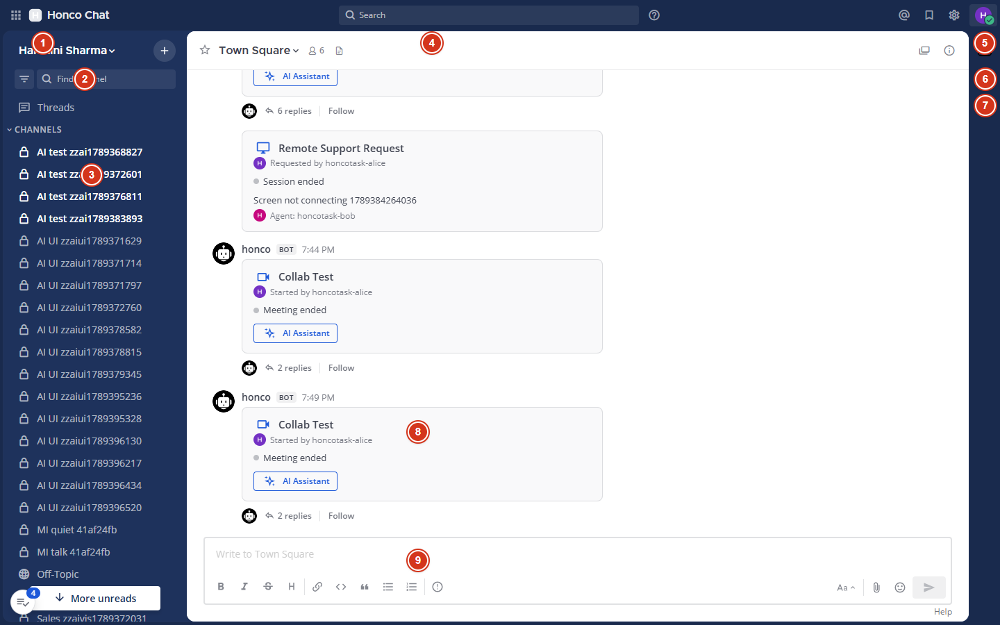
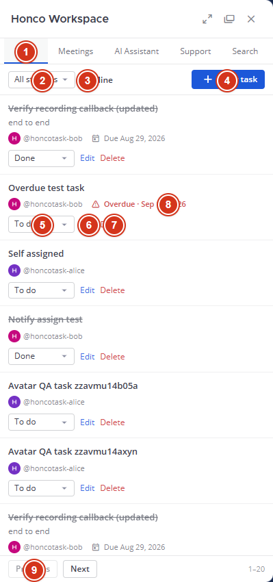
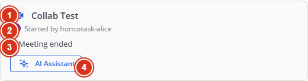
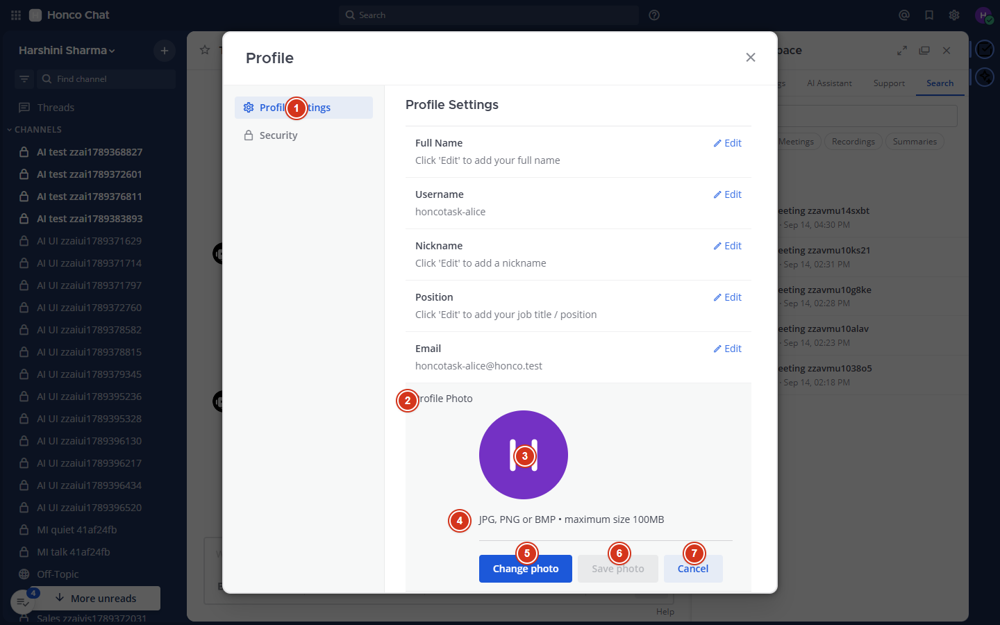
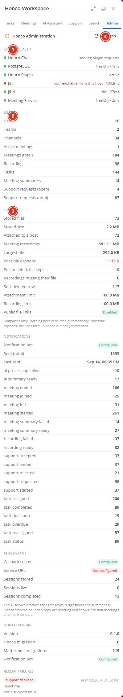

# HONCO CHAT

## Complete Project Learning & Developer Guide

**"Understand the product, follow the data, find the code."**

| | |
|---|---|
| Guide version | 1.0 — 14 September 2026 |
| Code documented | Git commit `126acc9` on `main` (documentation commit `72e3153`) |
| Companion reference | `docs/HONCO_CHAT_COMPLETE_DOCUMENTATION.pdf` (the exhaustive technical reference — use it when you need every field and every route; use *this* guide to understand) |
| Who this is for | A developer or team member who did not build Honco Chat and needs to understand it well enough to change it safely |
| How it was verified | Every file name, route, table and status below was checked against the current source, the running instance and the test suites on 14 Sep 2026. Anything that could not be checked is marked **"Not verified in current environment."** |

> **How to read this guide.** Parts 1–5 give you the mental model. Part 6 is the heart: every important button, what it does, and which file to open. Parts 7–22 teach each feature area from zero. Parts 23–25 are the practical toolkit (run it, debug it, find the code). Parts 26–30 are the status, the boundaries, the FAQ, the user journeys and a cheat sheet you can print.

---

<figure class="shot"><figcaption>Figure 0 — The login page of the running Honco Chat (the vendor branding is replaced by the Honco wordmark).</figcaption></figure>

## Table of contents

1. Understand Honco Chat first
2. The big picture
3. Frontend vs backend vs database
4. The Honco Workspace plugin
5. UI map
6. Button-by-button explanation
7. Task management
8. Meeting system
9. Jitsi
10. Jibri recording
11. Meeting Intelligence
12. AI Assistant
13. Remote Support
14. Files
15. Notifications
16. Search
17. Admin dashboard
18. Profile & avatar
19. Database
20. API concept
21. WebSockets
22. Security
23. How to run the project
24. How to debug
25. Code navigation
26. Feature status
27. What is not our responsibility
28. Common questions
29. Complete user journeys
30. One-page project cheat sheet

---

# 1. Understand Honco Chat first

### What is Honco Chat?
Honco Chat is Honco's own team-chat application. People log in, join channels, send messages, start video meetings, record them, keep track of tasks, ask for help with their computer, and search all of it — inside one web application that runs on Honco's own servers, not on a vendor's cloud.

### Why does it exist?
Without it, a team's conversation lives in one tool, meetings in another, follow-up tasks in a third, recordings on someone's disk and "can you look at my screen?" in a phone call. Honco Chat keeps those things **next to each other**: the meeting is started from the channel where the discussion happened, the recording and the notes land on the same card, the follow-up becomes a task beside the conversation, and everything is searchable together.

### What is Mattermost?
**Mattermost** is an open-source team-chat server (think of Slack, but software you install and run yourself). It provides users, teams, channels, direct messages, threads, file attachments, search, notifications, an admin console, a REST API, a WebSocket and — importantly — a **plugin system** that lets you add features without editing its core.

### Why is Honco based on Mattermost?
Because chat is a solved problem. Writing a reliable chat server (accounts, permissions, message history, mobile apps, file handling) would take years. Mattermost gives all of that, under a licence that allows Honco to modify and self-host it. Honco's effort goes into what is *specific to Honco*: meetings, recording, tasks, support, AI integration and administration.

### What has Honco customized?
Two kinds of changes:

1. **The fork ("de-brand").** Honco keeps a modified copy of the Mattermost source. Scripts in `chat/branding/` remove the vendor's telemetry ("phone-home" calls), crash reporting, update checker, marketplace and hosted push endpoints, replace the logo and product name with "Honco Chat", and (most recently) relabel the profile picture section as "Profile Photo". These scripts are **idempotent** (running them twice changes nothing more) so they can be re-applied after every upstream update.
2. **The Honco Workspace plugin** (`plugins/com.honco.workspace`). All the Honco features live here, outside the Mattermost core: a right-hand panel with Tasks, Meetings, AI Assistant, Support, Search and Admin tabs; meeting and support "cards" in channels; the `/meet` integration; the recording callback; notifications; nine database tables of its own.

### Native Mattermost vs added by Honco

| Native Mattermost (unchanged) | Added or customized by Honco |
|---|---|
| Login, passwords, MFA, sessions | Honco Workspace panel (Tasks · Meetings · AI Assistant · Support · Search · Admin) |
| Teams, channels, DMs, group DMs, threads, reactions, mentions | `/meet` command service and meeting cards with a live lifecycle |
| Message and file search | Jibri recording delivery to the meeting card |
| File attachments and storage | Meeting Intelligence (notes from the channel conversation, via a Claude summarizer) |
| Profile settings and profile picture storage | "Profile Photo" wording and success/failure messages; avatars inside Honco panels |
| Desktop/e-mail notifications | Honco notifications from the `honco` bot (with "send once" protection) |
| System Console | Honco Administration dashboard |
| Plugin framework, REST API, WebSocket | De-brand scripts, start/stop/backup scripts |

> **Not part of Honco Chat:** "Honco Workspace V2" (a separate project and separate Docker containers on the same machine). It shares no code and no database with Honco Chat. When this guide says "Honco Workspace" it always means the *plugin inside Honco Chat*.

---

# 2. The big picture

```
        USER  (a person at a browser, desktop or phone)
          │
          ▼
        BROWSER  — the Mattermost web client + the Honco plugin's JavaScript
          │   HTTP requests (REST) and one WebSocket connection
          ▼
   ┌────────────────────────────────────────────────┐
   │ HONCO CHAT / MATTERMOST SERVER   (Go, port 8065)│
   │   ┌────────────────────────────────────────┐   │
   │   │ HONCO WORKSPACE PLUGIN  (Go + JS)      │   │
   │   │ tasks · meetings · recordings · AI ·   │   │
   │   │ support · search · admin · notifications│   │
   │   └────────────────────────────────────────┘   │
   └────────────────────────┬───────────────────────┘
                            │ SQL
                            ▼
                     POSTGRESQL  (database "honcochat", port 5433)
```

External services around it:

```
                       ┌── Jitsi ─────────► video meetings (the room people join)
                       ├── Jibri ─────────► recording (turns a meeting into an MP4)
   HONCO CHAT ─────────┼── AI service ────► AI Assistant (live transcript, suggestions, summary) [not connected]
                       ├── Claude ────────► Meeting Intelligence (notes from the conversation)  [unreachable today]
                       ├── RustDesk ──────► Remote Support (the actual screen control)          [separate host]
                       ├── SMTP ──────────► e-mail (notifications, password reset)
                       └── Cloudflare ────► a public address for the server                    [binary missing]
```

### Every box in simple language

| Box | What is it? | What does it do? | Why do we need it? |
|---|---|---|---|
| **Browser** | The user's web browser (Chrome, Edge, …) running the Honco Chat web client. | Draws the screens, reacts to clicks, talks to the server. | It is how people use the product. |
| **Honco Chat / Mattermost server** | One Go program (`~/honco-chat/build/honcochat`) listening on port 8065. | Logs users in, stores messages, serves files, hosts plugins, pushes live updates. | The core of the product. |
| **Honco Workspace plugin** | Honco's own code, loaded *inside* the server (a Go part) and *inside* the browser (a JavaScript part). | Everything Honco-specific. | Keeps Honco's features separate from Mattermost's code so updates don't collide. |
| **PostgreSQL** | A database server (port 5433). | Stores every message, user, channel, file record, and Honco's tasks, meetings, recordings, summaries, support requests and notification ledger. | Data must survive restarts and be queried quickly. |
| **meetsvc.py** (not in the diagram: a small helper) | A Python program on port 8077 (localhost only). | Answers the `/meet` command: creates a room address, schedules reminders, registers the meeting with the plugin. | Mattermost slash commands need a web service to talk to. |
| **Jitsi** | Open-source video-conferencing software running in Docker on this machine. | Provides the actual audio/video room. | Honco does not build video; it uses Jitsi. |
| **Jibri** | Jitsi's recorder (Docker). | Joins a room invisibly, records it to an MP4, then calls Honco Chat. | Recordings. |
| **AI service** | Another team's service (voice recognition, live transcript, suggestions, summary). | Sends events to Honco while a meeting runs. | Honco shows its output; Honco does not own the AI. **Not connected today.** |
| **Claude summarizer** | A script on another host ("mother") that runs the Claude command-line tool. | Turns the channel conversation of a meeting into notes. | Meeting Intelligence. **That host is unreachable today.** |
| **RustDesk** | Open-source remote-desktop software (relay on another host). | Lets a support agent see and control a colleague's screen. | Honco only manages the *request workflow*; the screen session happens in RustDesk. |
| **SMTP** | An e-mail sending server (Gmail, STARTTLS on port 587). | Mattermost sends notification and password-reset e-mails through it. | E-mail. |
| **Cloudflare tunnel** | A program (`cloudflared`) that publishes the server under a public hostname. | Makes Honco Chat reachable from the internet without opening firewall ports. | Public access. **The binary is not installed on this machine.** |

---

# 3. Frontend vs backend vs database

Every web application has three layers. Knowing which layer you are in tells you which language you are reading and which file to open.

### FRONTEND — what the user sees
- **What it is:** JavaScript that runs *in the browser*. Mattermost's web client is written in React (a JavaScript library for building screens). The Honco plugin's user interface is one hand-written JavaScript file that plugs into it.
- **What happens on a click:** a JavaScript function runs. It usually (1) collects what the user typed, (2) sends a request to the server, (3) waits for the answer, (4) redraws part of the screen.
- **Where the code lives:** Honco UI → `plugins/com.honco.workspace/webapp/dist/main.js` (about 3,900 lines, plain JavaScript, no build step). Mattermost UI → the fork at `~/honco-workspace/server/webapp/channels/src` (React/TypeScript; only touched through the branding scripts).

### BACKEND — the server that does the work
- **What it does:** receives requests, checks *who* is asking and *whether they may*, applies the rules, reads/writes the database, and answers.
- **REST API:** an **API** ("application programming interface") is the set of URLs the frontend can call. **REST** just means those URLs follow web conventions: `GET` to read, `POST` to create, `PATCH` to change, `DELETE` to remove, and the answer comes back as **JSON** (text formatted like `{"title": "Fix login"}`).
- **Where the code lives:** Honco backend → `plugins/com.honco.workspace/server/*.go` (Go language). Mattermost backend → the fork at `~/honco-workspace/server/server` (Go; not modified except by the de-brand scripts).

### DATABASE — where data is kept
- **What PostgreSQL does:** stores tables of rows, guarantees they are saved even if the server crashes, and answers queries like "all tasks in team X that are not done".
- **What is stored:** everything Mattermost knows (users, teams, channels, posts, file records, preferences, sessions — 85 tables) and everything Honco adds (9 tables: tasks, meetings, participants, recordings, summaries, notifications, support requests, support events, migration versions).

### One simple example — CREATE TASK

```
User clicks "New task", fills the form, clicks "Save task"
  ↓
FRONTEND   main.js → TaskForm: reads the fields, calls fetch('POST /plugins/com.honco.workspace/api/v1/tasks', {title, ...})
  ↓
API REQUEST  travels to the server as JSON, with the user's login cookie
  ↓
GO BACKEND   Mattermost checks the cookie → it is user "alice" → adds the header Mattermost-User-Id → hands the request to the plugin
  ↓
HONCO PLUGIN tasks_api.go → handleCreateTask: is alice a member of this team? is the assignee in the team? is the title valid?
  ↓
POSTGRESQL   store.go → INSERT INTO honco_tasks (...)
  ↓
RESPONSE     201 Created + the task as JSON; if someone else was assigned, a DM from the "honco" bot is sent (notify.go)
  ↓
UI           TaskForm closes, the new row appears at the top of the Tasks list
```

---

# 4. The Honco Workspace plugin

### What is it?
A **plugin** is a package of code that a host program loads to gain features. Mattermost plugins have two halves: a **server half** (Go, run by the Mattermost server as a separate process and talked to over an internal connection) and a **webapp half** (JavaScript, loaded into every user's browser). The Honco Workspace plugin (`com.honco.workspace`, version 0.1.0) has both.

### Why a plugin instead of editing Mattermost?
- Mattermost gets updates; a plugin survives them unchanged, while edits inside Mattermost's code would have to be redone (that is why even the branding is a *script*, not hand edits).
- The plugin has its own database tables, own URLs and own JavaScript, so a mistake in Honco code cannot corrupt Mattermost's data.
- It can be built, tested and redeployed on its own in a minute.

### What does it own?
Tasks · meeting registration, cards and lifecycle · recording callback and cards · Meeting Intelligence · AI Assistant UI and integration · Remote Support workflow · Honco global search · Admin dashboard · Honco notifications · the security layer around all of that (authentication check, rate limits, security headers).

### How does it talk to Mattermost?
- **Incoming:** every URL under `/plugins/com.honco.workspace/api/v1/…` is routed by Mattermost to the plugin's `ServeHTTP`. Mattermost has already identified the user and sets the `Mattermost-User-Id` header (a browser cannot forge it — the server strips any client-supplied copy).
- **Outgoing:** the plugin uses Mattermost's *plugin API* to create posts and direct messages (as the `honco` bot), read users/teams/channels/memberships, upload files, store small key-value data, and publish WebSocket events.

### Where it is
Source in the Git repository: `plugins/com.honco.workspace/`. Installed copy on the server: `~/honco-chat/run/plugins/com.honco.workspace/` (never edit that one; redeploy instead).

```
plugins/com.honco.workspace/
├── plugin.json                 manifest: id, version, and the SETTINGS SCHEMA (every configuration key, which are secret)
├── server/                     the Go half
│   ├── main.go                 program entry (starts the plugin)
│   ├── plugin.go               OnActivate (migrations, bot, background jobs), ServeHTTP (the front door)
│   ├── api.go                  THE ROUTE TABLE: every URL → handler; requireUser; membership helpers
│   ├── hardening.go            security headers, rate limiter, which routes are "service" or "AI push" routes
│   ├── store.go                database connection, MIGRATIONS (table definitions), task SQL
│   ├── task.go / tasks_api.go  task model + rules / task HTTP handlers
│   ├── notify.go               all task/summary notifications, the "send once" ledger, the due-date scanner
│   ├── recordings_api.go       /meetings/register (from meetsvc), /recordings/complete (from Jibri), recordings list
│   ├── recording.go            recording model, size limits, statuses ready/failed/unavailable
│   ├── meetings_api.go         read meetings (one, per channel, active)
│   ├── meeting_lifecycle.go    the 10-second poller: started / joined / left / ended, 90 s grace, 30 min fallback
│   ├── muc.go                  asks Jitsi (Prosody) who is in a room
│   ├── meeting_card.go         the meeting card's data (props), thread replies, WebSocket event
│   ├── summarizer.go / meeting_summary.go / summary_api.go   Meeting Intelligence
│   ├── ai.go / ai_adapter.go / ai_api.go                       AI Assistant sessions, service adapter, routes
│   ├── support.go / support_api.go / support_card.go           Remote Support
│   ├── search.go / search_api.go                               Honco global search
│   ├── admin_api.go / admin_store.go / files_admin.go          Admin dashboard
│   └── *_test.go               79 Go unit tests
└── webapp/dist/main.js         the JavaScript half: the panel, tabs, cards, avatars, WebSocket handlers
```


---

# 5. UI map

Verified against the running application (14 Sep 2026).

```
HONCO CHAT
│
├── Login page                       (username/e-mail + password; "Forgot your password?")
│
├── Global header                    Honco wordmark · search box · @ mentions · saved messages · settings ⚙ · account menu (your avatar)
│     └── Account menu               status · custom status · Profile → (Profile Settings | Security) · Log out
│
├── Left sidebar                     team name · Find channel · Threads · CHANNELS · DIRECT MESSAGES · Add Channels / Invite Members
├── Channels                         message list · composer (attach, emoji, formatting) · channel header (members, info)
├── Direct Messages / Group DMs      same view; "Write a direct message" button opens the member picker
├── Threads                          replies open in the right-hand panel
├── Search (Mattermost)              Messages / Files, plus a Honco results button
├── Profile                          Profile Settings (Full Name · Username · Nickname · Position · Email · Profile Photo) · Security
│
├── App Bar (right edge)             [Honco Workspace icon]  [AI Assistant icon]
│
└── Honco Workspace panel (opens on the right)
    ├── Tasks                        All statuses ▾ · Mine ☐ · New task · task rows · Previous / Next
    ├── Meetings ("Meeting Intelligence")  Choose a meeting ▾ · Generate summary / Regenerate / Try again · notes
    ├── AI Assistant                 status badge · Start AI session / Stop session / Reconnect · live blocks · meeting ▾ · AI Meeting Summary
    ├── Support                      Request Support · my requests · (agents) queue with Accept Request / Decline / Start Session / End Session · Cancel
    ├── Search                       query · All / Tasks / Meetings / Recordings / Summaries / Support · results
    └── Admin (system admins only)   Refresh · System health · Usage · Files · Notifications · AI Assistant · Security · Recent failures

Cards posted in channels by the "honco" bot
    ├── Meeting card                 title · Started by · status · [Join Meeting] [AI Assistant] [View Summary] [View Recording]
    └── Support card                 "Remote Support Request" · requester · status · issue · agent
```

On a phone (≤ 768 px) the left "☰" opens the sidebar and the right "≡" opens a menu with Profile, Settings, View Members and the Honco Workspace entry.

<figure class="shot"><figcaption>Figure 1 — The main workspace. ① team name/menu ② Find channel ③ channel list ④ channel header ⑤ account menu (your avatar → Profile) ⑥ Honco Workspace icon ⑦ AI Assistant icon ⑧ a meeting card posted by the honco bot ⑨ message composer.</figcaption></figure>

---

# 6. Button-by-button explanation

Conventions used below. **Frontend** always means `plugins/com.honco.workspace/webapp/dist/main.js` unless it says "Mattermost". **API** paths are relative to `/plugins/com.honco.workspace/api/v1`. **Backend** files are in `plugins/com.honco.workspace/server/`. "PostgreSQL: yes" names the table.

<figure class="shot"><figcaption>Figure 2 — The Tasks tab. ① tabs ② All statuses filter ③ Mine filter ④ New task ⑤ status selector of a row ⑥ Edit ⑦ Delete ⑧ due date / Overdue marker ⑨ Previous / Next paging.</figcaption></figure>

### BUTTON: Create Task (Tasks → **New task** → **Save task**)

Where: Honco Workspace panel → Tasks tab, top right.

What it does: creates a new task for the current team.

Flow:
```
Click "New task" → the form opens (Title*, Description, Assignee ▾, Status ▾, Due date)
Click "Save task"
 ↓ Frontend: TaskForm.onSubmit → fetch POST /tasks {team_id, title, description, assignee_id, status, due_at}
 ↓ Backend: tasks_api.go → handleCreateTask → is the caller in the team? is the assignee in the team? valid title/status?
 ↓ Database: store.go → INSERT honco_tasks
 ↓ notify.go → DM "task_assigned" to the assignee (only if it is someone else; only once)
 ↓ Response 201 with the task → the form closes and the row appears at the top
```

Code: Frontend `TaskForm`, `TasksTab` · Backend `tasks_api.go`, `task.go`, `store.go`, `notify.go` · Database `honco_tasks`, `honco_notifications`.

Fails when: title empty/too long (400 shown under the form), status not one of todo/in_progress/done, assignee not a team member, caller not a team member (403), too many requests (429).

### BUTTON: Edit Task (row → **Edit** → **Save task**)

Where: each task row. Who sees it: everyone; only the creator or the assignee may save (the server checks).

Flow: click Edit → the same form pre-filled → Save → `PATCH /tasks/{id}` → `handleUpdateTask` → `UPDATE honco_tasks` → row re-renders.

Code: `TaskForm` (edit mode) · `tasks_api.go` · `honco_tasks`.

Fails when: 403 "only the creator or assignee can change this task"; validation as above.

### BUTTON: Assign Task (part of Create/Edit: **Assignee ▾**)

Where: the Assignee dropdown in the form (lists team members from Mattermost's `GET /api/v4/users?in_team=…`).

What it does: sets or changes who is responsible. Choosing "Unassigned" clears it.

Flow: Save → `POST /tasks` or `PATCH /tasks/{id}` with `assignee_id` → server re-checks the assignee is in the team → `honco_tasks.assignee_id` → new assignee gets DM "task_assigned"; the previous one gets "task_reassigned".

Code: `TaskForm`, `fetchTeamMembers` · `tasks_api.go`, `notify.go` (`notifyAssigned`, `notifyUnassigned`).

Fails when: "assignee is not a member of this team" (400).

### BUTTON: Change Task Status (row → **status ▾**: To do / In progress / Done)

Flow: change → `PUT /tasks/{id}/status {status}` → `handleSetTaskStatus` → `UPDATE honco_tasks` → DM to the other party ("task_status"; "task_completed" to the creator when someone else finishes it) → the row shows the new status (Done rows are struck through).

Code: `TaskRow` · `tasks_api.go`, `notify.go` · `honco_tasks`.

Fails when: not creator/assignee (403).

### BUTTON: Delete Task (row → **Delete** → **Yes**)

Who: the creator only. Flow: confirm → `DELETE /tasks/{id}` → `handleDeleteTask` → sets `deleted_at` (a *soft* delete: the row stays in the table but is hidden everywhere) → the row disappears. Fails when: 403 "only the creator can delete this task".

### BUTTON: Filter Tasks (**All statuses ▾**, **Mine ☐**, **Previous / Next**)

Flow: any change → `GET /tasks?team_id=…&status=…&assignee_id=<me>&page=N&limit=20` → `handleListTasks` → `SELECT … FROM honco_tasks` scoped to the team → the list reloads. The panel shows 20 per page ("1–20"); the server allows up to 200.

Code: `TasksTab` · `tasks_api.go`, `task.go` (page sizes) · `honco_tasks`. Fails when: bad page/limit values (400).

### BUTTON (command): Create Meeting (type **`/meet`** in a channel)

Where: the message composer of any channel. Forms: `/meet`, `/meet Client review`, `/meet in 30m …`, `/meet at 15:00 …`, `/meet schedule`, `/meet list`, `/meet history`, `/meet cancel <id>`.

Flow:
```
/meet Client review
 ↓ Mattermost sends the command to meetsvc.py (127.0.0.1:8077)
 ↓ meetsvc builds the room address  <MeetPublicURL>/client-review-a1b2c3
 ↓ meetsvc → POST /meetings/register (header X-Honco-Service-Secret) → recordings_api.go handleRegisterMeeting
 ↓ Database: INSERT honco_meetings (status active, started_at 0) ; the plugin posts the MEETING CARD (custom_honco_meeting) as the honco bot
 ↓ WebSocket "meeting_updated" → every open client draws the card
 ↓ meetsvc answers you privately (ephemeral message) with the link in a copyable code block
```

Code: `chat/meetsvc.py` · `recordings_api.go` · `meeting_card.go` · Frontend `MeetingCard` · Database `honco_meetings`.

Fails when: meetsvc is down (Mattermost shows "command failed"); the shared secret does not match (registration 401 — no card); the bot token is invalid.

### BUTTON: Join Meeting (on the meeting card)

Where: the card, while the meeting is not ended. What it does: opens the Jitsi room in a new tab (`card.join_url`).

Behind it: nothing is sent to Honco by the click itself. Within 10 s the plugin's poller (`meeting_lifecycle.go` → `muc.go` asks Prosody) sees you, stamps `started_at` if you are the first, writes `honco_meeting_participants`, replies "started"/"joined" in the card's thread and sends "meeting_updated" so the card says "Meeting is active · N participants".

Fails when: `MeetPublicURL` is not reachable from *your* browser (today it is the host's LAN address `https://192.168.1.11:8443`); Jitsi containers down; a self-signed certificate warning on the LAN (accept it).

### BUTTON: AI Assistant (on the card, and the App Bar icon)

Where: every meeting card; the second App Bar icon. What it does: opens the Honco panel on the AI Assistant tab for that meeting (`window.HoncoOpenAIAssistant(meeting_id)`; the icon looks up the channel's latest meeting with `GET /channels/{id}/meetings`).

Then **Start AI session** → `POST /meetings/{id}/ai/session` → `ai_api.go handleStartAISession` → `ai_adapter.go` calls the external service `POST {AIServiceURL}/v1/sessions` → session stored in the plugin key-value store `ai:session:<meeting_id>`. **Stop session** → `DELETE …/ai/session`. **Reconnect** → `GET /meetings/{id}/ai`.

PostgreSQL: no dedicated table (the key-value store lives in Mattermost's `pluginkeyvaluestore` table).

What you see today: `AIServiceURL` is empty, so Start shows the honest "not configured / unavailable" state. Nothing is simulated.

Fails when: not a member of the meeting's channel (404); service unreachable (`unavailable`); service error (`failed`).

### BUTTON: Meeting Summary (Meetings tab → **Generate summary**; card → **View Summary**)

Where: Honco panel → Meetings tab ("Meeting Intelligence"), after choosing a meeting; **View Summary** appears on a card once a summary exists.

Flow: Generate → `POST /meetings/{id}/summary` → `summary_api.go handleGenerateSummary` → `summarizer.go` collects the channel messages posted during the meeting → row in `honco_meeting_summaries` (pending) → calls the Claude summarizer over SSH → ready / empty / failed → the panel polls `GET /meetings/{id}/summary` and shows Summary, Key points, Decisions, Action items, Participants; DM with a link.

What you see today: **"The summarizer is not reachable from this server."** with **Try again** — the summarizer host cannot be reached from this machine. No real Claude summary exists in the database.

Known defect: **View Summary** on a card does nothing if the Honco panel is *closed*; open the panel first.

Code: `MeetingsTab`, `MeetingIntent` · `summary_api.go`, `summarizer.go`, `meeting_summary.go` · `honco_meeting_summaries`.

### BUTTON: View Recording (on the meeting card)

Where: the card, when `recording_status = ready`. What it does: a link to `/api/v4/files/<recording_file_id>` — Mattermost's ordinary file endpoint — and the browser plays the MP4 inline.

Behind it: the recording arrived earlier from Jibri (`POST /recordings/complete`, see Part 10) and was uploaded through Mattermost's file API, so it is a normal file: only channel members can open it, and the card checks the file still exists (otherwise "Recording unavailable").

Code: `MeetingCard` · `recordings_api.go`, `recording.go` · `honco_recordings` + Mattermost `fileinfo`.

Fails when: not a channel member (403/404); file deleted ("Recording unavailable"); the recording was refused as too large ("Recording failed").

<figure class="shot"><figcaption>Figure 3 — A meeting card after the meeting ended. ① topic ② Started by (avatar + name) ③ status line ④ AI Assistant. Join Meeting is shown while the meeting is active; View Summary / View Recording appear when a summary or recording exists.</figcaption></figure>

### BUTTON: Create Support Request (Support → **Request Support** → **Send**)

Where: Honco panel → Support tab. What it does: asks the support agents for help with your screen/device; you describe the issue (up to 1024 characters; the form warns never to include passwords).

Flow: Send → `POST /support/requests {team_id, channel_id, issue}` → `support_api.go handleCreateSupportRequest` → `INSERT honco_support_requests (status open)` + `honco_support_events (created)` → a **support card** is posted in the channel → the support channel is notified → WebSocket "support_updated".

Code: `SupportTab` · `support_api.go`, `support.go`, `support_card.go` · `honco_support_requests`, `honco_support_events`.

Fails when: empty issue (400); not a member of the channel (403).

### BUTTON: Accept Support Request (**Accept Request**, agents only)

Who: members of the configured support channel (`honco-support` in team `harshini-sharma`) — the server checks membership on every click; the UI only shows the button when `is_agent` is true.

Flow: `POST /support/requests/{id}/accept` → status `accepted`, `agent_id = you`, event logged → requester gets a DM → card and rows update.

Fails when: not an agent (403); someone else was faster (409 "already updated by someone else").

### BUTTON: Reject Support Request (**Decline**, agents)

Flow: `POST …/reject {reason?}` → status `rejected` + event → DM to the requester → the request stays visible as declined and appears under Admin → Recent failures ("support declined").

### BUTTON: Start Support (**Start Session**, the assigned agent)

Flow: `POST …/start` → status `active`, `started_at` → the card and the requester's row show the **RustDesk hint** ("Open the RustDesk client and share your ID with the agent"). The screen session itself happens in RustDesk, outside Honco.

### BUTTON: End Support (**End Session**, the assigned agent)

Flow: `POST …/end` → status `ended`, `ended_at` + event → DM to the requester (or to the agent if the requester ended it).

### BUTTON: Cancel Support (**Cancel**, the requester)

Flow: `POST …/cancel` → status `cancelled` + event → DM to the agent if one was assigned. Allowed while open, accepted or active.

### BUTTON: Search (Search tab → type → Enter; chips All / Tasks / Meetings / Recordings / Summaries / Support)

Flow: `GET /search?q=…&type=all&page=0` → `search_api.go handleSearch` → `searchScope` = the teams and channels *you* belong to → `search.go` runs one `ILIKE` query per category, limited to that scope → grouped results with counts → click a result to open the tab/post.

PostgreSQL: yes — `honco_tasks`, `honco_meetings`, `honco_recordings`, `honco_meeting_summaries`, `honco_support_requests`.

Fails when: empty query (the panel explains instead of searching); nothing found ("No Honco results for …").

### BUTTON: Upload File (📎 in the composer — Mattermost)

Flow: choose a file → Mattermost `POST /api/v4/files` (≤ 100 MB) → a `fileinfo` row + the file under `~/honco-chat/run/data/<date>/` → the message carries the file id → only channel members can download it; public links are disabled. Honco code is not involved (recordings use the same path, uploaded by the bot).

Fails when: over 100 MB; not a channel member; disk full.

### BUTTON: Profile Photo (account menu → Profile → Profile Settings → **Profile Photo** → **Edit** → **Change photo** → **Save photo**)

Flow: Change photo → file picker (JPG/PNG/BMP) → a **preview** appears → Save photo → Mattermost `POST /api/v4/users/{me}/image` → the server stores the image under your user id and updates `Users.LastPictureUpdate` → Mattermost broadcasts `user_updated` → every open client re-keys your avatar URL → your photo changes everywhere immediately; the section shows "Profile photo updated.". **Remove photo** → `DELETE …/image` → default avatar → "Profile photo removed.".

Code: Mattermost `user_settings_general.tsx` + `setting_picture.tsx` patched by `chat/branding/profile-photo.py`; Honco panels use `UserAvatar` in `main.js`. PostgreSQL: only `Users.LastPictureUpdate` — no new table.

Fails when: wrong type ("Only JPG, PNG or BMP…"), over 100 MB, a corrupt file (server refuses: "Unable to update profile photo. Please try again."), trying to change someone else's photo (403).

<figure class="shot"><figcaption>Figure 4 — Profile Settings. ① Profile Settings tab ② the Profile Photo section ③ current photo ④ accepted types and the server's size limit ⑤ Change photo ⑥ Save photo (enabled once a file is chosen) ⑦ Cancel. "Remove photo" appears when a custom photo is set.</figcaption></figure>

### BUTTON: Admin Dashboard (Admin tab → **Refresh**; system admins only)

Flow: opening the tab calls `GET /admin/overview` and `GET /admin/health` → `admin_api.go` (checks the `manage_system` permission first) → counts from the Honco tables and Mattermost tables (`admin_store.go`, `files_admin.go`), configuration *flags* (never values), and six live probes → the cards render. Refresh re-runs both.

Fails when: not an admin (403 — and the tab is not offered at all).

<figure class="shot"><figcaption>Figure 5 — The Admin tab. ① System health (live probes) ② Usage (counts) ③ Files ④ Refresh. Further down: Notifications, AI Assistant, Security, Recent failures.</figcaption></figure>

### NOTIFICATIONS (no button — they arrive)

What they are: direct messages from the `honco` bot (task assigned/reassigned/status/completed/due soon/overdue, summary ready/failed, support accepted/rejected/started/ended/cancelled, AI summary ready/failed) and channel posts (meeting started/joined/left/ended in the card's thread, recording ready/failed).

Behind it: every send is first *claimed* in `honco_notifications` with a unique key, so the same event never produces two messages. Desktop pop-ups and e-mail then follow the user's normal Mattermost preferences. Code: `notify.go` (+ the feature files that call it).

---

# 7. Task management

**A task** is a small piece of work with a title, an optional description, someone responsible (the assignee), a status (To do → In progress → Done) and an optional due date. Tasks belong to a **team** (the Mattermost team you are in), not to a channel.

| Question | Answer |
|---|---|
| How is it created? | Tasks tab → New task → Save task → `POST /tasks` → `honco_tasks`. |
| How does assignment work? | The Assignee dropdown lists members of *your team* (read from Mattermost). The server re-checks membership; you cannot assign to someone outside the team. Changing the assignee notifies both the new and the previous person. |
| How does status work? | Three values only: `todo`, `in_progress`, `done`. Anything else is refused with 400. Done rows are shown struck through; "task_completed" goes to the creator if someone else finished it. |
| How do due dates work? | Optional. Stored as a millisecond timestamp in `due_at`. The row shows "Due <date>". |
| How does overdue work? | Not a stored flag: it is *computed* — due date in the past and status not done. The row shows a red "Overdue · date". A background scanner (`runDueScanner`, every 10 minutes) DMs the assignee once when a task is due within 24 h ("task_due_soon") and once when it becomes overdue ("task_overdue"). |
| How do notifications work? | All through `notify.go` and the `honco_notifications` ledger (see Part 15). |
| How does authorization work? | Read/list: any member of the team. Edit/status: the creator or the assignee. Delete: the creator only. Everything is checked on the server (`tasks_api.go`); the UI only hides buttons that would fail. |
| Where is the data? | `honco_tasks` (PostgreSQL). Deleted tasks keep their row with `deleted_at` set. |

```
User ──► Create Task (form) ──► POST /tasks ──► tasks_api.go (rules) ──► store.go ──► honco_tasks
                                                       │
                                                       └──► notify.go ──► honco_notifications (claim) ──► DM from the honco bot
                                                                                                             │
UI: new row at the top  ◄──── 201 JSON ◄──────────────────────────────────────────────────────────────────────┘
```

**"If I want to change Tasks, look here."**
- Form, rows, filters, paging, avatars: `webapp/dist/main.js` → `TaskForm`, `TaskRow`, `TasksTab`
- Rules (who may, validation, page sizes): `server/task.go`
- HTTP handlers: `server/tasks_api.go`
- SQL: `server/store.go` (task functions) and migration 1 (the table)
- Notifications and the due scanner: `server/notify.go`
- Tests to run after a change: `go test ./server/...`, browser `tasks-ux.js`, API `p11-tasks.sh`

---

# 8. Meeting system

### What happens when I type `/meet`?

```
/meet Client review
 ↓
Mattermost slash command  →  POSTs the text to meetsvc.py (a small Python service, localhost:8077)
 ↓
Meeting service (meetsvc.py)  →  builds the room address  <MeetPublicURL>/client-review-<6 random hex>
 ↓
Meeting registration  →  POST /meetings/register with the shared secret  →  plugin creates the honco_meetings row (status "active", started_at 0)
 ↓
Jitsi room  →  exists the moment the first person opens the address (Jitsi creates rooms on demand)
 ↓
Meeting card  →  posted in the channel by the honco bot (custom post type custom_honco_meeting); sent to all clients by WebSocket
 ↓
Participants  →  every 10 s the plugin asks Jitsi's Prosody "who is in room X?" and records joins/leaves
 ↓
Meeting lifecycle  →  started → (joined/left…) → ended
```

### The four states, in words
- **started** — the *first* person was actually seen in the room. `started_at` is set at that moment (not when `/meet` ran). The bot replies "started" in the card's thread.
- **joined** — a new occupant appeared: a row in `honco_meeting_participants` (Jitsi display name + an occupant key), a "joined" thread reply, the card's participant count and names update.
- **left** — an occupant disappeared: `left_at` is set, `present = false`, a "left" reply.
- **ended** — the room has been empty for **90 seconds** (`emptyRoomGrace`): status `ended`, `ended_at` set, "ended" reply, the Join button disappears. Safety net: a meeting nobody ever joined ends after **30 minutes** (`neverJoinedTimeout`).

Both timings were verified with two real participants on 14 Sep 2026 (ended 108 s after the room emptied; never-joined meetings ended at 30.0–30.1 min). The 90-second path was broken until commit `e9b03ed`; do not "fix" it by moving `started_at` back to registration time.

### Participant tracking
Participants are **Jitsi identities** (whatever display name a person typed in the Jitsi prejoin screen), not Mattermost users. That is why the card shows initials for participants rather than profile photos, and why a person who joins twice may appear twice.

### WebSocket updates
Every change to a meeting (registered, started, joined/left, ended, recording arrived, summary ready) makes the plugin publish a `meeting_updated` event to the channel. The browser's `MeetingCard` listens and re-renders in place — no reload, no polling from the browser (see Part 21).

Code: `chat/meetsvc.py` (command, scheduling) · `server/recordings_api.go` (register) · `server/meeting_lifecycle.go` (the poller and the timings) · `server/muc.go` (asking Prosody) · `server/meeting_card.go` (card props, thread replies, WebSocket) · `main.js` `MeetingCard` · tables `honco_meetings`, `honco_meeting_participants`.

---

# 9. Jitsi

**What is Jitsi?** Open-source video-conferencing software (like Zoom/Meet, but self-hosted). It runs here as a set of Docker containers (project `honco-meet`, folder `~/honco-meet`).

**Why do we use it?** Honco does not write video software. Jitsi provides rooms, audio/video, screen sharing, and a recorder (Jibri) that we can run ourselves.

```
Honco Chat  ──(link on the meeting card)──►  Jitsi room  ──►  audio / video / screen sharing between participants
Honco Chat  ◄──(every 10 s: "who is in the room?")──  Prosody
```

| Part | Belongs to | What it does |
|---|---|---|
| Meeting card, `/meet`, participant tracking, lifecycle, recording delivery | **Honco** | Everything around the room. |
| **Jitsi web** (port 8443) | Jitsi | The web page people join; the prejoin screen; the toolbar (mute, share, Record). |
| **Prosody** | Jitsi | The chat/presence server (XMPP) underneath Jitsi. It knows who is in which room. Honco asks it through a small HTTP module (`mod_muc_size`) on `127.0.0.1:5280`. |
| **Jicofo** | Jitsi | The "conference focus": decides how participants are connected and assigns Jibri when someone presses Record. |
| **JVB** (Jitsi Videobridge) | Jitsi | Routes the actual audio/video streams (UDP 10000). |
| **Jibri** | Jitsi | The recorder (Part 10). |

What Honco configures: `MeetPublicURL` (the address participants open — today `https://192.168.1.11:8443`), `ProsodyHTTPURL`, `XMPPDomain` (`meet.jitsi`), plus Docker overrides in `meet/docker-compose.override.yml`, branding (`meet/brand-meet.sh`) and the Jibri hook (`meet/setup-jibri.sh`). Start/stop with `meet/meet.sh up|down|ps|logs`.

Current caveat: from *inside* this WSL machine the LAN address is not routable, so the Admin health card says "Jitsi: not reachable from this host" even though the containers are up and meetings work from browsers on the LAN.

---

# 10. Jibri recording

**What is Jibri?** A Jitsi component that joins a room as an invisible participant, captures the screen and audio with a headless browser + ffmpeg, and writes an MP4. **Why?** So a meeting can be watched later from the channel.

```
Meeting (people talking)
 ↓  a participant presses "Start recording" in the Jitsi toolbar (Honco never starts it automatically)
Jitsi (Jicofo assigns the one Jibri)
 ↓
Jibri records  (1280×720, 25 fps)  … until someone stops it or the room empties
 ↓
MP4 written to /storage/<recording-id>/  + metadata.json (contains the room name)
 ↓
finalize: Jibri runs /config/finalize.sh  (source: meet/jibri-finalize.sh)
 ↓
Honco callback: POST /recordings/complete  (multipart: room_name, status, duration, file; header X-Jibri-Callback-Secret read from a 0600 file)
 ↓
recordings_api.go: secret ok? room registered? size ≤ limit (100 MB today)?  →  upload through Mattermost's file API as the honco bot
 ↓
File storage: a normal fileinfo row + the file under ~/honco-chat/run/data/  ;  honco_recordings row (ready | failed)
 ↓
Recording card: the meeting card gains "View Recording"; the bot posts "Recording ready for <topic> (size · min)"
```

Step by step: **start** = a person's click in Jitsi; **stop** = the person's click or the room emptying; **finalize** = Jibri's hook script (skipped entirely if zero media was captured — then the card simply never gets a recording); **callback** = the authenticated upload to Honco; **file upload** = Mattermost's file API; **View Recording** = Mattermost's file endpoint, channel members only.

**If Jibri fails:** Jitsi shows "Recording failed to start" (or no Record option when no Jibri is registered) and nothing reaches Honco — the card stays without a recording. If the callback secret is wrong, Honco answers 401 and logs "recording callback rejected"; the file stays in Jibri's `/storage`. If the file is over the limit, Honco records it as **failed** and posts "Recording failed for …" — it is never silently dropped. After a Docker Desktop restart Jibri usually has to be recreated (see Part 23).

Code: `meet/jibri-finalize.sh`, `meet/setup-jibri.sh` · `server/recordings_api.go` (`handleRecordingComplete`), `server/recording.go` (limits, statuses) · `main.js` `MeetingCard` · tables `honco_recordings` + Mattermost `fileinfo`. Real end-to-end delivery was verified in the QA audit (a 271 KB MP4 from a real Jibri run, playable in the channel).


---

<figure class="shot"><figcaption>Figure 6 — AI Assistant tab for an ended meeting with no session: the honest empty state, Reconnect, meeting selector, AI Meeting Summary block.</figcaption></figure>

# 11. Meeting Intelligence

Four things that are easy to confuse:

| Term | What it is | Where it lives |
|---|---|---|
| **Meeting** | The room, its card, who joined and when. | `honco_meetings`, `honco_meeting_participants` |
| **Recording** | The MP4 Jibri produced. | `honco_recordings` + a Mattermost file |
| **Meeting Intelligence** | Written notes generated from the **channel conversation** during the meeting — summary, key points, decisions, action items, participants. Does **not** listen to audio. | `honco_meeting_summaries`; Meetings tab |
| **AI Assistant** | A *live* assistant during the call (transcript, suggestions, insights, topics) plus a post-call summary — produced by an **external AI service**. | plugin key-value store; AI Assistant tab |

### How Meeting Intelligence works today
```
Meeting (honco_meetings row)
 ↓
Channel conversation: the messages posted in the meeting's channel between the meeting's creation and the end of its last recording (or now),
                      capped at 6 hours / 1000 messages / 200 000 characters; bot posts are left out
 ↓
Summary request: Meetings tab → Generate summary → POST /meetings/{id}/summary → honco_meeting_summaries (status pending)
 ↓
External Claude service: the plugin runs  ssh <SummarizerHost>  with a key locked to one script (summarize/honco-summarize.sh), which runs the Claude CLI;
                         alternatively a local executable named in SummarizerCommand
 ↓
Summary: the reply is parsed into Summary / Key points / Decisions / Action items / Participants → status ready (or "empty" if nobody typed anything, or "failed")
 ↓
Honco UI: the Meetings tab shows the sections; the meeting card gains "View Summary"; the requester gets a DM with a link
```

### The current blocker (still true on 14 Sep 2026)
The summarizer host (`192.168.2.150`, "mother") **cannot be reached from this machine**. Every real generation ends with the message **"The summarizer is not reachable from this server."** and a **Try again** button. The only "ready" summaries in the database were produced by a *test stub* (they contain "STUB-ECHO…") — **no genuine Claude summary exists**. The rest of the feature — the request, the conversation window, the states, the UI, the deep link, the notifications — is implemented and tested.

Honco Chat does **not** do speech-to-text. A separate batch transcription worker (`transcribe/`) exists for another host and is not connected to the plugin.

Code: `server/summarizer.go` (window, SSH/command transport, parsing) · `server/meeting_summary.go` (model, statuses `pending/ready/failed/empty`) · `server/summary_api.go` (routes) · `summarize/honco-summarize.sh` (runs on mother) · `main.js` `MeetingsTab`.

---

<figure class="shot"><figcaption>Figure 7 — Meeting Intelligence today: the real generation attempt failed because the summarizer host is unreachable; Try again is offered.</figcaption></figure>

# 12. AI Assistant

**VERY IMPORTANT:** Honco Chat does **not** own the AI. There is no speech recognition, no language model and no transcription engine in this codebase. Another service/team owns that. Honco Chat provides the *place where it shows up* and the *secure way for it to plug in*.

| HONCO OWNS THIS | EXTERNAL SERVICE OWNS THIS |
|---|---|
| The UI: the AI Assistant tab, the card button, the App Bar icon, the states (idle / connecting / live / ended / completed / unavailable / failed), transcript with "Load earlier lines", suggestions with history, insights, topics, the completed-summary view, dark theme, phone layout, accessibility | Listening to the call (voice capture) |
| Session handling: Start / Stop / Reconnect, one session per meeting, stored in the plugin key-value store (`ai:session:<meeting_id>`) | Speech-to-text / the live transcript lines |
| The **callback endpoint** `POST /ai/events` protected by a shared secret (`X-Honco-AI-Secret`), with event name aliases and size limits | Sales suggestions, insights (concern / sentiment / opportunity), topics |
| The adapter that calls the service (`POST {AIServiceURL}/v1/sessions`, bearer token kept on the server) | The post-call summary, action items, transcript reference |
| WebSocket delivery of every event to the meeting's channel (`ai_event`) | Any AI model |
| Authorization (channel membership), rate limiting, no secrets in the browser | — |
| DM notifications "AI Meeting Summary Ready" / "AI Meeting Insights Unavailable"; the Admin card | — |

```
User → clicks "AI Assistant" on the card → Honco AI Assistant UI (main.js AIPanel) → "Start AI session"
 ↓
Honco integration: POST /meetings/{id}/ai/session → ai_api.go → ai_adapter.go → POST {AIServiceURL}/v1/sessions  (Bearer token, callback URL)
 ↓
External AI service joins/listens to the meeting (its job)
 ↓
AI event: the service POSTs /ai/events {meeting_id, event: transcript|suggestion|insight|topics|status|final|error, …}  with X-Honco-AI-Secret
 ↓
Honco callback: ai_api.go handleAIEvents → secret ok? meeting known? → ai.go appends to the session → publishes WebSocket "ai_event"
 ↓
Browser: AIPanel receives the event → transcript line / suggestion / insight / topic appears live; "final" renders the summary view
```

**Today:** `AIServiceURL` is empty and no such service exists on the network (checked: no ports, no containers, no config; the "mother" host is unreachable; Honco Workspace V2 is a different product with a different contract). Pressing **Start AI session** therefore shows the honest *not configured / unavailable* state. The 24 stored sessions in the Admin card came from the test fixture pusher, not from a real service. Everything Honco owns is tested (94 API checks, 56 browser checks, 33 entry-point checks, 31 accessibility checks); the real AI end-to-end is **BLOCKED** until the service is connected — the contract is written down in `AI_INTEGRATION.md`.

Code: `server/ai.go` (session, events, aliases, KV) · `server/ai_adapter.go` (service calls, URL safety, secret redaction) · `server/ai_api.go` (routes, DMs) · `main.js` `AIPanel`, `AILive`, `AIFinished`, `SuggestionCard`, `TranscriptBlock`, `AIIntent`.

---

# 13. Remote Support

```
Support request  (anyone: Support tab → Request Support → describe → Send)          status: open
 ↓
Agent queue  (members of the support channel see it; the support channel gets a post)
 ↓
Accept  (an agent clicks Accept Request; or Decline)                                  accepted | rejected
 ↓
Start  (the agent clicks Start Session)                                               active  → the card shows the RustDesk hint
 ↓
RustDesk  (the requester opens the RustDesk client and shares their ID; the agent controls the screen THERE)
 ↓
End  (the agent clicks End Session; the requester may Cancel at any time before)     ended | cancelled
```

- **Honco = workflow.** Honco keeps the request, its status, who the agent is, timestamps, an audit trail (`honco_support_events`: created / accepted / rejected / started / ended / cancelled with actor and detail), a card in the channel, DMs to the other party at every step, and live updates by WebSocket.
- **RustDesk = the actual remote control.** Honco stores no RustDesk credential, calls no RustDesk API and cannot see whether the screen session happened. The RustDesk relay is a separate deployment on another host (**not verified in current environment**). If RustDesk is down, the Honco workflow still works but the agent cannot take the screen.
- **Who is an agent?** Whoever is a member of the channel named in the plugin settings (`SupportChannelName` in `SupportTeamName`; today `honco-support` in `harshini-sharma`). Add or remove agents by adding/removing them from that channel. Being a system admin does *not* make you an agent. If the setting is blank, requests can be raised but nobody can accept them.
- **Races:** two agents clicking Accept at once → the second gets 409 "this request was already updated by someone else".

Code: `server/support.go` (model, states) · `server/support_api.go` (routes, agent check) · `server/support_card.go` (card, notifications) · `main.js` `SupportTab`, `SupportCard`, `RustDeskHint` · tables `honco_support_requests`, `honco_support_events`.

---

<figure class="shot"><figcaption>Figure 8 — The Support tab as a requester (Request Support, own requests).</figcaption></figure>

# 14. Files

| | Normal attachment | Meeting recording |
|---|---|---|
| Who uploads | a person, with the 📎 button | the Honco plugin, as the `honco` bot, when Jibri calls back |
| How | Mattermost `POST /api/v4/files` | the same Mattermost file API, from Go |
| Where the bytes go | `~/honco-chat/run/data/<date>/…` (Mattermost's local file storage) | the same place |
| Database | Mattermost `fileinfo` row attached to the post | `fileinfo` row **plus** a `honco_recordings` row pointing at it |
| Size limit | `FileSettings.MaxFileSize` = 100 MB | `MaxRecordingMB` (0 ⇒ the same 100 MB); over the limit → "failed", never silently dropped |

```
📎 in the composer → choose a file
 ↓
Browser: Mattermost POST /api/v4/files  (multipart; the login cookie identifies you; limit 100 MB)
 ↓
Mattermost server: is the caller a member of the channel? size ok?  →  fileinfo row  +  bytes under ~/honco-chat/run/data/<date>/
 ↓
The message is sent with the file id attached  →  channel members see a preview / download link
 ↓
Reading later: GET /api/v4/files/{id}  →  channel membership checked again  →  bytes served (no public links)
```

**Permissions.** A file can be opened only by members of the channel whose post carries it. Non-members get 403/404. There are **no public links** (`EnablePublicLink=false`), so a file URL cannot be shared with an outsider.

**Deletion.** Deleting the post soft-deletes the file in Mattermost. The meeting card notices (it asks `GET /api/v4/files/{id}/info`) and shows "Recording unavailable" instead of a broken player. Nothing deletes files automatically: **there is no retention policy** (Mattermost's retention job is an Enterprise feature; this is Team Edition).

**Cache invalidation.** Recording links point at `/api/v4/files/<id>` and the card re-checks existence when drawn. Profile pictures use a different trick — a timestamp in the URL (Part 18).

The Admin tab's Files card (`files_admin.go`) reports stored files and bytes, recordings, orphans and "recordings missing their file" so problems are visible.

---

# 15. Notifications

A **notification** in Honco is a message the `honco` **bot** (an automated Mattermost user) sends to you, or posts in a channel. Examples:

```
Task assigned to you          → DM: "You were assigned: <title>"           (notify.go, kind task_assigned)
Meeting scheduled (/meet in…) → channel post at the time, with the link     (meetsvc.py reminder)
Meeting started / ended       → reply in the meeting card's thread          (meeting_card.go)
Recording ready               → channel post "Recording ready for <topic>"  (recordings_api.go)
Support request accepted      → DM to the requester                         (support_card.go)
AI summary ready              → DM "AI Meeting Summary Ready" + link        (ai_api.go)
Meeting summary ready/failed  → DM with a link to the summary               (notify.go)
Task due soon / overdue       → DM once per due date (scanner every 10 min) (notify.go)
```

**How it reaches the user.**
```
Something happens (e.g. task saved with a new assignee)
 ↓
notify.go claim(kind, subject, recipient, key)  →  INSERT into honco_notifications with a UNIQUE key
        (if the key already exists, the event was already announced → stop; this is why you never get the same DM twice)
 ↓
the plugin creates a direct message from the honco bot (Mattermost plugin API)
 ↓
Mattermost delivers it like any DM: badge in the sidebar, desktop pop-up if enabled, e-mail if you are away/offline and have e-mail notifications on
   (e-mail goes out through the configured SMTP server; push to phones is NOT configured)
```

Ledger rows older than 90 days are pruned daily; that is the only automatic cleanup in the system.

---

# 16. Search

There are **two** searches:

| Mattermost message search (top search box) | Honco global search (panel → Search tab) |
|---|---|
| Searches **messages and files** — Mattermost's own feature, untouched. | Searches Honco's own objects: **Tasks** (title/description), **Meetings** (topic/room), **Recordings** (file name/room), **Summaries** (text), **Support** requests (issue). |
| Results in Mattermost's results panel. | Results grouped by category with counts; click to open the tab/post. |

```
Search tab: type "invoice" + Enter
 ↓
Honco Search API: GET /search?q=invoice&type=all&page=0   (search_api.go)
 ↓
Authorization: searchScope(you) = the list of teams and channels YOU belong to; every query is limited to those ids
               (so a private channel you are not in, or another team's tasks, can never appear)
 ↓
Search categories: one ILIKE query per category (search.go), wildcards escaped, 20 results per page (max 50)
 ↓
Results: pages per category with totals → the panel lists them; "No Honco results for …" when nothing matches
```

Limits to know: it is substring matching (no ranking beyond recency), it does not search message text (use the top box), and the Mattermost search box only shows a Honco *button*, not search pills, because pills are disabled on an unlicensed server.

Code: `server/search.go` (queries, scope), `server/search_api.go` (route, paging) · `main.js` `SearchTab`.

---

<figure class="shot"><figcaption>Figure 9 — The Search tab with results grouped by category.</figcaption></figure>

# 17. Admin dashboard

**Who can see it?** Only users with the `manage_system` permission (system admins). The tab is hidden for others *and* every `/admin/*` call is re-checked on the server (a normal user gets 403).

**Why does it exist?** Mattermost's System Console shows Mattermost's health; nothing there knows about Honco tables, Jitsi, Jibri, meetsvc or the AI service. This dashboard is the one place to see whether the *Honco* parts are alive and how much they are used. It is read-only.

```
Admin clicks the Admin tab (or Refresh)
 ↓
GET /admin/overview  and  GET /admin/health        (main.js AdminTab)
 ↓
admin_api.go: does the caller have manage_system?  →  no: 403 (the tab is not even offered)
 ↓
overview: counts from honco_* and Mattermost tables (admin_store.go), file figures (files_admin.go), notification counts,
          AI session state, configuration FLAGS (true/false only), recent failures
health:   six probes run now — plugin, PostgreSQL, Jitsi (MeetPublicURL, 4 s timeout), Jibri (:2222), meetsvc (:8077), plugin state
 ↓
The cards render; "not reachable" lines are shown in red with the probe time
```

| Section | What it means | Where the information comes from |
|---|---|---|
| **System health** | Six live probes: Honco Chat (plugin answering), PostgreSQL (a query + latency), Honco Plugin (active), Jitsi (an HTTP request to `MeetPublicURL`, 4 s timeout), Jibri (its health port `127.0.0.1:2222`), Meeting Service (meetsvc on `127.0.0.1:8077`) | `admin_api.go handleAdminHealth`, run at the moment you open the tab |
| **Usage** | Users, Teams, Channels (Mattermost) and Active meetings, Meetings, Recordings, Tasks, Summaries, Support open/total (Honco) | `SELECT count(*)` over the tables (`admin_store.go`) |
| **Honco Workspace** (versions) | plugin version 0.1.0, Honco migration 6, Mattermost migration 215, bot configured | plugin + `db_migrations` |
| **Recent failures** | latest failed recordings, failed summaries, declined support requests | the three tables' failed/rejected rows |
| **Notifications** | bot configured; how many of each kind were ever sent | `honco_notifications` grouped by kind |
| **Files** | stored files/bytes, attached to posts, recordings, largest file, orphans, missing files, limits, public-links flag | `files_admin.go` over `fileinfo` + `honco_recordings` |
| **AI** | callback configured, service configured/reachable, sessions live/completed/stored | plugin config + the key-value store |
| **Security** | yes/no flags: self-signup, MFA, public links, uploads, e-mail/push, SMTP, Jibri/meet/summarizer/support configured | Mattermost config — **flags only, never values or secrets** |

Today's reading includes "Jitsi — not reachable from this host · ~4000 ms": the probe targets the LAN address, which is not routable from inside this WSL machine (the containers are up).

---

# 18. Profile & avatar

The profile photo is **Mattermost's existing profile picture**, relabelled and polished — not a new feature with new storage.

```
Profile Settings (account menu → Profile → Profile Settings → Profile Photo → Edit)
 ↓
Select Photo  ("Change photo" → JPG / PNG / BMP; the browser checks type and size (≤ 100 MB) before uploading)
 ↓
Preview  (the chosen picture is shown; Cancel discards it)
 ↓
Save  ("Save photo")
 ↓
Mattermost Avatar API  POST /api/v4/users/{me}/image   (only your own user; anyone else → 403)
 ↓
Existing user avatar storage  (the server resizes the image and stores it under your user id in the file store;
                               the only database change is Users.LastPictureUpdate = now)
 ↓
user_updated  (Mattermost broadcasts the change on the WebSocket to every connected client)
 ↓
All UI locations update  (each client rebuilds your avatar URL as /api/v4/users/{id}/image?_=<LastPictureUpdate>;
                          the new timestamp means a new URL, so no cached old picture is shown)
```

**Why no new table?** Mattermost already stores one picture per user, already serves it with cache-busting, already checks that only you can change yours, and already broadcasts the change. A second copy per feature would have to be kept in sync and secured again. Instead, the Honco panels render the **same URL** through one small `UserAvatar` component that watches `LastPictureUpdate` in the webapp's store — so the task assignee, the support requester/agent and the meeting "Started by" change at the same instant as the message beside them.

**Where it appears:** messages, threads, DMs and group DMs, the channel member list, the profile popover, the DM picker, mention search, the header menu — and, in Honco: task rows, support rows and cards, meeting cards. Meeting *participants* keep initials (they are Jitsi names, not users).

**Removing:** "Remove photo" → `DELETE …/image` → the generated default avatar (initial on a colour) returns everywhere. Verified with two real users on 14 Sep 2026 (44/44 browser checks, 57/57 for the settings dialog).

Code: the dialog is Mattermost's `user_settings_general.tsx` + `setting_picture.tsx`, patched by `chat/branding/profile-photo.py` (wording, "Profile photo updated."/"removed.", plain failure message); Honco avatars: `main.js` `UserAvatar`, `pictureUpdateOf`.

---

<figure class="shot"><figcaption>Figure 10 — Phone width (390 px): the channel view with cards; the panel is reached from the channel menu.</figcaption></figure>

# 19. Database

**Why PostgreSQL?** Mattermost requires a SQL database, and PostgreSQL is the one it supports best (fast, reliable, free). One instance (port 5433, data in `~/honco-chat/pgdata`) holds one database, **`honcochat`**.

**What Mattermost stores** (85 tables): `users`, `teams`, `channels`, `channelmembers`, `posts`, `fileinfo`, `preferences`, `sessions`, `bots`, `pluginkeyvaluestore` (where the AI sessions live), `db_migrations`, …

**What Honco stores** (9 tables, created by the plugin):

| Feature | Table | Purpose |
|---|---|---|
| Tasks | `honco_tasks` | one row per task (team, creator, assignee, title, description, status, due_at, deleted_at) |
| Meetings | `honco_meetings` | one row per `/meet` room (room_name unique, channel, creator, topic, status, post_id of the card, scheduled/started/ended_at, participant_count) |
| Meetings | `honco_meeting_participants` | who was in the room (Jitsi name + occupant key, joined_at, left_at, present) |
| Recording | `honco_recordings` | delivered recordings (status ready/failed/unavailable, file_id → `fileinfo`, size, duration, error) |
| Meeting Intelligence | `honco_meeting_summaries` | one per meeting (status, summary, key_points, decisions, action_items, participants, raw_output, window) |
| Notifications | `honco_notifications` | the "send once" ledger (kind, subject, recipient, unique dedupe_key) |
| Remote Support | `honco_support_requests` | the request (requester, agent, status, issue, timestamps) |
| Remote Support | `honco_support_events` | the audit trail (actor, action, detail) |
| — | `honco_schema_migrations` | which Honco migrations have been applied (currently 6) |

**Migrations.** A **migration** is a numbered, one-way change to the database structure ("create table honco_tasks", "add column status"). The plugin keeps its list in `server/store.go` (`var migrations`), applies the ones not yet recorded in `honco_schema_migrations` when it starts (each in its own transaction), and never touches Mattermost's own `db_migrations`.

**"If I change the Task database structure, what must I consider?"**
1. **Add a new migration; never edit a shipped one.** Version 7 with `ALTER TABLE honco_tasks ADD COLUMN IF NOT EXISTS …`. Editing version 1 would do nothing on existing servers (it already ran) and would make fresh installs differ from old ones.
2. **Make it additive and safe for existing rows** — new columns need a `DEFAULT`; never drop or rename in place.
3. **Update the model and SQL** in `task.go` / `store.go` (the `INSERT`, `UPDATE`, `SELECT` column lists), the JSON the API returns (`tasks_api.go`), the UI (`main.js`), and search if the field should be searchable (`search.go`).
4. **Think about authorization and validation** for the new field (who may set it, what values are allowed).
5. **Run the tests** (`go test ./server/...`, `tasks-ux.js`, `p11-tasks.sh`) and redeploy the plugin — the migration runs on activation. Take a backup first (`chat/backup-honcochat.sh`).

---

<figure class="shot"><figcaption>Figure 11 — Meeting Intelligence "empty" result: no messages were posted during that meeting, so there is nothing to summarise.</figcaption></figure>

# 20. API concept

An **API** is a way for the frontend (or another program) to ask the backend to do something, by calling a URL with a method:

| Method | Meaning | Honco example |
|---|---|---|
| `GET` | read, change nothing | `GET /tasks?team_id=…` — list tasks |
| `POST` | create / do an action | `POST /tasks` — create a task; `POST /support/requests/{id}/accept` — accept |
| `PATCH` | change part of something | `PATCH /tasks/{id}` — edit title/assignee/due date |
| `PUT` | replace one thing | `PUT /tasks/{id}/status` — set the status |
| `DELETE` | remove / end | `DELETE /tasks/{id}` — delete; `DELETE /meetings/{id}/ai/session` — end the AI session |

**One endpoint in detail — `POST /plugins/com.honco.workspace/api/v1/tasks`**
- *Request:* JSON body `{"team_id": "…", "title": "Fix login", "assignee_id": "…", "status": "todo", "due_at": 1789000000000}`, sent with the login cookie and `X-Requested-With: XMLHttpRequest`.
- *Server steps:* Mattermost verifies the cookie and sets `Mattermost-User-Id` → `hardening.go` adds security headers and checks the rate limit (60 mutations/min) → `api.go` routes to `tasks_api.go handleCreateTask` → `requireUser` → team membership → `task.go` validation → `store.go` INSERT → `notify.go`.
- *Response:* `201 Created` with the task JSON; on error `{"error": "title is required"}` with 400, `403`, `429`, or `500`.

**Categorized list** (all under `/plugins/com.honco.workspace/api/v1`; "session" = you must be logged in; membership checks apply as described in Part 22):

| Group | Endpoints | Purpose | Auth | Backend file |
|---|---|---|---|---|
| Health | `GET /health` | is the plugin alive | session | `api.go` |
| Tasks | `POST /tasks`, `GET /tasks`, `GET/PATCH/DELETE /tasks/{id}`, `PUT /tasks/{id}/status` | task CRUD | session + team member (creator/assignee rules) | `tasks_api.go` |
| Meetings | `POST /meetings/register` | meetsvc registers a room | **service secret** `X-Honco-Service-Secret` | `recordings_api.go` |
| Meetings | `GET /meetings/{id}`, `GET /channels/{id}/meetings`, `GET /channels/{id}/active-meetings` | read meetings | session + channel member | `meetings_api.go`, `summary_api.go` (channel list) |
| Recording | `POST /recordings/complete` | Jibri delivers a recording | **callback secret** `X-Jibri-Callback-Secret` | `recordings_api.go` |
| Recording | `GET /channels/{id}/recordings` | list recordings | session + channel member | `recordings_api.go` |
| Summaries | `POST/GET /meetings/{id}/summary` | generate / read notes | session + channel member | `summary_api.go` |
| AI | `POST /ai/events` | the AI service pushes events | **callback secret** `X-Honco-AI-Secret` | `ai_api.go` |
| AI | `GET /ai/status`, `GET /meetings/{id}/ai`, `GET …/ai/transcript`, `POST/DELETE …/ai/session` | status, session state, older lines, start/stop | session + channel member | `ai_api.go` |
| Support | `POST/GET /support/requests`, `GET /support/requests/{id}`, `POST …/{accept,reject,start,end,cancel}` | workflow | session; agent checks for accept/reject/start/end | `support_api.go` |
| Search | `GET /search` | Honco global search | session (scoped to your teams/channels) | `search_api.go` |
| Admin | `GET /admin/overview`, `GET /admin/health` | dashboard | session + `manage_system` | `admin_api.go` |

The route table itself is `server/api.go` (`newRouter`) — if a URL is not there, it does not exist.

---

# 21. WebSockets

**In simple terms:** a normal web request is like a phone call the browser makes — ask, get an answer, hang up. A **WebSocket** is a call that stays open, so the *server* can speak whenever it has news. Mattermost keeps one WebSocket per browser tab (`/api/v4/websocket`); the Honco plugin uses that same connection.

**Why not polling?** Polling means every browser asking "anything new?" every few seconds. With a meeting card visible to a whole channel that would be thousands of useless requests. The plugin already knows the exact moment something changes, so it *pushes* one event to the channel's connected clients.

```
Jitsi participant changes (someone joins or leaves the room)
 ↓
Honco detects it (the 10-second poll of Prosody in meeting_lifecycle.go)
 ↓
WebSocket event "meeting_updated" {post_id, meeting_id, props…}  published to the channel (meeting_card.go)
 ↓
Browser (main.js registerWebSocketEventHandler)
 ↓
Meeting card updates in place: "Meeting is active · 2 participants", names, buttons
```

```
AI event (the external service POSTs /ai/events: a transcript line, a suggestion, an insight, topics, final, error)
 ↓
Honco validates the secret and the meeting, stores the event in the session (ai.go)
 ↓
WebSocket event "ai_event" {meeting_id, event, seq, data}  to the channel
 ↓
AI panel updates: the line/suggestion appears; the status badge changes; "final" shows the summary view
```

A third event, `support_updated`, does the same for support requests. If the connection drops, Mattermost reconnects; the plugin's reconnect handler then re-reads the AI session and the Support/Meetings lists, so nothing missed during the gap is lost (the state is on the server, the socket only announces changes). The AI panel also shows "Reconnecting" while the socket is down.

Payload rule for developers: publish only plain maps/lists (JSON-like data). A Go struct in a WebSocket payload once wedged the plugin's internal connection — there is a unit test guarding this.

---

# 22. Security

In beginner language — *what* is enforced and *why*:

| Topic | What happens | Why it exists |
|---|---|---|
| **Login** | Mattermost checks username/e-mail + password (optionally a second factor, MFA). Self-signup is off; an admin creates accounts. | Only known people get in. |
| **Authentication** ("who are you?") | Every Honco request must carry a valid session. Mattermost sets the `Mattermost-User-Id` header from it; anything without it gets **401**. The browser cannot forge the header. | The plugin never has to guess who is calling. |
| **Authorization** ("may you?") | Each handler checks the specific rule: team member, channel member, creator/assignee, support agent, system admin. | Being logged in is not the same as being allowed. |
| **Team membership** | Tasks and search are limited to the teams you belong to; assignees must be in the team. | Team A cannot see or touch team B's work. |
| **Channel membership** | Meetings, recordings, summaries, AI sessions and support requests are visible only to members of their channel; outsiders get **404** (not 403) so they cannot even learn the item exists. | Private conversations stay private. |
| **Admin permissions** | `/admin/*` require `manage_system`; the UI hiding the tab is only convenience. | Configuration flags and usage figures are for admins. |
| **IDOR protection** | Guessing another object's id does not help: every read/write re-checks the rule above (30 dedicated tests). | Ids are public in URLs; ownership must be checked every time. |
| **Private channels** | Same membership rule, verified across two teams in tests; Honco search never returns a hit from a channel you are not in. | — |
| **Service secrets** | The three machine-to-machine routes (`/meetings/register`, `/recordings/complete`, `/ai/events`) use a shared secret header compared in constant time. An unset secret rejects everything. Secrets live only in the server config (0600), never in the JavaScript, responses or logs. | Only our meetsvc, our Jibri and the real AI service can inject data. |
| **Callback secrets** | Jibri reads its secret from a 0600 file inside its container, never from the script; the AI secret is a header; meetsvc's is in a 0600 env file. | Keeps secrets out of Git and backups. |
| **Rate limiting** | Per user: reads 240/min, mutations 60/min, service routes 60/min, AI pushes 300/min → **429** with `Retry-After`. | A runaway script cannot overload the server. |
| **Security headers** | Every plugin response: `nosniff`, `X-Frame-Options: DENY`, `Referrer-Policy: no-referrer`, `Cache-Control: no-store`, `Permissions-Policy`. | Standard browser protections (no clickjacking, no cached private data). |
| **File permissions** | Channel members only; no public links; recordings go through the same file API. | Files inherit the channel's privacy. |
| **Session behaviour** | Web sessions last 180 days; changing your password invalidates sessions; password reset by e-mail. | Mattermost defaults, verified in tests. |
| **Audit trail** | Support: every transition is a row in `honco_support_events`. Notifications: the ledger. Mattermost: its own audit log. Tasks/meetings keep `created_at/updated_at` but no per-field history. | Who did what, when. |
| **What is *not* claimed** | No end-to-end encryption; TLS is terminated *outside* the server (plain HTTP on the LAN, HTTPS only through the Cloudflare tunnel); Jitsi uses a self-signed certificate on the LAN; no SOC 2/ISO/HIPAA/GDPR certification. | Honesty about the boundary. |


---

# 23. How to run the project

Everything runs as a normal user inside WSL (`Ubuntu-22.04`); no `sudo`, nothing destructive.

```bash
wsl.exe -d Ubuntu-22.04                       # 0. a Linux shell on this machine

cd ~/honco-workspace/chat
./honcochat.sh start                          # 1. PostgreSQL (5433) → Honco Chat server (8065) → meetsvc (/meet, 8077)
./honcochat.sh status                         #    postgres: up · honcochat: up (pid) · tunnel: down · meetsvc: up · SiteURL

curl -s http://127.0.0.1:8065/api/v4/system/ping        # 2. {"status":"OK",...}
psql -h 127.0.0.1 -p 5433 -U honco -d honcochat \
     -c "SELECT version FROM honco_schema_migrations ORDER BY version DESC LIMIT 1;"   # 3. → 6 (read-only check)

# 4. Jitsi + Jibri (Docker Desktop must be running first)
cd ~/honco-meet
~/honco-workspace/meet/meet.sh up             #    web / prosody / jicofo / jvb / jibri
~/honco-workspace/meet/meet.sh ps
#    after a Docker Desktop restart Jibri must be recreated:
#    docker compose -f docker-compose.yml -f jibri.yml -f docker-compose.override.yml up -d --force-recreate --no-deps jibri

# 5. Browser
#    http://localhost:8065   (from another device on the LAN: http://<WSL eth0 address>:8065 — see ~/honco-chat/lan-address.sh)
#    Log in with an existing account (admins create accounts; self-signup is off).

# 6. Health, all components at once
~/honco-workspace/chat/healthcheck.sh         #    or Honco Workspace → Admin → System health

# 7. Stop (keeps all data)
./honcochat.sh stop                           #    server + meetsvc ;  ./honcochat.sh stop-all also stops PostgreSQL
```

| Component | Started by | Listens | Log |
|---|---|---|---|
| PostgreSQL | `honcochat.sh start` | 127.0.0.1:5433 | `~/honco-chat/logs/pg.log` |
| Honco Chat server | `honcochat.sh start` | :8065 | `~/honco-chat/logs/mattermost.log`, `honcochat.log` |
| Meeting service (meetsvc.py) | `honcochat.sh start` | 127.0.0.1:8077 | `honcochat.log` |
| Jitsi (web, prosody, jicofo, jvb) | `meet/meet.sh up` | :8443, 127.0.0.1:5280, :10000/udp | `meet.sh logs <svc>` |
| Jibri | `meet/meet.sh up` | 127.0.0.1:2222 (health) | `meet.sh logs jibri`, `/storage/finalize.log` in the container |

After changing plugin code: `cd ~/honco-workspace/plugins/com.honco.workspace && go build ./server/ && go vet ./... && go test ./server/...`, then package and `mmctl --local plugin add --force <tar.gz>` (`OPERATIONS.md` §3). After changing a branding script: run it, then `cd ~/honco-workspace/server/webapp/channels && npm run build` — **run that build alone**; it takes 7–17 minutes and on 14 Sep it overloaded the machine badly enough to poison the server's database connections until a stop/start.

Never run: `DROP DATABASE`, `TRUNCATE`, any "reset database", `git reset --hard`, `git clean`, or delete `pgdata`/`run/data`.

---

# 24. How to debug

The general order is always the same: **browser console → network request → API response → server log → database → source file.**

**"I click Create Task but nothing happens."**
1. Browser console (F12 → Console): a red error from `main.js`? Note the line.
2. Network tab: is there a `POST …/api/v1/tasks`? If not, the click never reached `fetch` — look at `TaskForm` in `main.js`.
3. API response: 400 → read `{"error": …}` (title/status/assignee). 401 → session expired, reload. 403 → team membership or creator/assignee rule. 429 → rate limited, wait 10 s. 500 → server log.
4. Server log: `~/honco-chat/logs/mattermost.log`, search for `honco:` lines around that time.
5. PostgreSQL: `SELECT id, title, status, deleted_at FROM honco_tasks ORDER BY created_at DESC LIMIT 5;` — did the row land?
6. Source: `tasks_api.go handleCreateTask` → `task.go` validation → `store.go CreateTask`.

**"Meeting doesn't start (no card after /meet)."**
1. Did Mattermost show "command failed"? → meetsvc is down: `./honcochat.sh status`.
2. `honcochat.log`: meetsvc lines — "register … 401"? → `HONCO_SERVICE_SECRET` in `run/meetsvc.env` does not match the plugin's `meetservicesecret` (compare without printing them).
3. `mattermost.log`: "registration rejected".
4. DB: `SELECT room_name, status, created_at FROM honco_meetings ORDER BY created_at DESC LIMIT 3;`
5. Source: `meetsvc.py register_room`, `recordings_api.go handleRegisterMeeting`.
Card exists but "Join Meeting" fails → `MeetPublicURL` is not reachable from your browser; Jitsi containers (`meet.sh ps`).

**"Recording unavailable."**
1. Was Record pressed in Jitsi at all? (Honco never starts recordings.)
2. Inside Jibri: `meet.sh exec jibri cat /storage/finalize.log` — "delivered to Honco Chat"? "cannot authenticate"? nothing (zero media captured)?
3. `mattermost.log`: "recording callback rejected" (secret) or "too large".
4. Admin → Files: "recordings missing file"; card badge says *failed* (with the reason) vs *unavailable* (file deleted).
5. DB: `SELECT status, error_message, size_bytes FROM honco_recordings ORDER BY created_at DESC LIMIT 3;`
6. Source: `meet/jibri-finalize.sh`, `recordings_api.go handleRecordingComplete`, `recording.go`.

**"AI Assistant offline."**
1. Admin → AI Assistant card: *service configured?* Today it is **not** (`aiserviceurl` empty) — that is expected, not a bug.
2. If configured: *reachable?* → `ai_adapter.go` errors in `mattermost.log` (secrets are redacted).
3. Pushes not arriving → the service must send `X-Honco-AI-Secret`; 401 in the log means a mismatch; 429 means it pushes too fast.
4. `GET /meetings/{id}/ai` in the Network tab shows the stored session state.
5. Source: `ai_api.go`, `ai_adapter.go`, `ai.go`; contract `AI_INTEGRATION.md`.

**"Support unavailable (nobody can accept)."**
1. Admin → Security: "support channel configured"? Settings `supportteamname` / `supportchannelname`.
2. Is the agent a *member* of that channel? Membership is the only thing that makes an agent.
3. 409 on Accept → someone else already acted; refresh.
4. DB: `SELECT status, agent_id, updated_at FROM honco_support_requests ORDER BY created_at DESC LIMIT 3;` and `honco_support_events`.
5. Source: `support_api.go isSupportAgent`, `support.go`.

**"Avatar not updating."**
1. `GET /api/v4/users/<id>` → `last_picture_update` changed? If not, the upload did not happen (check the dialog's message).
2. Network tab: image requests must carry `?_=<timestamp>`; a URL *without* it can be cached for a day — Honco never renders one.
3. Other users update through the `user_updated` WebSocket event; if their socket is down they update on reload.
4. Your own session right after the dialog uses a client-side timestamp (upstream behaviour) — still a new key.
5. Source: `main.js UserAvatar`, `chat/branding/profile-photo.py`.

**"Search not returning results."**
1. Are you a member of the team/channel that owns the item? Scope is by membership — this is by design.
2. Is the term a substring of the title/topic/issue? (Message text is not searched here.)
3. Network tab: `GET /search?q=…` → the JSON pages and totals.
4. DB: `SELECT title FROM honco_tasks WHERE title ILIKE '%term%';`
5. Source: `search_api.go searchScope`, `search.go`.

---

# 25. Code navigation — "I want to change X → open Y"

| I want to change… | Open |
|---|---|
| **Tasks** (UI) | `plugins/com.honco.workspace/webapp/dist/main.js` → `TaskForm`, `TaskRow`, `TasksTab` |
| Tasks (rules, validation, page size) | `plugins/com.honco.workspace/server/task.go` |
| Tasks (HTTP handlers) | `plugins/com.honco.workspace/server/tasks_api.go` |
| Tasks (SQL) | `plugins/com.honco.workspace/server/store.go` |
| **Meeting lifecycle** (10 s poll, 90 s grace, 30 min fallback) | `server/meeting_lifecycle.go`; occupancy query `server/muc.go` |
| **Meeting card** (data, thread replies, WebSocket) | `server/meeting_card.go`; drawing: `main.js` → `MeetingCard` |
| `/meet` command syntax, scheduling, reminders | `chat/meetsvc.py` |
| Meeting registration, recording callback, recordings list | `server/recordings_api.go` |
| Meeting read endpoints | `server/meetings_api.go` |
| **Jibri** (limits, statuses) | `server/recording.go`; hook `meet/jibri-finalize.sh`; install `meet/setup-jibri.sh`; stack `meet/meet.sh`, `meet/docker-compose.override.yml` |
| **Notifications** (texts, recipients, dedupe, due scanner) | `server/notify.go` (tasks, summaries); `server/recordings_api.go` (recording posts); `server/support_card.go` (support); `server/ai_api.go` (AI DMs) |
| **AI** (UI) | `main.js` → `AIPanel`, `AILive`, `AIFinished`, `SuggestionCard`, `TranscriptBlock`, `AIIntent` |
| AI (integration: service calls, events, secrets) | `server/ai_adapter.go`, `server/ai_api.go`, `server/ai.go`; contract `AI_INTEGRATION.md`; keys in `plugin.json` |
| **Meeting Intelligence** | `server/summarizer.go`, `server/meeting_summary.go`, `server/summary_api.go`; `summarize/honco-summarize.sh`; UI `main.js` → `MeetingsTab` |
| **Support** | `server/support.go`, `server/support_api.go`, `server/support_card.go`; UI `main.js` → `SupportTab`, `SupportCard` |
| **Search** | `server/search.go`, `server/search_api.go`; UI `main.js` → `SearchTab` |
| **Admin** | `server/admin_api.go`, `server/admin_store.go`, `server/files_admin.go`; UI `main.js` → `AdminTab` |
| **Profile photo** (dialog wording/behaviour) | `chat/branding/profile-photo.py` → then rebuild the web client |
| Avatars inside Honco panels | `main.js` → `UserAvatar`, `pictureUpdateOf` |
| **Frontend** (all Honco UI, styles `.hw-*`, WebSocket handlers, registrations) | `plugins/com.honco.workspace/webapp/dist/main.js` (single file) |
| **API routes** (the table of every URL) | `plugins/com.honco.workspace/server/api.go` → `newRouter` |
| Security layer (headers, rate limits, service routes) | `server/hardening.go`; auth wrapper in `server/plugin.go` / `api.go` |
| **Database migrations** | `plugins/com.honco.workspace/server/store.go` → `var migrations` (append only) |
| Plugin settings (config keys) | `plugins/com.honco.workspace/plugin.json` (schema) + the config struct in `server/recordings_api.go` |
| Start / stop / publish | `chat/honcochat.sh` |
| De-brand / vendor removal | `chat/branding/*`, `chat/DEBRAND.md` |
| Tests | Go: `server/*_test.go`; browser/API suites: outside the repo (`honco-browser/*.js`, scratchpad `*.sh`) — see the reference document §25 |

All paths verified against the repository at commit `126acc9`.

---

# 26. Feature status

| Feature | Status | Explanation |
|---|---|---|
| Chat (Mattermost core) | **DONE** | Unchanged upstream behaviour; Team Edition. |
| De-brand / telemetry removal | **DONE** | Scripted; re-run after each upstream pull. |
| Tasks | **DONE** | All operations, overdue, filters, paging, notifications; tests green. |
| `/meet`, meeting cards, lifecycle | **DONE** | Verified with two real participants: 90 s empty-room end and 30 min fallback. Caveat: `MeetPublicURL` must be reachable by participants; "View Summary" on a card needs the panel already open (known defect). |
| Jibri recording | **DONE** | Real delivery verified; a participant must press Record; Jibri needs recreating after a Docker restart. |
| Meeting Intelligence | **BLOCKED** | Implemented and tested with a stub; the real summarizer host is unreachable, so no real notes can be produced today. |
| AI Assistant | **DONE** (UI + integration) / **BLOCKED** (real AI) | Everything Honco owns works and is tested; no external AI service exists or is configured. |
| Remote Support | **DONE** | Full workflow with two real users; RustDesk itself is external and **NOT TESTABLE** from here. |
| Files & recordings | **DONE** | Permissions, unavailable handling, admin diagnostics; no retention policy (by edition). |
| Notifications | **DONE** | 20+ kinds with the send-once ledger; e-mail via SMTP; no push (no push server). |
| Search | **DONE** | Five categories, scoped, injection-safe. |
| Admin dashboard | **DONE** | All cards; Jitsi probe reports unreachable from WSL today. |
| Profile photo | **DONE** | Dialog, validation, everywhere, live updates, permissions — two-user tests green. |
| Security hardening | **DONE** | Auth on every route, secrets, rate limits, headers, IDOR — suites green. |
| Backup / ops scripts | **DONE** | `honcochat.sh`, `healthcheck.sh`, `backup-honcochat.sh`. |
| Cloudflare publish | **PARTIAL** | Script exists; `cloudflared` binary is missing; quick tunnel only. |
| Desktop / mobile apps | **PARTIAL** | Backend ready; no client source in this repository; push not configured. |
| Transcription worker (`transcribe/`) | **NOT TESTABLE** | Runs on another host; not connected to the plugin. |
| Landing page (`website/`) | **DONE** | Static site; not deployed. |

---

# 27. What is not our responsibility

| Component | Honco controls | The external service controls | If it is unavailable |
|---|---|---|---|
| **Jitsi** | the link on the card, who-is-in-the-room polling, lifecycle, Docker config/overrides, branding | audio/video quality, the prejoin screen, the toolbar, rooms | Join Meeting fails in the browser; the Admin health card shows Jitsi unavailable; cards/tasks/chat keep working. Today the LAN URL is unreachable *from WSL* only. |
| **Jibri** | the finalize hook, the callback endpoint, size limits, the card and the failure states | when recording starts/stops (a participant's click), the MP4 itself, one recording at a time | No recording arrives; the card never gains "View Recording"; nothing else breaks. |
| **RustDesk** | the request workflow, agents, audit trail, cards, DMs, the hint text | the actual screen sharing/control, the relay, its clients and accounts | The workflow still runs; the agent cannot take the screen. **Not verified in current environment.** |
| **External AI service** | the UI, entry points, session start/stop, the `/ai/events` endpoint and its secret, WebSocket delivery, notifications | voice capture, transcript, suggestions, insights, topics, summary, the model | The AI tab shows *not configured / unavailable*; nothing is faked. **Not connected today.** |
| **Claude summarizer** | the conversation window, the SSH/command transport, parsing, states, UI, DMs | running the Claude CLI on "mother", the wording of the notes | Generation fails with "The summarizer is not reachable from this server." **Unreachable today.** |
| **SMTP** | Mattermost's mail settings (server, port, STARTTLS) | delivering the e-mail | In-app notifications continue; e-mails queue/fail in Mattermost's log. Sending **not exercised** in this pass. |
| **Cloudflare** | the `publish` script, `SiteURL` | the tunnel and the public hostname | LAN access on `:8065` still works; no public address. **Binary missing today.** |

---

# 28. Common questions

**What is Mattermost?** An open-source, self-hosted team-chat server (channels, DMs, files, search, apps). Honco Chat is a customized copy of it.

**What is the Honco plugin?** `com.honco.workspace` — Honco's own code that Mattermost loads: a Go part on the server (tasks, meetings, recordings, AI, support, search, admin) and a JavaScript part in the browser (the Honco Workspace panel and the cards).

**What is PostgreSQL?** The database program that stores all the data in tables. Honco Chat uses one database called `honcochat`.

**What is Jitsi?** Self-hosted video conferencing. It provides the meeting room; Honco provides everything around it.

**What is Jibri?** Jitsi's recorder. It joins the room invisibly, records an MP4, and then calls Honco Chat to deliver it.

**What is a WebSocket?** A connection between browser and server that stays open so the server can push news (a card changed, a transcript line arrived) without the browser asking.

**What is a REST API?** The set of URLs the browser calls to read or change things: `GET` reads, `POST` creates, `PATCH` edits, `DELETE` removes; answers are JSON.

**What is a migration?** A numbered, one-way change to the database structure. Honco's live in `store.go`; the applied ones are recorded in `honco_schema_migrations` (currently 6). Add new ones; never edit old ones.

**What is a bot?** An automated Mattermost user. `honco` is the bot that posts meeting/support cards, thread replies, recording notices and notification DMs.

**What is a callback?** A request that an *external* system makes *to us* when something finished: Jibri calls `/recordings/complete` when a recording is done; the AI service calls `/ai/events` when it has something to show.

**What is a service secret?** A long random string both sides know. meetsvc, Jibri and the AI service each put theirs in a request header; the plugin compares it (in constant time) before trusting the request. They live only in server config files, never in the browser or Git.

**Why do we have multiple services?** Each does one thing well and can be restarted or replaced alone: Mattermost for chat, PostgreSQL for data, meetsvc for the `/meet` command, Jitsi for video, Jibri for recording, the summarizer for notes, RustDesk for remote control. Honco Chat is the hub that ties them together.

**Why does one feature use PostgreSQL while another uses Mattermost storage?** Structured data that must be queried (tasks, meetings, requests) goes in Honco's own tables. Things Mattermost already handles well are reused: recordings are ordinary Mattermost *files* (so channel permissions apply for free), AI sessions sit in Mattermost's plugin key-value store (small, per-meeting, no query needed), and the profile photo is Mattermost's own picture (so every existing screen already shows it).

---

# 29. Complete user journeys

Each journey: **USER ACTION → SYSTEM → RESULT.**

**1. Send message** — type in the composer, Enter → Mattermost saves the post and broadcasts it → the message appears for everyone in the channel; mentions notify.

**2. Create task** — Honco Workspace → Tasks → New task → fill → Save task → `POST /tasks` → rules checked → `honco_tasks` row → DM to the assignee → the row appears at the top.

**3. Schedule meeting** — type `/meet in 30m Client review` → meetsvc stores the reminder, registers the meeting (scheduled), posts the card → at the time the reminder is posted with the link; the card becomes joinable.

**4. Join meeting** — click Join Meeting → new tab, Jitsi prejoin, enter the room → within 10 s the plugin sees you, sets `started_at`, replies "started/joined" in the thread → the card says "Meeting is active · 1 participant".

**5. Record meeting** — in Jitsi: ⋯ → Start recording → Jibri joins invisibly and records → Stop recording → finalize → callback → stored → the card gains "View Recording"; "Recording ready for …" is posted.

**6. View recording** — click View Recording → Mattermost checks you are a channel member → the MP4 plays inline.

**7. Generate summary** — Honco Workspace → Meetings → choose the meeting → Generate summary → the plugin collects the channel conversation and calls the summarizer → **today: "not reachable" + Try again**; when it works: sections shown, View Summary on the card, DM with a link.

**8. Use AI Assistant** — click AI Assistant on the card → the panel opens on the AI tab → Start AI session → the plugin asks the external service → **today: not configured** → when connected: transcript, suggestions, insights and topics stream in live; after the call the summary view and a DM.

**9. Create support request** — Honco Workspace → Support → Request Support → describe → Send → request saved (open), card posted, agents notified → an agent Accepts, Starts (RustDesk hint), Ends → you get a DM at each step.

**10. Upload file** — 📎 → choose → send → Mattermost stores it (≤ 100 MB) → visible to channel members only.

**11. Change profile photo** — avatar → Profile → Profile Photo → Edit → Change photo → preview → Save photo → Mattermost stores it, broadcasts `user_updated` → "Profile photo updated."; your photo changes everywhere for everyone.

**12. Search** — Honco Workspace → Search → term → Enter → results grouped by Tasks / Meetings / Recordings / Summaries / Support, limited to what you may see → click to open.

**13. Admin health check** — (admin) Honco Workspace → Admin → six probes run, counts load → read System health; Refresh re-runs.

---

# 30. One-page project cheat sheet

**HONCO CHAT =** a customized, self-hosted Mattermost (team chat) + the Honco Workspace plugin (tasks · meetings · recording · meeting notes · AI-assistant boundary · remote-support workflow · search · admin) + Jitsi/Jibri for video and recording.

**Main components:** browser (Mattermost web client + `main.js`) → Honco Chat server (`honcochat`, :8065) → Honco Workspace plugin (`com.honco.workspace`) → PostgreSQL (`honcochat`, :5433). Helpers: meetsvc.py (`/meet`, :8077), Jitsi + Jibri (Docker `honco-meet`), SMTP. External: AI service (not connected), Claude summarizer on "mother" (unreachable), RustDesk relay (other host), Cloudflare tunnel (binary missing).

**Main features:** Tasks · `/meet` + meeting cards + lifecycle (started/joined/left/ended, 90 s empty-room end, 30 min fallback) · Jibri recording → View Recording · Meeting Intelligence (notes from the channel conversation) · AI Assistant (UI + integration only) · Remote Support (request → accept → start → end; RustDesk does the control) · Global search · Admin dashboard · Profile Photo (Mattermost's avatar, everywhere).

**Main database tables:** `honco_tasks` · `honco_meetings` · `honco_meeting_participants` · `honco_recordings` · `honco_meeting_summaries` · `honco_notifications` · `honco_support_requests` · `honco_support_events` · `honco_schema_migrations` (+ 85 Mattermost tables; AI sessions in the plugin key-value store).

**Main APIs** (`/plugins/com.honco.workspace/api/v1`): `/tasks` · `/meetings/register` (secret) · `/recordings/complete` (secret) · `/channels/{id}/meetings|recordings|active-meetings` · `/meetings/{id}` · `/meetings/{id}/summary` · `/ai/events` (secret) · `/ai/status` · `/meetings/{id}/ai[/transcript|/session]` · `/support/requests[/{id}/accept|reject|start|end|cancel]` · `/search` · `/admin/overview|health`. Route table: `server/api.go`.

**Main services & ports:** PostgreSQL 5433 · Honco Chat 8065 · meetsvc 8077 · Jitsi web 8443 · Prosody 5280 · JVB 10000/udp · Jibri health 2222.

**Important folders:** `plugins/com.honco.workspace/server/` (Go) · `plugins/com.honco.workspace/webapp/dist/main.js` (UI) · `chat/` (`honcochat.sh`, `meetsvc.py`, `branding/`, `DEBRAND.md`) · `meet/` (Jitsi/Jibri) · `summarize/` · `docs/` · runtime `~/honco-chat/{build,run,logs,pgdata}` · source fork `~/honco-workspace/server`.

**Important files:** `api.go` (routes) · `hardening.go` (security) · `store.go` (migrations) · `tasks_api.go` / `task.go` · `meeting_lifecycle.go` / `muc.go` / `meeting_card.go` · `recordings_api.go` / `recording.go` · `summarizer.go` / `summary_api.go` · `ai.go` / `ai_adapter.go` / `ai_api.go` · `support_api.go` / `support_card.go` · `search.go` · `admin_api.go` · `notify.go` · `plugin.json` · `main.js`.

**How to start:** `wsl.exe -d Ubuntu-22.04` → `cd ~/honco-workspace/chat && ./honcochat.sh start` → `curl http://127.0.0.1:8065/api/v4/system/ping` → (meetings) `cd ~/honco-meet && ~/honco-workspace/meet/meet.sh up` → browser `http://localhost:8065`.

**How to debug:** browser console → Network tab (status code + JSON error) → `~/honco-chat/logs/mattermost.log` (`honco:` lines) → `psql … honcochat` (read-only SELECT) → the file from Part 25. Admin → System health for the services.

**Current blockers:** summarizer host unreachable (Meeting Intelligence) · no AI service (AI Assistant real E2E) · `cloudflared` missing (publish) · Jitsi LAN URL not routable from WSL (health probe only) · RustDesk/transcription on other hosts (not testable here).

> **Most important rule: always inspect the existing implementation before changing it.** Read the handler, the store function, the UI component and the test that covers them — then change the smallest thing, add a migration rather than editing one, keep secrets out of code, and run the tests.

---

*Generated from the codebase at commit `126acc9` on 14 September 2026. Items marked BLOCKED, NOT TESTABLE or "Not verified in current environment" depend on systems outside this machine and were not simulated.*
